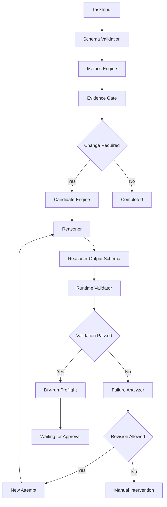

# Amazon Ads Agent PoC

> 一个面向亚马逊广告关键词竞价优化的、可审计、可校验、Human-in-the-loop 的智能体工程 PoC。

本项目使用合成数据验证单个 Keyword 高 ACoS 竞价优化闭环。它通过确定性计算和候选生成约束 Reasoner 的职责，再用严格 Schema、Runtime Validator、有限修订、dry-run Preflight 与人工确认边界控制输出风险。

这是离线工程 PoC，不是生产广告系统。当前未接入 Amazon Ads API、生产 Adapter、正式 Approval Service、数据库或前端，也不具备生产写入能力。

## 项目简介

广告指标分析通常依赖人工，优化经验难以结构化复用；如果让大模型自由生成修改方案，又可能出现候选越界、对象幻觉、证据虚构或绕过审批等问题。

本 PoC 将职责拆分为两个边界清晰的部分：

- 确定性模块负责 Decimal 指标、证据充分性、候选集合、对象引用、业务规则和状态守卫；
- Reasoner 只负责在既有候选中选择并生成结构化解释，不能创造候选、对象或规则。

输出随后经过独立的结构校验和业务校验。合法修改只能停在 `waiting_for_approval`，失败输出会在有限修订后转为 `manual_intervention_required`。

## 当前状态

以下结果于 2026-07-20 从当前仓库重新验证：

| 项目 | 当前状态 |
|---|---|
| 离线智能体闭环 | 已完成 |
| 全量测试 | `565 passed` |
| 固定 Fake 评估 | `12/12 passed` |
| OpenAI-compatible HTTP Transport | 工程实现完成，默认关闭 |
| 真实模型质量 | 未执行、未验收 |
| Amazon Ads API | 未接入 |
| 生产 Adapter / 生产写入 | 未实现 |
| 人工确认 | 合法修改停在 `waiting_for_approval` |
| LangGraph | 未接入运行时，由项目内 Workflow 编排 |

离线评估的关键安全计数为：

```text
real_model_used=false
真实模型请求数=0
production_write_violation_count=0
```

Fake 评估只验证固定合同、确定性边界和离线工作流，不代表真实模型回答质量。

## 核心能力

- 使用 `decimal.Decimal` 完成金额、竞价和比例计算，JSON 中以 Decimal 字符串表达业务值；
- Evidence Gate 判断数据和证据是否充分；
- Candidate Engine 确定性生成合法候选集合；
- Reasoner Stub、Provider 抽象、Fake Transport 与 OpenAI-compatible HTTP Transport；
- Reasoner 只能从候选集合中选择，不能创建竞价、对象、规则、快照或版本；
- 严格纯 JSON 输出合同与独立 Reasoner Output Schema；
- Draft 2020-12 JSON Schema 与 Runtime Validator 双重边界；
- 使用 allow-list 形式的 `previous_failure` 反馈进行有限自动修订；
- 最多 3 次自动修订，相同错误连续出现 2 次后停止；
- Schema 合法的 `ManualInterventionPackage`；
- 仅本地 `dry_run` 的 Preflight；
- Human-in-the-loop 与 `waiting_for_approval` 停止点；
- 追加式内存 Audit 事件；
- 12 个固定案例、自动 Evaluator、Metrics 和报告。

## 系统架构



图中没有生产写入节点：本 PoC 的合法修改在人工确认前停止。

## LangGraph 使用状态

当前 PoC 按照 LangGraph 风格的状态图、节点职责和条件路由组织，由项目内 Workflow 模块完成编排，尚未接入 LangGraph 运行时。

`pyproject.toml` 不包含 `langgraph` 依赖，代码也没有调用 `StateGraph`、节点注册、边注册或条件边 API。

## 快速开始

要求 Python 3.11 或更高版本。

```powershell
git clone https://github.com/Master-Zhao/amazon.git
cd amazon

python -m venv .venv
.\.venv\Scripts\Activate.ps1

python -m pip install --upgrade pip
python -m pip install -e ".[test]"
```

Linux / macOS 使用：

```bash
python -m venv .venv
source .venv/bin/activate
python -m pip install --upgrade pip
python -m pip install -e ".[test]"
```

运行 Stub、Fake 评估和默认测试均不需要 API Key，也不会访问真实模型或 Amazon Ads API。

## 运行 Stub 示例

高 ACoS 正常路径：

```powershell
python -m amazon_ads_agent examples/high-acos-keyword.json
```

其余固定 CLI 场景：

```powershell
# 数据不足
python -m amazon_ads_agent examples/insufficient-evidence.json

# 无需调整
python -m amazon_ads_agent examples/no-change-required.json

# 首次失败后修订成功
python -m amazon_ads_agent examples/invalid-reasoner-output.json --reasoner-mode invalid_once

# 相同错误连续出现两次后转人工介入
python -m amazon_ads_agent examples/repeated-invalid-output.json --reasoner-mode always_invalid
```

CLI 将审计步骤写入 stderr，将包含 `agent_output` 和 `manual_intervention_package` 的 JSON 协议信封写入 stdout。正常完成或等待审批返回 0，输入错误返回 2，人工介入返回 3，不可恢复的内部错误返回 4。

## 运行测试

```powershell
python -m pytest -q
```

当前完整结果为 `565 passed`。测试覆盖 Schema、Decimal 指标、Evidence、Candidate Engine、Reasoner、Provider/Transport、Runtime Validator、工作流、评估框架和安全边界。

## 运行固定评估

```powershell
python evaluation/run_evaluation.py
```

默认评估具有以下性质：

- 使用 Fake Provider、ReasonerStub、Fake Transport 或仓库内预定义响应；
- 不需要 API Key；
- 不访问真实模型网络；
- `real_model_used=false`；
- 12 个固定案例全部通过，生产写入违规数为 0。

生成的 `evaluation/results/latest.json` 和 `latest.md` 是本地运行产物，已被 Git 忽略。

## 真实模型模式

仓库提供 OpenAI-compatible chat-completions HTTP Transport 的工程接口，但真实调用默认关闭。启用时需要同时设置配置开关并在评估命令中显式确认；真实调用可能产生服务费用。

仅使用本地环境变量占位符，例如：

```powershell
$env:LLM_PROVIDER="llm"
$env:LLM_REAL_CALL_ENABLED="true"
$env:LLM_MODEL="<model-name>"
$env:LLM_API_KEY="<set-locally>"
$env:LLM_BASE_URL="<provider-base-url>"
```

真实评估还要求 `--provider real --confirm-real-model`，并受有限请求预算约束。当前尚未执行真实模型质量验收；不建议在完成离线验证和费用评估前开启。API Key 只能来自本地环境变量，不应写入 README、`.env`、命令历史或 Git。

## 项目结构

```text
src/amazon_ads_agent/   智能体核心代码与 CLI
schemas/                输入、输出、审计和人工介入 Schema
prompts/                Reasoner Prompt 模板
config/                 版本化 PoC 规则配置
evaluation/             12 个固定案例、Expected、Fixture、Evaluator 和报告器
tests/                  自动化测试
examples/               五个合成数据 CLI 示例
docs/                   规范、实现、验收、证据与比赛交付材料
```

## 测试与证据

- [PoC-01 运行时验收](docs/verification/poc-01-runtime-verification.md)
- [PoC-02 离线验收](docs/verification/poc-02-offline-verification.md)
- [PoC-02 真实模型评估状态](docs/verification/poc-02-real-model-evaluation.md)
- [比赛文档第 4～6 节](docs/reports/competition-sections-04-06-agent-module.md)
- [证据索引](docs/evidence/agent-module/evidence-index.md)
- [演示 Runbook](docs/demo/agent-module-demo-runbook.md)
- [PPT 大纲](docs/reports/agent-module-ppt-outline.md)

## 安全边界

- Reasoner 不能创造候选，最终建议值必须属于 Candidate Engine 的候选集合；
- Schema 通过不等于业务合法，所有业务结果仍须经过 Runtime Validator；
- 自动修订次数有限，相同错误连续出现两次后停止；
- 校验和 dry-run Preflight 通过后，合法方案冻结并停在人工确认前；
- `manual_intervention_required` 是失败运行的人工处理终态，不是批准状态；
- 当前没有 Amazon Ads API、生产 Adapter 或生产写入；
- API Key、Authorization Header 和凭据不得进入 Git、日志、审计或报告；
- 默认 Stub、测试和 Fake 评估完全离线运行。

## 当前限制

- 仅支持单个 Keyword 的高 ACoS 竞价降低，不支持 Campaign 预算优化；
- 仅使用合成数据，没有真实用户反馈；
- 真实模型质量尚未验证；
- 没有前端、数据库、正式 Approval Service 或 RBAC；
- 审计仅保存在内存；
- 没有静默学习、生产部署或线上效果结论。

## 文档索引

- [V0.2 主工程规范](docs/spec/amazon-ads-agent-loop-engineering-spec-v0.2.md)
- [V0.2.1 PoC 补丁基线](docs/spec/amazon-ads-agent-loop-engineering-spec-v0.2.1.md)
- [PoC-01 实现任务](docs/implementation/poc-01-keyword-bid-agent.md)
- [Reasoner Provider 设计](docs/implementation/poc-02-hour-01-reasoner-provider.md)
- [Prompt 与输出合同](docs/implementation/poc-02-hour-02-prompt-and-output-contract.md)
- [离线评估框架](docs/implementation/poc-02-hour-03-evaluation-framework.md)
- [真实模型 Transport 工程实现](docs/implementation/poc-02-hour-04-real-model-integration.md)
- [固定评估使用说明](evaluation/README.md)
- [第一周进展总结](docs/reports/week-01-agent-poc-summary.md)

## License

当前仓库尚未声明开源许可证。未经版权持有人另行授权，不应假定本项目采用 MIT、Apache-2.0 或其他开源许可证。
