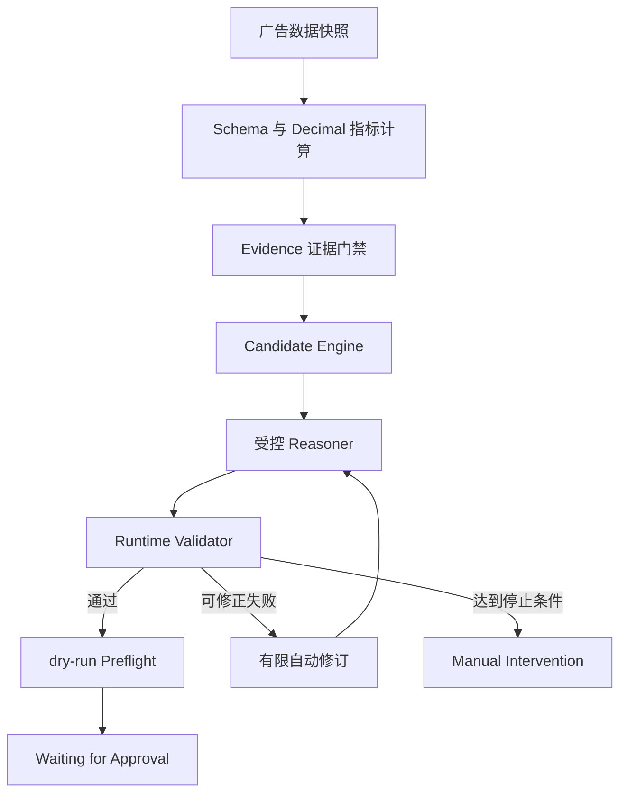

# 亚马逊广告智能体项目

> 面向亚马逊广告分析与关键词竞价优化的可审计、可校验、Human-in-the-loop 智能体工程项目。

本仓库的 `main` 分支用于汇总工程规范、场景与痛点材料、阶段成果和项目汇报文档。完整的可运行 Amazon Ads Agent PoC 位于 [`agent-poc-import` 分支](https://github.com/Master-Zhao/amazon/tree/agent-poc-import)。

## 项目定位

项目希望降低广告投手分析 Campaign、Ad Group、Keyword、Target 等多层级数据的人工成本，同时避免大模型自由生成带来的候选越界、对象幻觉、证据虚构和越权执行风险。

核心设计原则是：

- 指标、候选值、业务边界和状态守卫由确定性模块负责；
- Reasoner 只在确定性候选集合内选择并解释；
- Schema 通过不等于业务合法，输出仍须经过 Runtime Validator；
- 自动修订有次数上限，相同错误连续出现两次后停止；
- 合法修改停在人工确认前，不自动进入生产写入。

## 当前阶段

根据仓库内第二日工程成果总结和最新离线验证记录：

| 项目 | 当前状态 |
|---|---|
| 单 Keyword 高 ACoS 竞价优化 PoC | 已完成离线闭环 |
| 全量测试 | `565 passed` |
| 固定 Fake 评估 | `12/12 passed` |
| 真实模型 Transport | 已完成工程实现，默认关闭 |
| 真实模型质量 | 未执行、未验收 |
| Amazon Ads API | 未接入 |
| 生产 Adapter / 生产写入 | 未实现 |
| 正式 Approval Service | 未实现 |
| LangGraph | 采用其风格组织状态与路由，尚未接入运行时 |

```text
real_model_used=false
真实模型请求数=0
production_write_violation_count=0
```

这些结果代表离线工程验收，不代表真实模型质量、线上业务效果或生产系统验收。

## 架构概览



图中没有生产写入节点。当前项目不连接 Amazon Ads API，也不具备生产写入能力。

## `main` 分支内容

```text
docs/agent/     智能体闭环 V0.1、V0.2 工程规范
docs/submit/    场景与痛点提炼、第二日工程成果总结
reports/daily/  项目每日报告
reports/speech/ 每日汇报发言稿
.tmp/           已提交的历史文档生成与渲染材料
amazon-ads-agent-poc
                指向阶段性 PoC 提交的 Git gitlink
```

`main` 保留现有项目资料结构。需要浏览、安装或运行完整 Python PoC 时，请进入 [`agent-poc-import`](https://github.com/Master-Zhao/amazon/tree/agent-poc-import) 分支。

## 核心文档

- [Loop Engineering 工程规范 V0.2](docs/agent/amazon-ads-agent-loop-engineering-spec-v0.2.md)
- [Loop Engineering 工程规范 V0.1](docs/agent/amazon-ads-agent-loop-engineering-spec-v0.1.md)
- [项目场景与痛点提炼](docs/submit/亚马逊广告智能体项目场景与痛点提炼.md)
- [项目场景与痛点提炼原件](docs/submit/亚马逊广告智能体项目场景与痛点提炼原件.md)
- [第二日工程成果总结](docs/submit/亚马逊广告智能体项目第二日工程成果总结.md)
- [2026-07-17 每日报告](reports/daily/2026-07-17-亚马逊广告智投系统每日报告.md)

## 安全边界

- 不把离线 Fake 评估描述为真实模型验证；
- 不声称已经接入 Amazon Ads API；
- 不声称已经实现生产 Adapter、生产写入或正式 Approval Service；
- 不把单 Keyword 竞价优化描述为 Campaign 预算优化；
- 不声称已经接入 LangGraph 运行时；
- API Key、Token、Authorization Header 和 `.env` 不应进入 Git。

## 完整 PoC

完整项目代码、测试、固定评估、Prompt、Schema、证据和比赛交付材料请查看：

- [Amazon Ads Agent PoC 分支](https://github.com/Master-Zhao/amazon/tree/agent-poc-import)
- [PoC 根 README](https://github.com/Master-Zhao/amazon/blob/agent-poc-import/README.md)

当前仓库尚未声明开源许可证。
