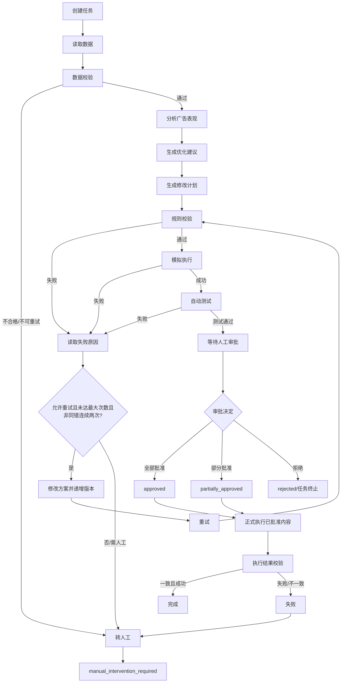
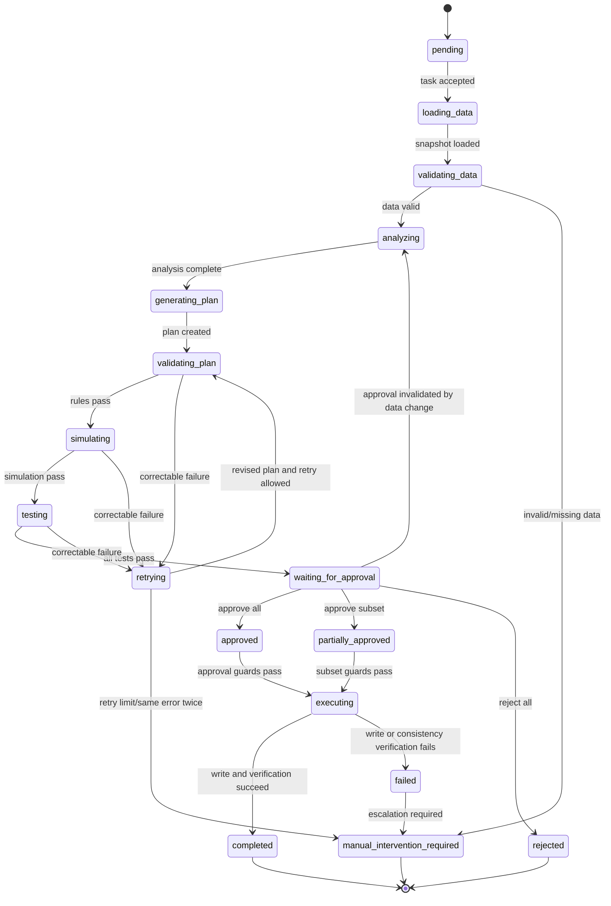

# 亚马逊广告智能体闭环功能设计与 Loop Engineering 工程规范 V0.1

## 1. 文档基本信息

| 项目 | 内容 |
|---|---|
| 文档名称 | 亚马逊广告智能体闭环功能设计与 Loop Engineering 工程规范 V0.1 |
| 项目名称 | 亚马逊广告智能管理系统 |
| 文档版本 | V0.1 |
| 当前阶段 | 第一周，第一个 4 小时工作块 |
| 对应工作块 | 智能体最小闭环产品定义与工程规格 |
| 预计工作量 | 4 人时（规格编制与评审准备，不含编码实现） |
| 编写日期 | 2026-07-16 |
| 编写人 | TBD |
| 审核人 | TBD |
| 文档状态 | 待评审 |
| 适用范围 | 亚马逊广告数据分析、优化建议、方案校验、模拟测试、人工审批与受控执行的首期闭环 |
| 关联文档 | TBD：产品需求文档、Amazon Ads API 适配规范、数据字典、测试报告模板、接口文档 |

### 1.1 版本变更记录

| 版本 | 日期 | 变更人 | 变更说明 | 状态 |
|---|---|---|---|---|
| V0.1 | 2026-07-16 | TBD | 建立最小闭环、数据协议、状态机、审批、重试、测试与验收基线 | 待评审 |

## 2. 项目背景

亚马逊广告运营需要持续处理 Campaign、Ad Group、Product Ad、Keyword 与 Target 等层级的数据。投手通常需要在多个报表与时间窗口之间比较曝光、点击、消耗、销售额、订单、ACoS、ROAS 等指标，再决定是否调整预算或竞价。原生管理工具能够完成基础管理，但在跨层级聚合、异常解释、批量辅助决策、方案验证和经验复用方面仍需要大量人工工作。

不同广告投手对指标、样本量和风险的判断不一致，经验常以个人习惯存在，难以形成可验证、可审计的组织资产。系统因此引入广告智能体，将结构化数据、明确业务规则、模型推理、模拟执行和自动测试组成受控闭环，使建议的依据、规则检查、失败原因和审批结果可以被复现。

智能体不同于仅按固定阈值执行动作的传统程序：固定规则负责不可违反的边界，智能体负责在边界内解释多指标关系、提出候选方案并根据机器可读反馈修正方案。智能体不得替代人工承担线上写入的最终责任。人工广告投手负责业务目标、风险偏好与最终审批；智能体是辅助决策和自动验证工具，不是未经授权的全自动广告投放系统。

## 3. 文档目标

| 编号 | 目标 | 可判定结果 |
|---|---|---|
| OBJ-001 | 明确智能体职责与边界 | 自动允许、自动禁止和必须人工介入的事项均有明确清单 |
| OBJ-002 | 固定最小业务闭环 | 从任务创建到审计完成的节点、分支和终止状态均已定义 |
| OBJ-003 | 定义机器可读取的数据协议 | 输入、输出、审批、状态与日志字段具有类型、约束和合法示例 |
| OBJ-004 | 定义自动修改与自动运行机制 | 失败分类、方案版本递增、最多 3 次重试和停止条件可执行 |
| OBJ-005 | 强制 Human-in-the-loop | 未持有有效审批记录时，任何正式写入均被拒绝 |
| OBJ-006 | 建立测试与验收基线 | 核心需求可追踪到测试用例、验收条件和交付证据 |
| OBJ-007 | 支持后续 Loop Engineering | AI 编码工具能够按约束拆解任务、运行测试、读取失败并判断完成 |

本文遵循以下工程语义：需求是目标；工程规格是机器可执行约束；代码是执行结果；测试是反馈信号。所有失败结果必须结构化、可读取；自动循环必须有终止条件；高风险和正式写入必须人工确认；全步骤必须可追踪、可审计、可复现。

## 4. 本阶段范围

### 4.1 本阶段包含内容

| 编号 | 内容 | 本阶段产出 |
|---|---|---|
| SCOPE-IN-001 | 智能体职责与执行边界 | 允许、禁止、转人工规则 |
| SCOPE-IN-002 | 最小业务场景与运行流程 | 场景表、完整流程图、状态机 |
| SCOPE-IN-003 | 输入、输出和审批数据规范 | 字段表及合法 JSON 示例 |
| SCOPE-IN-004 | 自动校验、模拟执行、自动测试与自动重试 | Loop 规则、失败分类和终止条件 |
| SCOPE-IN-005 | 日志、审计、异常、测试与验收 | 日志字段、异常矩阵、用例、Given-When-Then、追踪矩阵 |

### 4.2 本阶段不包含内容

| 编号 | 排除项 | 说明 |
|---|---|---|
| SCOPE-OUT-001 | 真实 Amazon Ads API 正式接入与线上参数修改 | 仅定义适配接口和模拟语义，不声称已实现 |
| SCOPE-OUT-002 | 完整前端页面与生产部署 | 审批界面仅保留数据协议 |
| SCOPE-OUT-003 | 复杂多智能体、长期记忆、向量知识库 | 首期采用单闭环、任务级上下文 |
| SCOPE-OUT-004 | 用户偏好学习与完整预算优化算法 | 仅接受显式目标与安全阈值 |
| SCOPE-OUT-005 | 竞品分析和多广告平台扩展 | 仅面向 Amazon Ads |
| SCOPE-OUT-006 | 未经批准的暂停、归档、删除和完全自动投放 | 首版禁止 |

### 4.3 后续阶段预留内容

后续可在不破坏本规范审批与审计边界的前提下增加：Amazon Ads API 适配层、人工审批页面、真实沙箱或测试账户、用户偏好沉淀、多场景提示词组合、可观测性平台和效果评估体系。所有新增写入能力均须复用有效审批、参数一致性与幂等控制。

## 5. 目标用户与角色

| 角色编号 | 角色 | 角色目标 | 主要操作 | 权限范围 | 与智能体关系 |
|---|---|---|---|---|---|
| ROLE-001 | 亚马逊广告投手 | 提高投放效率并控制风险 | 创建任务、查看依据、调整或审批建议 | 被授权账户与对象；是否可审批由 RBAC 决定 | 提供业务判断并复核建议 |
| ROLE-002 | 跨境电商运营人员 | 将广告与商品经营目标对齐 | 提供目标 ACoS、时间范围和经营约束 | 可读经营与广告摘要；默认无正式写入权 | 提供上下文、使用分析结论 |
| ROLE-003 | 广告运营负责人 | 统一策略、风险和效果口径 | 配置安全阈值、复核高风险方案 | 负责账户范围内策略与审批授权 | 设定规则并监督闭环 |
| ROLE-004 | 审批人员 | 对线上变更承担最终确认责任 | 全部批准、部分批准、全部拒绝 | 只能审批授权范围；不可篡改智能体待审批方案 | Human-in-the-loop 最终决策者 |
| ROLE-005 | 系统管理员 | 保障账户、权限、配置和审计可用 | 配置 RBAC、密钥引用、阈值、日志策略 | 系统管理；不得代替业务审批，除非另有审批角色 | 维护运行环境，不提供业务结论 |
| ROLE-006 | 开发与测试人员 | 按规格实现并验证系统 | 开发、模拟、测试、检查证据 | 非生产或受控环境；测试凭据隔离 | 将测试失败转为机器可读反馈 |
| ROLE-007 | AI 编码代理 | 按工程规格拆解和验证后续任务 | 修改授权范围内代码、运行测试、读取失败、迭代 | 仅限任务授权的仓库和环境；不得获得广告生产写入授权 | 工程实现代理，不是线上广告审批者 |

## 6. 最小业务场景

首期最小场景为：智能体依据指定时间范围的亚马逊广告数据，分析 Campaign 或 Keyword 表现，生成关键词竞价或广告预算调整建议，并在校验与测试通过后停留于人工审批状态。

| 场景编号 | 触发条件 | 输入数据 | 分析目标 | 预期输出 | 自动进入审批 | 异常处理 |
|---|---|---|---|---|---|---|
| SCN-001 | 点击量达到样本阈值且订单为 0 或 CVR 显著低于目标；样本阈值为 TBD-006 | Keyword、点击、订单、消耗、销售额、当前竞价、时间范围 | 判断高点击低转化及降价风险 | 可追溯的降价候选；幅度不超过 15% | 校验与测试通过后允许 | 样本不足则转 SCN-004，不生成确定性修改 |
| SCN-002 | ACoS 高于目标 ACoS 且数据充足 | ACoS、目标 ACoS、CPC、CVR、当前竞价 | 降低无效消耗 | 降低竞价或维持并提示的候选方案 | 校验与测试通过后允许 | ACoS 无法计算则停止计划并记录数据异常 |
| SCN-003 | 高转化且预算利用率达到受限阈值；阈值 TBD-007 | Campaign 预算、花费、销售、订单、ROAS | 判断增加预算是否可扩大有效流量 | 增加预算候选；幅度不超过 20% | 校验与测试通过后允许 | 平台最小值或上限未知则不得进入正式执行 |
| SCN-004 | 时间范围少于 7 天或样本量低于 TBD-006 | 全部可用指标与缺失清单 | 识别证据不足 | 仅风险提示、低置信度、空修改列表 | 否 | 状态完成或转人工补数，不自动重试数据缺失 |
| SCN-005 | 指标均在目标与安全区间，未触发异常 | Campaign/Keyword 完整指标 | 避免不必要变更 | “无需调整”、空修改列表及依据 | 否 | 指标冲突时降置信度并提示复核 |
| SCN-006 | 模型建议预算 >20% 或竞价 >15% | 当前值、建议值、账户阈值 | 阻止越界变更 | 规则失败；可在重试限额内收敛至阈值内新版本 | 仅修正并通过后允许 | 相同越界错误连续两次则转人工 |

## 7. 智能体职责与执行边界

### 7.1 智能体允许自动完成的操作

智能体可以自动：读取任务范围内的结构化广告数据；校验完整性和格式；计算或读取指标；识别异常；生成建议与参数修改计划；执行业务规则和 JSON Schema 校验；在模拟环境应用候选变更；运行自动测试；读取结构化失败结果；在限制次数内修正方案并重跑；输出结构化结果；记录过程日志；测试通过后等待人工审批。

### 7.2 智能体禁止自动完成的操作

| 安全规则 | 禁止事项 | 强制措施 |
|---|---|---|
| SR-001 | 未经人工确认修改线上广告 | 正式写入适配器必须验证有效审批令牌和状态 |
| SR-002 | 删除 Campaign、Ad Group、Product Ad、Keyword 或 Target | 动作白名单不包含 delete/archive |
| SR-003 | 绕过审批、规则校验、模拟或测试 | 状态机守卫拒绝非法迁移 |
| SR-004 | 修改任务范围外对象 | 对象必须存在于输入快照和 scope 清单 |
| SR-005 | 超出预算或竞价安全阈值 | 规则失败，不得进入审批或执行 |
| SR-006 | 无限重试 | 自动重试最多 3 次；同错连续两次提前停止 |
| SR-007 | 数据不足时伪造确定性结论 | 修改列表必须为空，输出风险提示并降低置信度 |
| SR-008 | 审批后改变已批准方案 | 锁定 plan_version；任何变化使原审批无效 |
| SR-009 | 执行与批准内容不一致 | 对 change_id、对象、动作和值做逐项哈希比对 |
| SR-010 | 未经授权修改生产代码或调用线上写入 | 智能体运行身份与生产写入身份隔离 |

### 7.3 必须人工介入的情况

正式写入前、连续失败达到停止条件、数据质量不合格、权限异常、API 异常、涉及暂停/归档/删除、修改幅度超限、审批后数据发生显著变化、执行内容与批准内容不一致时必须转人工。转人工不得隐式视为批准。

## 8. 功能需求

| 需求编号 | 需求名称 | 需求描述 | 触发条件 | 输入 | 处理规则 | 输出 | 异常处理 | 优先级 | 对应测试 | 验收条件 |
|---|---|---|---|---|---|---|---|---|---|---|
| FR-001 | 创建优化任务 | 创建唯一任务并冻结任务范围 | 合法请求到达 | DATA-001 | 校验必填项；生成 task_id/run_id；初态 pending | 任务记录 | 重复幂等键返回既有任务 | P0 | TC-001、TC-019 | AC-010 |
| FR-002 | 读取广告数据 | 从指定快照或适配器读取范围内数据 | 任务进入 loading_data | 账户、对象、时间范围 | 只读；记录快照版本 | 广告数据集 | 缺失、权限或 API 异常按 EX 处理 | P0 | TC-001、TC-002 | AC-010 |
| FR-003 | 数据完整性校验 | 校验字段、类型、范围、时间窗和对象引用 | 数据已加载 | DATA-001 | Schema 与交叉字段校验 | validation_result | 不合格不生成计划 | P0 | TC-002、TC-003 | AC-004 |
| FR-004 | 指标计算 | 以统一公式计算 CTR/CPC/CVR/ACoS/ROAS | 原始计数有效 | 指标原值 | 分母为 0 时输出 null 与原因；不伪造 | 标准指标 | 计算失败转人工或完成风险提示 | P0 | TC-AI-002 | AC-010 |
| FR-005 | 广告表现分析 | 对照目标、样本量和规则识别问题 | 数据校验通过 | 标准指标、目标 | 每个结论引用指标路径 | 问题列表、摘要 | 证据不足降置信度 | P0 | TC-001、TC-AI-004 | AC-010 |
| FR-006 | 生成优化建议 | 生成预算/竞价建议或无需调整结论 | 分析完成 | 分析结果、约束 | 仅生成白名单动作 | 建议列表 | Schema 错误可重试 | P0 | TC-001、TC-AI-001 | AC-002 |
| FR-007 | 生成修改计划 | 为每项建议生成唯一 change_id 和 plan_version | 存在可执行建议 | 当前值、建议值 | 计算比例；绑定对象与快照 | 候选计划 | 对象不存在则失败 | P0 | TC-006、TC-AI-003 | AC-002 |
| FR-008 | 业务规则校验 | 校验阈值、动作、范围、数据和审批前置条件 | 计划已生成 | 计划、规则集 | 所有 P0 规则必须通过 | 规则结果 | 可修正错误进入 retrying；不可重试错误转人工 | P0 | TC-004 | AC-004 |
| FR-009 | 模拟执行 | 在隔离模型中应用计划，不调用生产写入 | 规则通过 | 候选计划、快照 | 计算前后值与差异 | 模拟结果 | 失败进入原因分析 | P0 | TC-007 | AC-002 |
| FR-010 | 自动测试 | 对 Schema、规则、状态、范围和模拟结果运行测试 | 模拟成功 | 计划与模拟结果 | 输出机器可读 pass/fail、error_code | 测试结果 | fail 不得进入审批 | P0 | TC-008、TC-009 | AC-004、AC-005 |
| FR-011 | 失败原因分析 | 将失败归类为可修正、不可重试、需人工 | 任一校验/模拟/测试失败 | 错误码、上下文 | 使用稳定分类码 | failure_analysis | 无法分类时转人工 | P0 | TC-007、TC-008 | AC-002 |
| FR-012 | 自动修改方案 | 仅修正待执行计划或结构化输出 | 可修正失败且未达停止条件 | 失败分析、旧计划 | 递增 plan_version；保留差异 | 新计划版本 | 禁止改生产代码/线上参数 | P0 | TC-005、TC-007 | AC-002 |
| FR-013 | 自动重试 | 从规则校验重新运行闭环 | 新计划生成 | 重试计数、错误指纹 | 最多 3 次；同错连续两次停止 | 新 run step | 达限转人工 | P0 | TC-014、TC-015 | AC-003、AC-009 |
| FR-014 | 进入人工审批 | 测试全部通过后冻结方案并等待审批 | 测试通过 | plan_version、快照 | 状态只能转 waiting_for_approval | 待审批包 | 无有效测试证据则拒绝迁移 | P0 | TC-009 | AC-005 |
| FR-015 | 全部批准 | 批准计划全部 change_id | 授权操作人提交 approve_all | DATA-003 | 校验版本、快照和完整列表 | approved | 缺项或过期则审批无效 | P0 | TC-011 | AC-001 |
| FR-016 | 部分批准 | 逐项批准计划子集 | 提交 approve_partial | DATA-003 | 已批与拒绝集合互斥且覆盖全部项 | partially_approved | 非法 change_id 拒绝审批 | P0 | TC-012 | AC-006 |
| FR-017 | 全部拒绝 | 拒绝全部变更并记录原因 | 提交 reject_all | DATA-003 | comment 必填；不执行 | rejected | 信息不全拒绝审批请求 | P0 | TC-013 | AC-001 |
| FR-018 | 执行批准内容 | 仅将已批准严格子集提交正式写入适配器 | 状态 approved/partially_approved 且审批有效 | 批准记录、锁定计划 | 参数逐项一致、幂等检查、写入前审计 | 执行结果 | 任一守卫失败禁止写入并转人工 | P0 | TC-010～TC-012、TC-018 | AC-001、AC-006、AC-007 |
| FR-019 | 审批失效 | 数据、方案或有效期变化时撤销批准资格 | 写入前复核失败 | 新旧快照、版本、有效期 | 标记 invalidated；不得执行 | 失效原因 | 重新读取数据并分析 | P0 | TC-016、TC-017 | AC-008 |
| FR-020 | 日志记录 | 记录每个关键步骤的结构化事件 | 状态或动作发生 | 上下文 | 敏感信息脱敏；追加写 | 日志事件 | 日志写入失败阻断正式写入 | P0 | TC-020 | AC-010 |
| FR-021 | 审计追踪 | 关联 task/run/plan/approval/snapshot | 查询或审计请求 | 标识集合 | 时间有序、不可混用版本 | 审计链 | 链断裂标记 failed/manual | P0 | TC-020 | AC-010 |
| FR-022 | 任务终止 | 在完成、拒绝或不可恢复失败时停止 | 终止条件满足 | 最终上下文 | 禁止后续自动变更 | completed/rejected/failed | 非法恢复请求拒绝 | P0 | TC-013、TC-014 | AC-003、AC-009 |
| FR-023 | 异常转人工 | 对不可重试异常生成可处理上下文 | 权限/API/数据/达限异常 | 错误与证据 | 状态 manual_intervention_required | 人工处理包 | 不得自动批准或执行 | P0 | TC-002、TC-014 | AC-009 |

## 9. 非功能需求

| 编号 | 非功能需求 | 可验证指标 |
|---|---|---|
| NFR-001 | 可追踪性 | 100% 关键事件包含 task_id、run_id、event_id、timestamp；变更包含 change_id |
| NFR-002 | 可审计性 | 每次正式写入可追溯到唯一审批人、审批时间、plan_version、data_snapshot_id 和 API 结果 |
| NFR-003 | 可复现性 | 使用同一输入快照、规则版本、模型配置和随机性配置，可重放流程并得到等价结构；数值差异容限为 0，文本摘要可不同但不得改变计划语义 |
| NFR-004 | 安全性 | 未授权、未审批、审批过期、参数不一致四类请求的正式写入成功率必须为 0% |
| NFR-005 | 幂等性 | 同一 idempotency_key 重复提交不得产生第二次写入；返回首次结果或进行中状态 |
| NFR-006 | 可测试性 | 核心规则、状态迁移和写入守卫均可通过无外部生产依赖的自动测试触发 |
| NFR-007 | 可维护性 | 规则、状态枚举、Schema 与错误码均版本化；规则变更不得依赖修改提示词正文才生效 |
| NFR-008 | 可扩展性 | 新广告对象或场景通过适配器与枚举扩展；审批、审计和写入守卫不得被旁路 |
| NFR-009 | 日志完整性 | TC-020 定义的关键节点日志覆盖率为 100%；缺失任一写入前日志则正式执行被阻断 |
| NFR-010 | 输出稳定性 | 100% 智能体结构化输出通过指定 JSON Schema；未知字段按 Schema 策略拒绝 |
| NFR-011 | 数据隐私 | 日志中密钥、令牌、Secret、完整授权头出现次数为 0；敏感账号标识按策略脱敏 |
| NFR-012 | 错误可恢复性 | 可重试错误保留上下文并按策略恢复；不可重试错误在一次判断内转人工且不写线上 |
| NFR-013 | 人工审批强制性 | 100% 正式写入请求均验证 approval_id；测试中无审批路径全部返回拒绝 |
| NFR-014 | 模型输出结构化 | 输出包含 schema_version、plan_version、data_snapshot_id；缺失任一项判失败 |
| NFR-015 | 执行内容一致性 | 执行项集合为 approved_change_ids 的严格子集或相等集合，且每项对象、动作、值哈希完全一致 |

## 10. 智能体整体运行流程



### 10.1 自动运行闭环

自动闭环严格按“生成方案 → 校验 → 模拟执行 → 自动测试 → 读取失败原因 → 修改方案 → 重新运行”执行。失败必须产生结构化错误码、错误指纹和可修正性分类。任何一次测试通过即终止自动优化并冻结当前方案；达到 3 次重试、同错连续两次、数据缺失、权限错误或 API 错误时立即停止自动循环。

### 10.2 人工审批闭环

测试通过的冻结方案形成待审批包。授权人员可全部批准、逐项部分批准或全部拒绝。系统仅执行 `approved_change_ids` 指定且与冻结方案完全一致的内容；拒绝项不得执行。审批、执行结果和最终状态均写入审计链。

## 11. 智能体状态机



| 规则编号 | 状态 | 含义 | 进入条件 | 允许操作 | 退出条件/下一状态 | 失败处理 |
|---|---|---|---|---|---|---|
| ST-001 | pending | 任务已创建未处理 | 请求校验通过 | 记录任务、取消未开始任务 | 调度后 loading_data | 创建失败为 failed |
| ST-002 | loading_data | 读取指定范围数据 | pending 被调度 | 只读数据、生成快照 | 加载完成到 validating_data | 权限/API/缺失转人工 |
| ST-003 | validating_data | 校验数据质量 | 快照可用 | Schema、范围、时间窗校验 | 通过到 analyzing | 不合格转人工，不生成计划 |
| ST-004 | analyzing | 分析指标与问题 | 数据有效 | 计算指标、形成依据 | 完成到 generating_plan | 失败按可恢复性处理 |
| ST-005 | generating_plan | 生成候选方案 | 分析完成 | 生成建议、change_id、版本 | 完成到 validating_plan | 格式错误可重试 |
| ST-006 | validating_plan | 校验计划规则与范围 | 候选计划存在 | Schema、阈值、对象校验 | 通过到 simulating；可修正失败到 retrying | 不可重试转人工 |
| ST-007 | simulating | 隔离环境应用计划 | 规则全部通过 | 计算模拟前后差异 | 成功到 testing；可修正失败到 retrying | 不调用正式 API |
| ST-008 | testing | 自动验证计划与模拟结果 | 模拟成功 | 运行自动测试、读取报告 | 全通过只能到 waiting_for_approval；失败到 retrying/人工 | 禁止直接执行 |
| ST-009 | retrying | 根据失败修订并重跑 | 可修正且未达停止条件 | 记录失败、递增版本、修正方案 | 到 validating_plan；达限到人工 | 最大 3 次，同错两次停止 |
| ST-010 | waiting_for_approval | 测试通过且方案冻结 | 全部测试通过 | 展示、全部/部分批准或拒绝 | approved/partially_approved/rejected；失效到 analyzing | 禁止自动改方案和写入 |
| ST-011 | approved | 全部项获有效批准 | 审批数据有效 | 写入前一致性校验 | 通过到 executing | 失效则重新分析 |
| ST-012 | partially_approved | 部分项获有效批准 | 批准与拒绝集合合法 | 构建批准严格子集 | 通过到 executing | 非批准项必须过滤 |
| ST-013 | rejected | 全部变更被拒绝 | 有操作人、时间和原因 | 记录审计 | 终止 | 不得进入 executing |
| ST-014 | executing | 正式执行已批准项 | 仅来自 ST-011/ST-012 且守卫通过 | 调用正式写入适配器、核对结果 | 成功到 completed；失败到 failed | 禁止动态改计划 |
| ST-015 | completed | 合法闭环完成 | 执行成功或无需变更流程完成 | 只读查询 | 终态 | 后续请求创建新任务 |
| ST-016 | failed | 不可恢复执行失败 | 写入或核对失败 | 记录失败、阻断后续写入 | 转 manual_intervention_required | 不自动重放写入 |
| ST-017 | manual_intervention_required | 需人工处理 | 达限、权限/API/质量/一致性异常 | 查看证据、人工处置 | 本任务终止；修复后新建或显式恢复任务 | 不代表批准 |

状态守卫：`testing` 通过后只能进入 `waiting_for_approval`；非 `approved`/`partially_approved` 不得进入 `executing`；`rejected` 永不进入 `executing`；执行内容必须是审批计划的严格子集或相等集合；审批失效后必须回到 `analyzing`，不得复用旧审批。

## 12. 输入数据规范

### 12.1 DATA-001 智能体任务输入

```json
{
  "schema_version": "1.0",
  "task_id": "task-20260716-0001",
  "idempotency_key": "store-001-camp-1001-20260701-20260714",
  "scenario_type": "keyword_bid_optimization",
  "store_id": "store-001",
  "ad_account_id": "acct-001",
  "campaign_id": "camp-1001",
  "ad_group_id": "ag-2001",
  "asin": "B0EXAMPLE01",
  "keyword_or_target": {
    "type": "keyword",
    "id": "kw-3001",
    "value": "wireless travel mouse"
  },
  "date_range": {
    "start": "2026-07-01",
    "end": "2026-07-14",
    "timezone": "Asia/Shanghai"
  },
  "optimization_goal": "target_acos",
  "delivery_style": "balanced",
  "target_acos": 0.25,
  "risk_level": "medium",
  "max_budget_change_ratio": 0.20,
  "max_bid_change_ratio": 0.15,
  "allow_pause": false,
  "human_confirmation_required": true,
  "data_snapshot_id": "snap-20260716-001",
  "metrics": {
    "impressions": 25000,
    "clicks": 420,
    "spend": 315.00,
    "sales": 900.00,
    "orders": 30,
    "ctr": 0.0168,
    "cpc": 0.75,
    "cvr": 0.0714285714,
    "acos": 0.35,
    "roas": 2.8571428571,
    "current_budget": 100.00,
    "current_bid": 1.20,
    "currency": "USD"
  }
}
```

| 字段名 | 数据类型 | 必填 | 取值范围 | 默认值 | 说明 | 校验失败处理 |
|---|---|---|---|---|---|---|
| schema_version | string | 是 | `1.0` | 无 | 输入协议版本 | 拒绝任务 |
| task_id | string | 是 | 全局唯一，1～64 字符 | 无 | 任务编号 | 拒绝或按幂等记录返回 |
| idempotency_key | string | 是 | 1～128 字符 | 无 | 防重复键 | 查询并返回既有结果 |
| scenario_type | enum | 是 | keyword_bid_optimization、campaign_budget_optimization | 无 | 场景类型 | 拒绝任务 |
| store_id | string | 是 | 非空 | 无 | 店铺编号 | 拒绝任务 |
| ad_account_id | string | 是 | 非空且有读取权限 | 无 | 广告账户编号 | 转人工 |
| campaign_id | string | 是 | 必须存在于快照 | 无 | Campaign 编号 | 数据校验失败 |
| ad_group_id | string/null | 条件必填 | 关键词场景必填 | null | Ad Group 编号 | 数据校验失败 |
| asin | string/null | 否 | 合法 ASIN 格式；规则 TBD-002 | null | 商品标识 | 标记风险或失败 |
| keyword_or_target | object | 条件必填 | type 为 keyword/target；id 必须存在 | null | Keyword 或 Target | 不生成计划 |
| date_range.start/end | date | 是 | end≥start；不得晚于快照时间 | 无 | 分析时间范围 | 拒绝任务 |
| date_range.timezone | string | 是 | IANA 时区 | UTC | 时间解释 | 拒绝任务 |
| optimization_goal | enum | 是 | target_acos、increase_sales、control_spend | 无 | 优化目标 | 拒绝任务 |
| delivery_style | enum | 是 | conservative、balanced、aggressive | balanced | 投放风格，不可突破硬阈值 | 拒绝任务 |
| target_acos | number/null | 条件必填 | 0 < 值 ≤ 1 | null | ACoS 目标 | 不生成 ACoS 方案 |
| risk_level | enum | 是 | low、medium、high | medium | 任务风险级别 | 拒绝任务 |
| max_budget_change_ratio | number | 是 | 0～0.20 | 0.20 | 单次预算最大变化比例 | 取更严格配置或拒绝 |
| max_bid_change_ratio | number | 是 | 0～0.15 | 0.15 | 单次竞价最大变化比例 | 取更严格配置或拒绝 |
| allow_pause | boolean | 是 | 首版只能为 false | false | 是否允许暂停 | 为 true 时拒绝该动作 |
| human_confirmation_required | boolean | 是 | 必须为 true | true | 是否强制审批 | 为 false 时拒绝任务 |
| data_snapshot_id | string | 是 | 唯一且可读取 | 无 | 输入快照编号 | 转人工 |
| metrics.impressions | integer | 是 | ≥0 | 无 | 曝光量 | 数据校验失败 |
| metrics.clicks | integer | 是 | 0～impressions | 无 | 点击量 | 数据校验失败 |
| metrics.spend/sales | number | 是 | ≥0，统一货币 | 无 | 消耗/销售额 | 数据校验失败 |
| metrics.orders | integer | 是 | ≥0 且 ≤clicks | 无 | 订单量 | 数据校验失败 |
| metrics.ctr/cpc/cvr/acos/roas | number/null | 是 | ≥0；按原值重算并核对 | null | 派生指标 | 以重算值为准并记录差异；无法计算为 null |
| metrics.current_budget/current_bid | number | 是 | >0；平台边界 TBD-004 | 无 | 当前预算/竞价 | 不生成修改计划 |
| metrics.currency | string | 是 | ISO 4217 | 无 | 币种 | 拒绝混币数据 |

### 12.2 DATA-002 指标公式

`CTR = clicks / impressions`；`CPC = spend / clicks`；`CVR = orders / clicks`；`ACoS = spend / sales`；`ROAS = sales / spend`。分母为 0 时值为 `null`，同时输出 `metric_unavailable_reason`，不得使用 0 代替未知值。

## 13. 输出数据规范

### 13.1 DATA-003 智能体输出

```json
{
  "schema_version": "1.0",
  "task_id": "task-20260716-0001",
  "run_id": "run-20260716-0001-02",
  "current_status": "waiting_for_approval",
  "analysis_summary": "该关键词 ACoS 为 35%，高于目标 ACoS 25%，样本期为 14 天。",
  "issues": [
    {
      "issue_id": "issue-001",
      "type": "acos_above_target",
      "metric_refs": ["metrics.acos", "target_acos"]
    }
  ],
  "plan_version": 2,
  "changes": [
    {
      "change_id": "chg-0001",
      "object_type": "keyword",
      "object_id": "kw-3001",
      "action": "update_bid",
      "current_value": 1.20,
      "suggested_value": 1.08,
      "change_ratio": -0.10,
      "reason": "ACoS 高于目标值，在不超过 15% 安全阈值的范围内降低竞价。",
      "evidence": [
        {"field": "metrics.acos", "value": 0.35},
        {"field": "target_acos", "value": 0.25},
        {"field": "metrics.clicks", "value": 420}
      ],
      "confidence": 0.84,
      "risk_level": "medium"
    }
  ],
  "rule_validation": {
    "passed": true,
    "rule_set_version": "rules-0.1",
    "failed_rule_ids": []
  },
  "simulation_result": {
    "passed": true,
    "simulation_id": "sim-0001",
    "production_write_called": false
  },
  "automated_test_result": {
    "passed": true,
    "test_run_id": "test-run-0001",
    "passed_tests": 12,
    "failed_tests": 0
  },
  "retry_count": 1,
  "human_approval_required": true,
  "generated_at": "2026-07-16T10:30:00+08:00",
  "data_snapshot_id": "snap-20260716-001"
}
```

输出必须通过 JSON Schema，`current_status` 在本示例及所有未审批的可执行方案中必须为 `waiting_for_approval`。每项变更必须具有任务内唯一 `change_id`；`evidence.field` 必须指向输入快照中的真实字段；`simulation_result.production_write_called` 必须为 `false`。

| 编号 | 输出约束 | 判定方式 |
|---|---|---|
| DATA-004 | task_id、run_id、plan_version、data_snapshot_id 必须存在 | Schema 必填校验 |
| DATA-005 | changes 中 change_id 唯一且对象存在于输入快照 | 唯一性和引用完整性校验 |
| DATA-006 | current/suggested/change_ratio 数值一致 | `change_ratio=(suggested-current)/current`，误差 ≤1e-9 |
| DATA-007 | 理由和证据必须关联输入指标 | 每个变更至少一个有效 evidence 路径 |
| DATA-008 | 可执行输出必须带规则、模拟和测试通过证据 | 三类 `passed` 全为 true 才可等待审批 |

## 14. 人工审批数据规范

### 14.1 DATA-009 审批请求

`decision` 枚举为 `approve_all`、`approve_partial`、`reject_all`。以下为部分批准示例：

```json
{
  "task_id": "task-20260716-0001",
  "decision": "approve_partial",
  "approved_change_ids": ["chg-0001"],
  "rejected_change_ids": ["chg-0002"],
  "operator": {
    "operator_id": "user-9001",
    "display_name": "TBD"
  },
  "comment": "批准关键词竞价调整；预算调整待补充经营数据后再评估。",
  "approved_at": "2026-07-16T11:00:00+08:00",
  "data_snapshot_id": "snap-20260716-001",
  "plan_version": 2,
  "approval_version": 1
}
```

| 规则编号 | 审批规则 | 可执行约束 |
|---|---|---|
| BR-001 | 人工可逐项批准 | 部分批准时两个 change_id 集合互斥且并集等于待审批全集 |
| BR-002 | 系统只执行已批准项 | 正式执行集合必须是 approved_change_ids 的子集 |
| BR-003 | 审批后不得修改批准方案 | plan_version 或内容哈希变化即审批失效 |
| BR-004 | 数据显著变化时审批失效 | 按 TBD-007 阈值比较新旧快照 |
| BR-005 | 拒绝原因必须记录 | reject_all 及部分拒绝时 comment 非空 |
| BR-006 | 审批必须有操作人和时间 | operator_id、approved_at 必填并校验授权 |
| BR-007 | 审批绑定快照和方案版本 | data_snapshot_id、plan_version 必须与冻结计划一致 |
| BR-008 | 审批具有有效期 | 有效期为 TBD-008；到期不得执行 |

## 15. 自主修改与自主运行机制

“自己改”指智能体读取规则校验、模拟执行和自动测试的失败结果，修改尚未获批的优化方案、参数建议或结构化输出。它不包括未经授权修改生产代码、运行环境、规则硬边界或线上广告参数。“自己跑”指智能体自动执行分析、生成、校验、模拟、测试、读取结果、修正和重跑，不需要人工逐步点击，但仍受重试、状态和审批守卫约束。

完整循环如下：生成修改计划；规则校验；模拟执行；运行测试；读取失败结果；分类失败；重新生成或修正方案；再次校验和测试；测试通过后停止自动循环；进入人工审批。

### 15.1 自动循环规则

```yaml
loop_policy:
  policy_version: "0.1"
  start_state: generating_plan
  validation_order:
    - json_schema
    - object_reference
    - business_rules
    - simulation
    - automated_tests
  max_automatic_retries: 3
  increment_plan_version_on_retry: true
  record_failure_on_every_retry: true
  stop_on_same_error_consecutive_count: 2
  non_retryable_error_categories:
    - missing_data
    - permission_error
    - api_error
    - approval_violation
  on_test_pass:
    stop_automatic_changes: true
    next_state: waiting_for_approval
  on_retry_limit:
    next_state: manual_intervention_required
  after_approval:
    plan_mutation_allowed: false
    production_write_requires_valid_approval: true
```

### 15.2 执行伪代码

```text
plan := generate_plan(snapshot, constraints)
retry_count := 0
last_error_fingerprint := null
same_error_count := 0

while true:
    result := validate_simulate_and_test(plan)
    audit(result)
    if result.passed:
        freeze(plan)
        transition(waiting_for_approval)
        break
    if result.category in NON_RETRYABLE:
        transition(manual_intervention_required)
        break
    fingerprint := stable_error_fingerprint(result)
    same_error_count := fingerprint == last_error_fingerprint ? same_error_count + 1 : 1
    if retry_count >= 3 or same_error_count >= 2:
        transition(manual_intervention_required)
        break
    retry_count := retry_count + 1
    plan := revise_plan(plan, result, plan.version + 1)
    last_error_fingerprint := fingerprint
```

自动重试次数指初始方案之后允许的自动修订次数，暂定最大值为 3。每次修订必须产生新的 `plan_version`、差异记录和失败原因。数据缺失不得靠重试解决；权限错误与 API 错误直接转人工；测试通过后不得继续擅自优化；进入审批后计划必须冻结。

## 16. 业务规则与安全约束

| 规则编号 | 类型 | 规则 | 暂定值/来源 | 校验时点 | 失败处理 |
|---|---|---|---|---|---|
| BR-009 | 预算 | 单次预算调整绝对幅度不得超过 20% | 暂定值 20% | 计划校验、写入前 | 拒绝；可修正后重试 |
| BR-010 | 竞价 | 单次关键词竞价调整绝对幅度不得超过 15% | 暂定值 15% | 计划校验、写入前 | 拒绝；可修正后重试 |
| BR-011 | 数据 | 时间范围少于 7 天时只输出风险提示 | 暂定值 7 天 | 数据校验 | changes 为空，不进审批 |
| BR-012 | 数据 | 样本不足不得输出确定性修改 | 阈值 TBD-006 | 数据校验、分析 | 降低置信度，changes 为空 |
| BR-013 | 平台边界 | 调整后预算不得低于平台最低值 | TBD-004 | 计划校验、写入前 | 未知或越界均阻断 |
| BR-014 | 账户边界 | 调整后竞价不得超过账户安全上限 | TBD-004/TBD-005 | 计划校验、写入前 | 阻断并转人工确认配置 |
| BR-015 | 快照 | 数据显著变化后审批失效 | 阈值 TBD-007 | 写入前 | 返回 analyzing 重新分析 |
| BR-016 | 可解释性 | 建议理由必须关联输入指标 | 至少 1 个有效 evidence 路径 | 输出校验 | 结构化失败，可重试 |
| SR-011 | 删除 | 不允许自动删除广告对象 | 固定 | 动作校验 | 直接拒绝并转人工 |
| SR-012 | 暂停 | 首版不允许自动暂停广告 | 固定 | 动作校验 | 直接拒绝并转人工 |
| SR-013 | 审批 | 正式执行前必须存在有效审批记录 | 固定 | 写入前 | 拒绝写入 |
| SR-014 | 一致性 | 执行参数必须与审批参数一致 | 字段与内容哈希完全相等 | 写入前 | 拒绝并转人工 |
| SR-015 | 快照绑定 | 审批必须绑定 data_snapshot_id | 固定 | 审批、写入前 | 审批无效 |
| SR-016 | 输出格式 | AI 输出必须通过版本化 JSON Schema | 固定 | 每次模型输出后 | 可重试，受上限约束 |
| SR-017 | 审计 | 所有线上写入必须先后记录审计日志 | 固定 | 写入前后 | 前置日志失败时阻断；后置失败转人工 |

以上平台最小预算、最小/最高竞价、账户安全上限和显著变化阈值未确认前均为 `TBD`，不得用假设值替代平台或账户配置。

## 17. 异常处理机制

| 异常编号 | 触发条件 | 等级 | 允许重试 | 最大次数 | 系统处理 | 用户提示 | 最终状态 | 转人工 |
|---|---|---|---|---:|---|---|---|---|
| EX-001 | 广告数据必填项缺失 | 高 | 否 | 0 | 记录缺失字段，不生成计划 | 请补充或重新同步数据 | manual_intervention_required | 是 |
| EX-002 | 数据类型、范围或时间格式错误 | 高 | 否 | 0 | Schema 校验失败 | 数据格式不符合 DATA-001 | failed | 否 |
| EX-003 | 指标分母异常或计算器失败 | 中 | 条件允许 | 1 | 分母为 0 输出 null；系统异常重算一次 | 指标不可用及原因 | manual_intervention_required | 条件是 |
| EX-004 | 模型输出非合法 JSON | 中 | 是 | 3 | 反馈解析错误并重新生成 | 正在修正结构化输出 | manual_intervention_required | 达限是 |
| EX-005 | 模型输出缺少必填字段 | 中 | 是 | 3 | 返回缺失字段路径 | 正在补全输出 | manual_intervention_required | 达限是 |
| EX-006 | 模型引用不存在广告对象 | 高 | 是 | 1 | 拒绝计划并反馈合法对象集合；再犯停止 | 建议包含无效对象 | manual_intervention_required | 是 |
| EX-007 | 预算/竞价修改幅度超限 | 高 | 是 | 3 | 反馈限制并生成新版本 | 建议已超安全阈值 | manual_intervention_required | 达限是 |
| EX-008 | 其他业务规则校验失败 | 中/高 | 条件允许 | 3 | 按规则可修正性分类 | 显示 failed_rule_ids | manual_intervention_required | 达限或不可重试是 |
| EX-009 | 模拟执行失败 | 高 | 是 | 3 | 记录模拟差异和错误码，修正计划 | 模拟未通过，未写入线上 | manual_intervention_required | 达限是 |
| EX-010 | 自动测试失败 | 高 | 是 | 3 | 读取失败断言并重试 | 测试未通过，不能审批 | manual_intervention_required | 达限是 |
| EX-011 | 相同错误连续出现两次或达重试上限 | 高 | 否 | 0 | 停止循环，保留所有版本 | 自动修正已停止 | manual_intervention_required | 是 |
| EX-012 | 读取或写入权限不足 | 严重 | 否 | 0 | 立即停止，不更换身份绕过 | 需要管理员核对授权 | manual_intervention_required | 是 |
| EX-013 | Amazon Ads API 超时 | 高 | 否（首版） | 0 | 保留请求摘要，不假定成功 | API 超时，执行状态待人工核对 | manual_intervention_required | 是 |
| EX-014 | Amazon Ads API 限流 | 高 | 否（首版） | 0 | 记录限流信息和建议重试时间 | API 限流，请人工安排重试 | manual_intervention_required | 是 |
| EX-015 | Amazon Ads API 正式写入失败 | 严重 | 否 | 0 | 禁止自动重放；核对是否部分成功 | 写入失败或状态未知 | manual_intervention_required | 是 |
| EX-016 | 未获得人工审批即请求执行 | 严重 | 否 | 0 | 拒绝写入并记录安全事件 | 必须先完成有效审批 | waiting_for_approval | 是 |
| EX-017 | 审批超过有效期 | 高 | 否 | 0 | 标记审批失效 | 审批已过期，请重新分析审批 | analyzing | 否 |
| EX-018 | 审批后数据达到显著变化阈值 | 高 | 否 | 0 | 作废审批并加载新快照 | 数据已变化，旧审批不可用 | analyzing | 否 |
| EX-019 | 执行内容与审批内容不一致 | 严重 | 否 | 0 | 拒绝全部写入，记录安全事件 | 参数一致性校验失败 | manual_intervention_required | 是 |
| EX-020 | 相同幂等键重复执行 | 中 | 否 | 0 | 返回首次执行结果，不二次写入 | 已处理相同任务 | completed/原状态 | 否 |

## 18. 日志、审计与可追踪性

每次工作流执行必须有唯一 `run_id`；每次方案修改必须递增 `plan_version`；每次审批必须关联 `plan_version` 与 `data_snapshot_id`。日志采用追加事件模型，应能按 `task_id` 和时间顺序还原任务创建、输入数据版本、数据校验、AI 请求摘要、AI 输出版本、规则校验、模拟、测试、重试、失败、审批、正式执行、API 结果和最终状态。

| 日志字段 | 类型 | 必填 | 说明 |
|---|---|---|---|
| event_id | string | 是 | 全局唯一事件编号 |
| event_type | enum | 是 | task_created、snapshot_loaded、data_validated、ai_requested、ai_output、plan_validated、simulated、tested、retried、approved、executed、api_result、state_changed、task_terminal |
| occurred_at | datetime | 是 | 含时区的 ISO 8601 时间 |
| task_id | string | 是 | 任务关联键 |
| run_id | string | 是 | 本次工作流执行编号 |
| trace_id | string | 是 | 跨组件追踪编号 |
| actor_type | enum | 是 | user、agent、system、api |
| actor_id | string | 是 | 操作主体；系统主体使用固定服务标识 |
| from_state/to_state | string/null | 条件必填 | 状态变更事件必填 |
| data_snapshot_id | string/null | 条件必填 | 数据加载后必填 |
| plan_version | integer/null | 条件必填 | 生成方案后必填 |
| change_ids | array | 否 | 涉及的变更编号 |
| approval_version | integer/null | 条件必填 | 审批后必填 |
| rule_set_version | string/null | 条件必填 | 规则校验必填 |
| model_config_id | string/null | 条件必填 | AI 调用摘要必填；不得含密钥 |
| input_digest/output_digest | string/null | 否 | 规范化内容哈希，用于重放与一致性 |
| result | enum | 是 | started、passed、failed、blocked、completed |
| error_code/error_fingerprint | string/null | 失败必填 | 稳定错误分类和同错判定 |
| retry_count | integer | 是 | 当前自动重试计数 |
| idempotency_key | string | 条件必填 | 创建和写入事件必填 |
| payload_summary | object | 否 | 脱敏摘要；禁止存密钥、访问令牌、完整授权头或敏感凭据 |

审计日志至少保留输入和输出的摘要哈希、规则与 Schema 版本、方案差异、审批主体和 API 响应摘要。敏感值使用不可逆脱敏或安全引用；日志不得成为凭据存储。

## 19. 测试策略

本阶段定义、后续实现需覆盖以下测试层次：

| 测试类型 | 验证重点 | 最小证据 |
|---|---|---|
| 单元测试 | 指标公式、比例、错误指纹、集合约束 | 测试报告与断言 |
| 数据 Schema 测试 | 输入、输出、审批字段及未知字段策略 | Schema 校验结果 |
| 规则引擎测试 | BR/SR 边界值与组合冲突 | 规则 ID、输入、结果 |
| 状态机测试 | 合法/非法迁移和终态 | 迁移轨迹 |
| 工作流测试 | 端到端自动闭环和审批闭环 | task/run 事件序列 |
| 模拟执行测试 | 不调用生产写入且前后值正确 | simulation_id、调用桩记录 |
| 自动重试测试 | 版本递增、计数、同错两次与最大 3 次 | 重试事件列表 |
| 人工审批测试 | 全部、部分、拒绝、过期和失效 | 审批记录与写入调用列表 |
| 审计日志测试 | 关键节点 100% 覆盖、敏感信息为 0 | 日志扫描报告 |
| 幂等性测试 | 同键不重复创建或写入 | 调用计数与首次结果 |
| AI 结构化输出测试 | JSON Schema、证据引用、置信度 | 原始输出摘要和校验结果 |
| AI 幻觉对象检测 | 计划对象必须存在于快照 | 引用完整性报告 |
| 安全边界测试 | 无审批、越界、绕过状态、参数篡改全部阻断 | 安全测试报告 |

在 Loop Engineering 中，自动测试不是最后一步，而是智能体可读取的反馈信号。失败输出必须包含稳定测试编号、断言、期望值、实际值、错误分类和可修正性；智能体只能在本规范许可范围内据此修正候选方案。

## 20. 测试用例

| 测试编号 | 测试名称 | 关联需求 | 前置条件 | 输入 | 执行步骤 | 预期结果 | 自动化 | 优先级 | 证据要求 |
|---|---|---|---|---|---|---|---|---|---|
| TC-001 | 正常数据生成建议 | FR-001～FR-007 | 14 天完整快照，对象存在 | ACoS 35%、目标 25% | 创建任务并运行至计划生成 | 产生合法建议和唯一 change_id | 是 | P0 | 输出 JSON、指标与计划 |
| TC-002 | 数据缺失不生成计划 | FR-002、FR-003、FR-023 | 缺少 clicks | 不完整 DATA-001 | 加载并校验 | changes 不存在或为空；转人工；无模拟/写入 | 是 | P0 | 校验错误、状态轨迹 |
| TC-003 | 少于 7 天仅风险提示 | FR-003、FR-005 | 6 天完整数据 | date_range=6 天 | 运行分析 | 风险提示、低置信度、changes 为空、不进审批 | 是 | P0 | 输出和 BR-011 结果 |
| TC-004 | 修改幅度超限 | FR-008 | 计划建议预算 +25% | 候选计划 | 执行规则校验 | BR-009 失败，不模拟、不审批 | 是 | P0 | failed_rule_ids |
| TC-005 | 模型格式错误自动重试 | FR-010～FR-013 | 第一次模型输出非法 JSON | 错误输出桩 | 运行闭环 | 记录 EX-004，plan_version 递增后重试 | 是 | P0 | 两版输出与重试日志 |
| TC-006 | 不存在对象校验失败 | FR-007、FR-008 | 快照无 kw-9999 | 计划引用 kw-9999 | 校验引用 | EX-006；不得模拟或审批 | 是 | P0 | 对象集合与错误码 |
| TC-007 | 模拟失败后修正方案 | FR-009、FR-011、FR-012 | 模拟桩第一次失败 | 可修正模拟错误 | 执行两轮 | 记录失败，产生新版本并重跑 | 是 | P0 | simulation 结果、plan diff |
| TC-008 | 自动测试失败进入重试 | FR-010～FR-013 | 测试桩返回 fail | 可修正断言 | 执行测试 | 状态 testing→retrying，不进审批 | 是 | P0 | 测试报告和状态轨迹 |
| TC-009 | 测试通过进入审批 | FR-010、FR-014 | 规则、模拟、测试全通过 | 合法计划 | 执行至测试结束 | 唯一下一状态 waiting_for_approval，计划冻结 | 是 | P0 | 状态事件、冻结哈希 |
| TC-010 | 未审批禁止执行 | FR-018 | 状态 waiting_for_approval | 直接写入请求 | 调用执行入口 | 返回拒绝；生产写入调用次数 0 | 是 | P0 | 安全事件、调用桩计数 |
| TC-011 | 全部批准允许执行 | FR-015、FR-018 | 有效 approve_all | 全部 change_id | 审批并执行 | 仅批准项成功调用一次 | 是 | P0 | 审批、请求、API 摘要 |
| TC-012 | 部分批准只执行批准项 | FR-016、FR-018 | 两项计划，一项批准 | approve_partial | 审批并执行 | 仅已批 change_id 被调用；拒绝项 0 次 | 是 | P0 | 调用列表与集合对比 |
| TC-013 | 全部拒绝终止 | FR-017、FR-022 | 有效 reject_all 和原因 | 审批请求 | 提交拒绝 | 状态 rejected；写入 0 次 | 是 | P0 | 审批日志、终态 |
| TC-014 | 超最大重试转人工 | FR-013、FR-023 | 每轮不同可修正错误 | 连续失败 | 运行至上限 | 最多 3 次自动重试后转人工 | 是 | P0 | 重试计数、版本 1～4 |
| TC-015 | 同错连续两次停止 | FR-011～FR-013 | 两轮相同错误指纹 | 相同失败 | 运行闭环 | 第二次相同错误后停止，转人工 | 是 | P0 | 错误指纹序列 |
| TC-016 | 审批后方案修改禁止执行 | FR-019 | 计划 v2 已批准 | 将计划改为 v3 或篡改值 | 执行 | 审批失效，写入 0 次 | 是 | P0 | 版本/哈希对比 |
| TC-017 | 数据快照变化使审批失效 | FR-019 | 审批绑定快照 A | 快照 B 达 TBD-007 | 写入前复核 | 状态回 analyzing；写入 0 次 | 是 | P0 | 新旧快照差异 |
| TC-018 | 执行参数不一致禁止执行 | FR-018 | change_id 已批准 | 改写 suggested_value | 执行 | EX-019，转人工，写入 0 次 | 是 | P0 | 参数哈希与安全日志 |
| TC-019 | 重复任务保持幂等 | FR-001、FR-018 | 首次已完成 | 相同 idempotency_key | 重复提交 | 返回首次结果；无第二次写入 | 是 | P0 | 两次响应、写入计数 1 |
| TC-020 | 关键步骤审计完整 | FR-020、FR-021 | 完整成功流程 | 正常任务 | 查询事件链并扫描敏感字段 | 必需事件 100%，凭据出现 0 次，可重放 | 是 | P0 | 审计导出与扫描报告 |
| TC-AI-001 | JSON Schema 合规 | FR-006、NFR-010 | 已加载输出 Schema | 合法与非法模型输出 | 分别校验 | 合法通过；非法返回精确字段路径 | 是 | P0 | Schema 报告 |
| TC-AI-002 | 指标引用正确 | FR-004、FR-005 | 固定输入快照 | 分析与 evidence | 重算指标并核对引用 | 数值误差 ≤1e-9；路径存在 | 是 | P0 | 重算表与引用报告 |
| TC-AI-003 | 不得虚构对象 | FR-007 | 快照对象白名单 | 模型生成对象集合 | 做集合差 | 输出对象集合是快照集合子集 | 是 | P0 | 集合差为空 |
| TC-AI-004 | 数据不足降低置信度 | FR-005 | 少于 7 天或低于样本阈值 | 不足样本 | 生成分析 | changes 为空且置信度低于充足样本基线；具体上限 TBD-006 | 是 | P1 | 两组输出对比 |
| TC-AI-005 | 建议原因可追溯 | FR-006、BR-016 | 存在建议 | 每项 change | 校验 evidence | 每项至少 1 个存在且数值一致的指标路径 | 是 | P0 | evidence 校验报告 |
| TC-AI-006 | 不得绕过人工审批 | FR-014、FR-018 | 模型指令要求直接执行 | 对抗性提示 | 运行任务 | 输出仍停在 waiting_for_approval；写入调用 0 次 | 是 | P0 | 状态、调用桩、安全日志 |

## 21. 验收标准

| 编号 | 关联需求 | 关联测试 | Given-When-Then | 可判定通过条件 |
|---|---|---|---|---|
| AC-001 | FR-014～FR-018 | TC-010～TC-013、TC-AI-006 | Given 方案已通过测试，When 请求正式执行，Then 只有有效人工审批对应的项可执行 | 无审批/拒绝时写入 0 次；有效审批时仅批准项被调用 |
| AC-002 | FR-011～FR-013 | TC-005、TC-007 | Given 可修正失败，When 智能体读取失败，Then 递增版本并重新校验、模拟和测试 | 每次有失败记录、plan diff 和新版本，且未越过校验步骤 |
| AC-003 | FR-013、FR-022 | TC-014、TC-015 | Given 循环持续失败，When 达到 3 次重试或同错连续两次，Then 自动循环终止 | 重试计数不超过 3，最终状态为 manual_intervention_required |
| AC-004 | FR-003、FR-008、FR-010 | TC-002、TC-004、TC-008 | Given 数据/规则/测试失败，When 工作流迁移，Then 不得进入审批 | waiting_for_approval 和写入调用均未出现 |
| AC-005 | FR-010、FR-014 | TC-009 | Given 自动测试全部通过，When 记录结果，Then 停止自动修改并冻结方案 | 下一状态仅为 waiting_for_approval，冻结后哈希不变 |
| AC-006 | FR-016、FR-018 | TC-012 | Given 部分批准，When 正式执行，Then 只执行 approved_change_ids | 实际 change_id 集合等于批准集合或其显式可执行子集，拒绝项调用 0 次 |
| AC-007 | FR-018 | TC-018 | Given 有效审批，When 执行参数与批准参数不同，Then 禁止执行 | 任一字段/哈希不一致时写入调用 0 次并转人工 |
| AC-008 | FR-019 | TC-016、TC-017 | Given 方案获批，When 版本改变或快照显著变化，Then 审批失效并重新分析 | 旧 approval_id 不可用于写入，状态为 analyzing |
| AC-009 | FR-013、FR-023 | TC-014、TC-015 | Given 达到停止条件，When 自动处理结束，Then 输出完整人工处理包 | 包含最后错误、全部版本、重试记录、快照和建议处置 |
| AC-010 | FR-001、FR-020、FR-021 | TC-019、TC-020 | Given 任一完成或失败任务，When 按 task_id 查询日志，Then 可还原全流程 | 关键事件覆盖 100%，关联键完整，重复写入为 0，敏感凭据为 0 |

## 22. 需求追踪矩阵

| 功能需求 | 业务/安全规则 | 数据规范 | 状态规则 | 测试用例 | 验收条件 | 交付证据 |
|---|---|---|---|---|---|---|
| FR-001 | BR-007 | DATA-001 | ST-001 | TC-001、TC-019 | AC-010 | 任务与幂等测试报告 |
| FR-002～FR-004 | BR-011、BR-012 | DATA-001、DATA-002 | ST-002、ST-003 | TC-002、TC-003、TC-AI-002 | AC-004、AC-010 | 数据校验与指标报告 |
| FR-005～FR-007 | BR-016、SR-004、SR-007 | DATA-003～DATA-007 | ST-004、ST-005 | TC-001、TC-006、TC-AI-003～TC-AI-005 | AC-002 | 输出 Schema 与引用报告 |
| FR-008 | BR-009～BR-014、SR-011～SR-016 | DATA-005～DATA-008 | ST-006 | TC-004、TC-006 | AC-004 | 规则引擎测试报告 |
| FR-009 | SR-003 | DATA-008 | ST-007 | TC-007 | AC-002 | 模拟调用桩与差异 |
| FR-010 | SR-003、SR-016 | DATA-008 | ST-008 | TC-008、TC-009、TC-AI-001 | AC-004、AC-005 | 自动测试报告 |
| FR-011～FR-013 | SR-006 | DATA-004 | ST-009 | TC-005、TC-007、TC-008、TC-014、TC-015 | AC-002、AC-003、AC-009 | 错误指纹、版本和重试日志 |
| FR-014 | SR-001、SR-003 | DATA-003、DATA-008 | ST-010 | TC-009、TC-AI-006 | AC-005 | 冻结哈希和状态轨迹 |
| FR-015 | BR-001、BR-006～BR-008 | DATA-009 | ST-011 | TC-011 | AC-001 | 全部批准记录 |
| FR-016 | BR-001、BR-002 | DATA-009 | ST-012 | TC-012 | AC-006 | 部分批准集合对比 |
| FR-017 | BR-005 | DATA-009 | ST-013 | TC-013 | AC-001 | 拒绝原因与终态 |
| FR-018 | BR-002、SR-013～SR-017 | DATA-009 | ST-014 | TC-010～TC-012、TC-018 | AC-001、AC-006、AC-007 | 写入调用列表与审批哈希 |
| FR-019 | BR-003、BR-004、BR-008、BR-015 | DATA-009 | ST-010～ST-012 | TC-016、TC-017 | AC-008 | 失效事件与快照差异 |
| FR-020、FR-021 | SR-017 | DATA-004 | ST-001～ST-017 | TC-020 | AC-010 | 审计导出和敏感信息扫描 |
| FR-022、FR-023 | SR-006 | DATA-004 | ST-013、ST-015～ST-017 | TC-013～TC-015 | AC-003、AC-009 | 终态与人工处理包 |

## 23. 4 小时工作块交付物

本工作块交付的是可评审、可用于后续任务拆解的文档规格，不是完整代码、已接通的 Amazon Ads API、生产部署或线上写入能力。

| 交付物编号 | 交付物 | 位置 |
|---|---|---|
| DEL-001 | 智能体范围、职责与边界 | 第 4、7 节 |
| DEL-002 | 最小业务场景 | 第 6 节 |
| DEL-003 | 整体流程图与状态机 | 第 10、11 节 |
| DEL-004 | 输入、输出、审批规范 | 第 12～14 节 |
| DEL-005 | 自动修改、自动运行、重试和终止机制 | 第 15 节 |
| DEL-006 | 业务规则、安全约束和异常处理 | 第 16、17 节 |
| DEL-007 | 日志审计、测试用例和验收标准 | 第 18～21 节 |
| DEL-008 | 需求追踪矩阵 | 第 22 节 |
| DEL-009 | 风险和集中待确认事项 | 第 25 节 |

## 24. 完成定义 Definition of Done

| 编号 | 完成条件 | 验证方式 |
|---|---|---|
| DOD-001 | 文档严格包含第 1～26 节且结构完整 | 标题扫描 |
| DOD-002 | 核心需求、规则、数据、状态、测试、验收均有唯一编号 | 编号唯一性扫描 |
| DOD-003 | 可做、不可做与必须人工介入事项明确 | 评审第 7 节 |
| DOD-004 | 人工确认节点、完整流程图和状态机已提供 | Mermaid 语法与内容评审 |
| DOD-005 | 输入、输出、审批 JSON 合法 | JSON 解析器校验 |
| DOD-006 | YAML 示例合法 | YAML 解析器校验 |
| DOD-007 | 最大重试为 3，存在同错两次和不可重试等终止条件 | 规则与 TC-014/015 评审 |
| DOD-008 | 核心异常具有明确处理、终态和转人工策略 | 异常矩阵检查 |
| DOD-009 | 核心需求可追踪到测试，测试可追踪到验收 | 第 21、22 节检查 |
| DOD-010 | 未设计未经确认直接写入线上广告的路径 | 状态机与安全测试检查 |
| DOD-011 | 未声称代码、API、测试或生产能力已完成 | 文本评审 |
| DOD-012 | 所有待确认项集中列于第 25 节 | TBD 扫描 |
| DOD-013 | 文档可直接支持后续开发任务、测试报告、接口和演示材料拆解 | 项目负责人评审通过 |

## 25. 风险与待确认事项

### 25.1 风险清单

| 风险编号 | 风险 | 影响 | 缓解措施 |
|---|---|---|---|
| RISK-001 | Amazon Ads API 权限、限流和测试条件不明确 | 适配层和集成测试无法定稿 | 在正式接入前确认权限矩阵、限流和沙箱条件 |
| RISK-002 | SP、SB、SD 对象和字段存在差异 | 通用 Schema 可能错误映射 | 采用广告类型适配器和版本化数据字典 |
| RISK-003 | 样本量和显著变化阈值未确认 | 误报、漏报或频繁审批失效 | 用历史数据回测后由业务负责人确认 |
| RISK-004 | 模型输出不稳定或虚构对象 | 产生无效或危险计划 | Schema、引用完整性、规则、模拟和审批五层守卫 |
| RISK-005 | 正式写入出现部分成功或状态未知 | 重复写入或账户状态不一致 | 幂等键、逐项结果、禁止自动重放、人工核对与回滚设计 |
| RISK-006 | 审批人与任务权限配置错误 | 越权写入 | RBAC、审批范围校验和安全审计 |
| RISK-007 | 模型成本与循环次数增长 | 成本和响应时间不可控 | 最大 3 次重试、同错提前停止、调用摘要统计 |

### 25.2 集中待确认事项

| 待确认编号 | 问题 | 影响 | 建议确认人 | 最晚确认阶段 | 当前暂定方案 |
|---|---|---|---|---|---|
| TBD-001 | Amazon Ads API 具体权限、区域、沙箱/测试账户条件是什么 | 决定适配层、集成测试和写入流程 | 系统管理员、Amazon Ads API 负责人 | API 适配开发前 | 本阶段仅定义接口，不调用真实 API |
| TBD-002 | Campaign、Ad Group、Product Ad、Keyword、Target 在各广告类型的字段差异 | 决定统一数据模型 | 产品负责人、API 开发 | 数据模型冻结前 | 使用公共字段加 type-specific 扩展 |
| TBD-003 | 首期覆盖 SP、SB、SD 中哪些类型 | 影响场景和测试规模 | 产品负责人 | Sprint 规划前 | 暂定优先 SP；未经确认不视为范围承诺 |
| TBD-004 | 平台预算、竞价最小值及账户/平台上限 | 决定边界校验 | API 负责人、广告运营负责人 | 规则实现前 | 未取得配置时阻断相关正式执行 |
| TBD-005 | 各账户的预算与竞价安全阈值如何配置 | 决定风险控制 | 广告运营负责人 | 审批功能实现前 | 文档暂定预算 20%、竞价 15%，取系统与任务中更严格值 |
| TBD-006 | 数据不足的点击、订单、曝光等样本量标准及低置信度上限 | 决定是否生成计划 | 数据分析负责人、广告运营负责人 | 分析规则实现前 | 少于 7 天必定不足；其他样本阈值未定，不输出确定性修改 |
| TBD-007 | 数据显著变化的指标、比较窗口和阈值 | 决定审批失效 | 产品负责人、数据负责人 | 审批守卫实现前 | 快照 ID 变化先视为需复核；生产阈值未定时阻断执行 |
| TBD-008 | 审批有效期多长 | 决定审批过期逻辑 | 广告运营负责人、安全负责人 | 审批功能实现前 | 未配置有效期时不得正式写入 |
| TBD-009 | AI 模型、版本和降级模型如何选择 | 影响输出、成本和复现 | AI 工程负责人 | 模型接入前 | 通过 model_config_id 外部配置，不在规格中伪造型号 |
| TBD-010 | 单任务模型调用与成本预算 | 影响限流和运营成本 | 项目负责人、AI 工程负责人 | 性能测试前 | 先执行最多 3 次重试并记录 token/cost 摘要，预算未定 |
| TBD-011 | 测试数据来自合成、脱敏历史数据还是沙箱账户 | 影响覆盖度和隐私 | 测试负责人、数据负责人 | 测试开发前 | 优先合成数据加脱敏样本，不使用生产凭据 |
| TBD-012 | 模拟执行环境的实现形式和精度 | 决定模拟可信度 | 架构师、测试负责人 | FR-009 开发前 | 采用隔离内存模型和 API Stub，严禁生产写入 |
| TBD-013 | 真实广告写入失败或部分成功时的回滚机制 | 影响一致性与恢复 | API 负责人、广告运营负责人 | 正式写入开发前 | 首版禁止自动回滚和自动重放，转人工逐项核对 |
| TBD-014 | 用户拒绝原因如何用于后续学习 | 影响偏好沉淀和隐私 | 产品负责人、AI 负责人、合规负责人 | 用户偏好阶段前 | 仅结构化记录，不自动训练或改变当前规则 |

## 26. 附录

### 26.1 术语表

| 术语 | 定义 |
|---|---|
| Campaign | 广告活动，通常承载预算、投放类型和状态等顶层配置 |
| Ad Group | 广告组，Campaign 下组织商品广告、关键词或投放目标的单元 |
| Product Ad | 商品广告，关联具体商品/ASIN 的广告实体 |
| Keyword | 关键词，广告匹配用户搜索意图的投放条件之一 |
| Target | 投放目标，可指商品、类目或其他平台支持的定向对象 |
| Search Term | 用户实际输入并触发广告展示或点击的搜索词 |
| ACoS | Advertising Cost of Sales，广告花费/广告销售额 |
| ROAS | Return on Ad Spend，广告销售额/广告花费 |
| CTR | Click-Through Rate，点击量/曝光量 |
| CPC | Cost Per Click，花费/点击量 |
| CVR | Conversion Rate，订单量/点击量 |
| Human-in-the-loop | 在关键或高风险节点由授权人员进行最终判断的机制 |
| Loop Engineering | 以规格为约束、以测试为反馈，让智能体在明确边界和终止条件内迭代执行的工程模式 |
| Data Snapshot | 某一时间点冻结、可标识和可重放的输入数据版本 |
| Plan Version | 候选修改方案的递增版本；每次自动修正必须产生新版本 |
| Simulation | 在隔离环境应用候选变更并计算结果，不调用正式线上写入接口 |
| Approval | 授权人员对特定快照和特定方案版本的全部、部分或拒绝决定 |

### 26.2 状态枚举

```yaml
state_enum:
  schema_version: "1.0"
  states:
    - pending
    - loading_data
    - validating_data
    - analyzing
    - generating_plan
    - validating_plan
    - simulating
    - testing
    - retrying
    - waiting_for_approval
    - approved
    - partially_approved
    - rejected
    - executing
    - completed
    - failed
    - manual_intervention_required
  terminal_states:
    - completed
    - rejected
    - manual_intervention_required
  restricted_transitions:
    testing_passed: waiting_for_approval
    execution_sources:
      - approved
      - partially_approved
```

### 26.3 最小任务规格示例

```yaml
feature_id: "FR-006..FR-018"
goal: "对指定快照生成关键词竞价建议，自动校验、模拟和测试，并在测试通过后等待人工审批。"
preconditions:
  - "输入符合 DATA-001。"
  - "广告对象存在于 data_snapshot_id 指向的快照。"
  - "human_confirmation_required 为 true。"
inputs:
  task_contract: "DATA-001"
  output_contract: "DATA-003"
  approval_contract: "DATA-009"
constraints:
  budget_change_ratio_max: 0.20
  bid_change_ratio_max: 0.15
  allow_delete: false
  allow_pause: false
  production_write_during_simulation: false
  output_must_pass_json_schema: true
workflow:
  - "load_data"
  - "validate_data"
  - "analyze"
  - "generate_or_revise_plan"
  - "validate_plan"
  - "simulate"
  - "run_automated_tests"
  - "read_failures_and_retry_if_allowed"
  - "freeze_plan"
  - "transition_to_waiting_for_approval"
acceptance_criteria:
  - "AC-001"
  - "AC-002"
  - "AC-003"
  - "AC-004"
  - "AC-005"
tests:
  required:
    - "TC-004"
    - "TC-007"
    - "TC-008"
    - "TC-009"
    - "TC-010"
    - "TC-AI-001"
    - "TC-AI-006"
  pass_rule: "all_required_tests_pass"
retry_policy:
  max_automatic_retries: 3
  create_new_plan_version: true
  stop_on_same_error_consecutive_count: 2
  non_retryable_errors:
    - "missing_data"
    - "permission_error"
    - "api_error"
human_approval:
  required: true
  allowed_decisions:
    - "approve_all"
    - "approve_partial"
    - "reject_all"
  bind_to:
    - "data_snapshot_id"
    - "plan_version"
  execute_only_approved_change_ids: true
terminal_conditions:
  automatic_success_state: "waiting_for_approval"
  business_success_state: "completed"
  rejection_state: "rejected"
  retry_exhausted_state: "manual_intervention_required"
  stop_automatic_changes_after_tests_pass: true
forbidden_actions:
  - "call_production_write_api_without_valid_approval"
  - "modify_approved_plan"
  - "execute_rejected_change"
  - "delete_ad_object"
  - "pause_ad_in_v0_1"
  - "retry_without_limit"
  - "invent_missing_data_or_ad_object"
  - "bypass_validation_simulation_or_tests"
```

