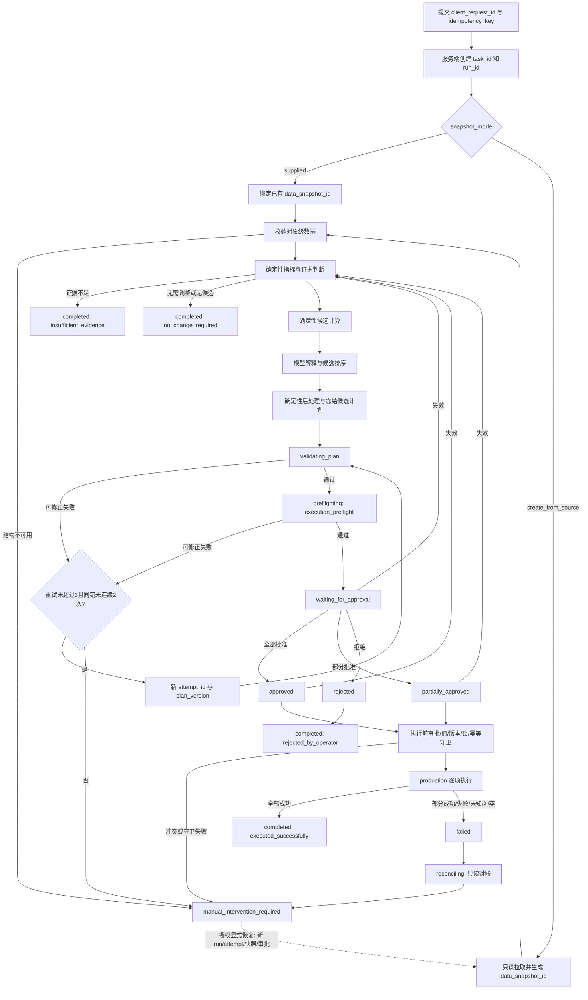
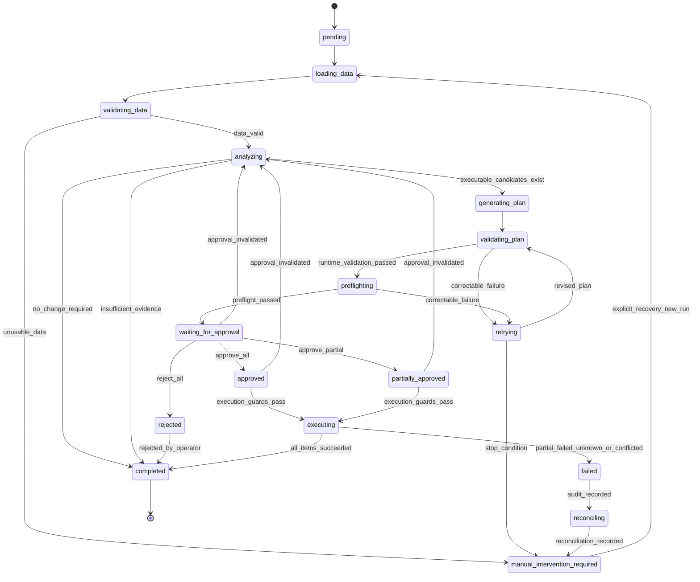

# 亚马逊广告智能体闭环功能设计与 Loop Engineering 工程规范 V0.2

## 1. 文档基本信息

| 项目 | 内容 |
|---|---|
| 文档名称 | 亚马逊广告智能体闭环功能设计与 Loop Engineering 工程规范 V0.2 |
| 项目名称 | 亚马逊广告智能管理系统 |
| 文档版本 | V0.2 |
| 当前阶段 | 第一周工程规格修订；PoC、内部 MVP 与生产化统一基线 |
| 基线文档 | `amazon-ads-agent-loop-engineering-spec-v0.1.md` |
| 编写日期 | 2026-07-16 |
| 编写人 | TBD |
| 审核人 | TBD |
| 文档状态 | 待评审 |
| 适用范围 | 只读分析、确定性候选计算、方案生成、运行期校验、执行预检、人工审批、受控执行、对账、审计与开发期测试 |
| 规范级别 | V0.2 中标记为“必须”的条款是 fail-closed 约束；配置缺失不得以模型推断替代 |

## 2. 版本变更记录

| 版本 | 日期 | 变更说明 | 兼容性影响 | 状态 |
|---|---|---|---|---|
| V0.1 | 2026-07-16 | 建立最小闭环、人工审批、最多三次修订、日志、测试与追踪基线 | 初始版本 | 已被 V0.2 取代 |
| V0.2 | 2026-07-16 | 补全无变更终止、审批失效与人工恢复；新增审批记录、执行、逐项结果、对账、Schema、Decimal、哈希、并发锁；拆分运行期校验和开发期测试；重构模型职责、错误码、测试和追踪矩阵 | DATA、状态、字段和编号均以本版为准；不兼容 V0.1 的审批与执行协议 | 待评审 |

V0.2 是独立、完整的工程基线。实现不得同时解释 V0.1 与 V0.2 的冲突字段；协议协商必须显式使用 `schema_version`。

## 3. 项目背景

亚马逊广告运营需要持续分析 Campaign、Ad Group、Product Ad、Keyword 与 Target 的曝光、点击、消耗、订单和销售数据。人工投手的指标口径、经验和风险偏好可能不一致，原生工具也不能自动形成可验证、可复现的“候选计算—解释—校验—审批—受控执行—对账”证据链。

本系统引入智能体以降低分析和方案组织成本，但关键数值、平台边界、审批与写入守卫由确定性模块控制。智能体是辅助决策、解释和结构化修正工具，不是未经授权的全自动投放系统。任何生产写入均须由认证系统识别的授权人员审批，并在写入前通过摘要、对象值、对象版本、锁和幂等校验。

## 4. 文档目标

| 编号 | 目标 | 机器可判定结果 |
|---|---|---|
| OBJ-001 | 建立内部一致的闭环 | 所有业务分支均到达 `completed` 或 `manual_intervention_required`；`failed` 不作为稳定终态 |
| OBJ-002 | 提供机器可执行协议 | DATA-001～DATA-014 均有字段、约束、枚举、示例或 JSON Schema |
| OBJ-003 | 建立审批和执行安全闭环 | 无活动审批、摘要不一致、权限不足、对象冲突时生产写入次数为 0 |
| OBJ-004 | 支持并发与幂等 | 对象级乐观锁、执行锁、任务/执行幂等键和冲突结果均有确定规则 |
| OBJ-005 | 约束模型职责 | 最终可执行数值仅来自确定性候选和后处理器，模型不得自由生成边界外数值 |
| OBJ-006 | 分离运行期与开发期验证 | 业务任务只运行 Schema、规则、预检和守卫；完整代码测试套件仅在 CI/开发环境运行 |
| OBJ-007 | 支持代码与测试生成 | 功能需求、规则、状态、错误、Schema、测试和验收均可追踪 |
| OBJ-008 | 形成阶段统一基线 | PoC 可以使用 Stub/合成数据，但不得削弱生产路径的审批和 fail-closed 语义 |

## 5. 范围

### 5.1 包含范围

| 编号 | 内容 |
|---|---|
| SCOPE-IN-001 | 任务创建、快照提供或生成、对象级指标分析 |
| SCOPE-IN-002 | 确定性指标、样本、候选区间、Decimal 和取整计算 |
| SCOPE-IN-003 | 模型解释、分类、候选排序、理由和证据引用 |
| SCOPE-IN-004 | 运行期 Schema/引用/规则校验与 `execution_preflight` |
| SCOPE-IN-005 | 方案冻结、RBAC 审批、撤销、过期和失效 |
| SCOPE-IN-006 | dry_run、sandbox、production 三种执行模式及逐项结果 |
| SCOPE-IN-007 | 乐观锁、对象锁、任务与执行幂等、只读对账 |
| SCOPE-IN-008 | 日志、审计、人工恢复、开发期测试、验收与追踪 |

### 5.2 排除范围

| 编号 | 排除项 |
|---|---|
| SCOPE-OUT-001 | 本文不声称 Amazon Ads API、沙箱、生产写入、部署或线上验证已完成 |
| SCOPE-OUT-002 | 首版禁止自动删除、归档、暂停、回滚和自动重放生产写入 |
| SCOPE-OUT-003 | 不包含竞品分析、多广告平台、复杂多智能体、长期记忆、向量知识库和用户自动学习 |
| SCOPE-OUT-004 | `execution_preflight` 不预测未来销量、ACoS、ROAS 或市场变化 |
| SCOPE-OUT-005 | 运行期不得执行单元、集成、回归或端到端代码测试套件 |

### 5.3 阶段化使用

PoC 可使用合成数据、内存锁、API Stub 和 `dry_run`；内部 MVP 可增加持久化、RBAC、沙箱适配器；生产化必须补齐第 38 节的阻断型 TBD。任何阶段都不得省略 Schema、状态守卫、审批摘要、一致性校验和审计事件。

## 6. 用户与系统角色

| 角色编号 | 角色 | 目标与操作 | 权限边界 |
|---|---|---|---|
| ROLE-001 | 广告投手 | 创建分析任务、审阅依据、提交审批决定 | 仅限 RBAC 授权账户和对象；不能伪造身份 |
| ROLE-002 | 跨境电商运营 | 提供经营目标和风险偏好、查看分析 | 默认只读；生产审批权需单独授予 |
| ROLE-003 | 广告运营负责人 | 配置策略、阈值和高风险审批级别 | 不能绕过平台边界和审计 |
| ROLE-004 | 审批人员 | 全部、部分批准或拒绝；撤销活动审批 | 身份来自认证系统；需通过角色和对象范围校验 |
| ROLE-005 | 系统管理员 | 管理账户映射、权限、密钥引用和规则配置 | 管理权限不自动等于业务审批权 |
| ROLE-006 | 开发与测试人员 | 实现模块、运行开发期测试并生成证据 | 非生产或受控环境；不得持有生产业务审批身份 |
| ROLE-007 | AI 编码代理 | 在授权仓库内生成代码、运行 CI 测试、读取失败 | 不得修改生产规则、凭据或线上广告 |
| ROLE-008 | 工作流编排器 | 驱动状态迁移、重试和停止 | 只能执行 ST 迁移表允许的路径 |
| ROLE-009 | 审批服务 | 从认证上下文生成审批记录并校验 RBAC | `approval_id` 只能由该服务生成 |
| ROLE-010 | 执行服务 | 校验审批、锁、幂等和适配器结果 | 生产路径默认拒绝；不得自动重放 |
| ROLE-011 | 确定性规则服务 | 计算指标、候选、阈值、Decimal、哈希和守卫 | 不接受模型对规则版本或边界的修改 |
| ROLE-012 | 只读对账服务 | 状态未知或部分成功后重新读取平台数据 | 不执行补写、回滚或覆盖 |

## 7. 最小业务场景

### 7.1 场景公共约束

所有场景使用对象级 `entity_metrics[]`。派生指标由确定性计算器重算。`requested_risk_profile` 表示用户输入风险偏好；`calculated_risk_level` 表示任务级系统计算风险；`change_risk_level` 表示单项变更风险。三者不得混用。

| 场景编号 | 触发条件 | 分析目标 | 结果与路径 | 异常处理 |
|---|---|---|---|---|
| SCN-001 | Keyword/Target 的点击量 ≥ `min_clicks`；若配置 `target_cvr`，则 `actual_cvr < target_cvr * cvr_alert_ratio`；最低订单量规则见 BR-006 | 识别高点击低转化并选择确定性降价候选 | 数据充分且存在候选：生成计划；缺少 `target_cvr`：降级为 ACoS/零订单规则；两者均不可用：`completed/insufficient_evidence` | 配置缺失不得自由推断阈值；正式执行被阻断 |
| SCN-002 | ACoS 可计算且 `actual_acos > target_acos`，并满足样本阈值 | 选择竞价降低候选或无需调整 | 候选在策略与安全区间内才生成计划 | ACoS 分母为 0 时按证据不足处理 |
| SCN-003 | `budget_utilization_ratio = spend / available_budget_for_period`；达到配置阈值，且满足最低订单、最低 ROAS/目标指标和日内进度条件 | 判断预算是否受限并选择预算提升候选 | 全部前置条件通过才生成不超过上限的候选 | 任一预算周期、数据时间点、可用预算或阈值缺失：`insufficient_evidence`，不写入 |
| SCN-004 | 分析窗口少于 `minimum_analysis_days` 或样本低于阈值 | 输出风险提示 | `analyzing -> completed`；`completion_reason=insufficient_evidence`；`changes=[]`；无需审批 | 不自动重试数据缺失 |
| SCN-005 | 数据充分但无规则触发，或确定性候选集合为空 | 避免无意义调整 | `analyzing -> completed`；`completion_reason=no_change_required`；`changes=[]`；无需审批 | 不进入预检、审批或执行 |
| SCN-006 | 候选超过系统、策略、账户或平台边界 | 阻止越界 | 规则失败；可将候选收敛到合法集合；集合为空则 `no_change_required` | 平台边界未知时 `ERR_PLATFORM_LIMIT_UNKNOWN`，禁止生产执行 |

### 7.2 SCN-001 可执行判定

| 配置 | 类型 | 默认策略 | 缺失处理 |
|---|---|---|---|
| `target_cvr` | decimal ratio string 或 null | 由任务或账户策略提供 | 若缺失，使用配置完整的 ACoS/零订单规则；无可用降级规则则证据不足 |
| `cvr_alert_ratio` | decimal ratio string | TBD-006 | PoC 可配置测试值；生产缺失阻断计划进入审批 |
| `min_clicks` | integer | TBD-006 | 同上 |
| `min_orders` | integer | TBD-006 | `orders < min_orders` 时不得输出高置信度提升建议；降价按已确认规则集处理 |
| `confidence_threshold` | decimal ratio string | 由策略配置版本决定 | 缺失时不得进入审批 |

比较使用高精度 Decimal：`actual_cvr = orders / clicks`，当 `clicks=0` 时为 `null`。若 `target_cvr` 存在，触发条件为 `actual_cvr < target_cvr × cvr_alert_ratio`。置信度由确定性评分公式版本 `confidence_formula_version` 计算，模型不得修改分数。

### 7.3 SCN-003 预算利用率

`available_budget_for_period` 是在 `budget_period_start` 至 `budget_period_end` 内可用的 Decimal 预算；`measurement_at` 是带时区时间点；`elapsed_period_ratio` 由确定性模块按账户时区计算。预算受限必须同时满足：

1. `budget_utilization_ratio >= budget_utilization_threshold`；
2. `elapsed_period_ratio <= budget_pacing_cutoff_ratio`；
3. `orders >= min_conversion_orders`；
4. `roas >= min_roas` 或满足配置的等价目标；
5. 当前预算、平台边界、货币和步长配置完整。

预算利用率阈值使用独立的 `TBD-007`，不得复用审批快照变化阈值。

### 7.4 投放风格配置

| 策略 | 推荐调整比例上限 | 最低置信度 | 允许进入审批 | 风险提示 | 审批级别 |
|---|---:|---:|---|---|---|
| conservative | `min(system_limit, policy.conservative.max_ratio)` | `policy.conservative.min_confidence` | 仅低/中变更风险 | 始终显示 | 标准审批；中风险可要求高级审批 |
| balanced | `min(system_limit, policy.balanced.max_ratio)` | `policy.balanced.min_confidence` | 低/中风险 | 中风险及以上显示 | 中风险按配置升级 |
| aggressive | `min(system_limit, policy.aggressive.max_ratio)` | `policy.aggressive.min_confidence` | 仅策略明确授权的低/中风险；不得突破硬上限 | 始终显示增强警告 | 必须高级审批 |

具体数值由版本化 `strategy_config_version` 提供，集中为 TBD-008。缺失时允许只读分析，但不得生成可审批计划。模型不得解释或补全这些数值。

## 8. 智能体职责和安全边界

### 8.1 允许自动完成

读取授权范围内数据；请求或引用快照；生成解释和证据；在确定性候选集合内排序；生成结构化候选计划；读取运行期校验失败；在未审批阶段最多修订三次；输出无变更结论；冻结计划；等待审批；记录审计。

### 8.2 禁止自动完成

| 安全规则 | 禁止事项 | 强制措施 |
|---|---|---|
| SR-001 | 无有效 `approval_id` 调用 production 写入 | 执行服务 fail-closed |
| SR-002 | 自动删除、归档或暂停广告对象 | 动作枚举和 Adapter 双重拒绝 |
| SR-003 | 绕过 Schema、引用、规则、预检、审批或并发守卫 | 状态机和服务端守卫 |
| SR-004 | 修改任务范围外或不存在的对象 | 快照对象集合校验 |
| SR-005 | 模型生成候选集合外的最终数值 | 确定性后处理拒绝或收敛 |
| SR-006 | 模型修改规则版本、生产代码或生产配置 | 权限隔离；输入字段只读 |
| SR-007 | 无限修订或同错反复重试 | 最多三次；同错连续两次停止 |
| SR-008 | 审批后修改任何计划业务字段 | 摘要变化使审批失效 |
| SR-009 | 自动重放、自动回滚或自动补偿 production 写入 | 执行服务禁止；补偿必须新任务新审批 |
| SR-010 | 对象冲突时采用最后写入覆盖 | 项结果 `conflicted`，写入次数 0 |
| SR-011 | 把超时视为成功或失败 | 结果 `unknown`，只读对账 |
| SR-012 | 信任客户端提交的审批人身份或 `approval_id` | 从认证上下文取身份；审批服务生成 ID |
| SR-013 | 使用普通二进制浮点保存金额或竞价 | Decimal 字符串、定点/Decimal 存储 |
| SR-014 | 运行期触发完整代码测试套件 | 运行时调用白名单限制为 validator/preflight |

### 8.3 必须人工介入

达到修订停止条件、数据或规则配置不完整、权限/API 异常、平台边界未知、审批异常、对象值/版本冲突、部分成功、状态未知、对账不一致、执行结果与批准内容不一致时进入 `manual_intervention_required`。该状态不代表批准。

## 9. 系统模块与职责划分

| 模块编号 | 模块 | 确定性职责 | 禁止职责 |
|---|---|---|---|
| MOD-001 | Task API | 幂等创建任务、生成 task_id | 接收客户端 task_id 作为主键 |
| MOD-002 | Snapshot Service | supplied/create_from_source 互斥处理、冻结对象与版本 | 混用两种模式 |
| MOD-003 | Metrics Engine | Decimal 指标、样本、预算利用率、日内进度 | 使用模型计算关键指标 |
| MOD-004 | Candidate Engine | 生成合法候选值集合和区间 | 自由文本直接成为执行值 |
| MOD-005 | Agent Reasoner | 解释、分类、排序、理由、风险摘要、证据引用 | 决定硬边界或规则版本 |
| MOD-006 | Deterministic Post-processor | Schema、数值、对象、取整、摘要、冻结 | 静默接受无法收敛输出 |
| MOD-007 | Runtime Validator | 引用、业务规则、状态守卫 | 运行 CI 测试套件 |
| MOD-008 | Execution Preflight | 参数合法、前后差异、Adapter 请求结构、无 production 写入 | 预测未来业务指标 |
| MOD-009 | Approval Service | RBAC、范围、审批记录、撤销、过期、消费 | 信任前端身份 |
| MOD-010 | Execution Service | 审批、乐观锁、对象锁、幂等、逐项写入 | 自动重放或覆盖冲突 |
| MOD-011 | Reconciliation Service | 只读重查和逐项对账 | 自动补写/回滚 |
| MOD-012 | Audit Service | 追加式事件、摘要和全链路追踪 | 记录凭据或允许业务方篡改 |
| MOD-013 | CI Test Harness | 单元、集成、安全、回归、Adapter Contract、E2E | 被生产任务动态调用 |

## 10. 功能需求

| 需求编号 | 名称 | 机器可执行要求 | 主要输入/输出 | 异常/状态 | 测试 | 验收 |
|---|---|---|---|---|---|---|
| FR-001 | 幂等创建任务 | 客户端提交 `client_request_id`、`idempotency_key`；服务端生成 `task_id` | DATA-001 → task_id | 冲突返回既有任务或 ERR_IDEMPOTENCY_CONFLICT | TC-001、TC-040 | AC-001 |
| FR-002 | 生成任务输入 | 按 snapshot_mode 生成或绑定唯一快照 | DATA-002 | 失败转人工 | TC-002、TC-039 | AC-002 |
| FR-003 | 校验对象级数据 | Schema、范围、对象引用和版本必须有效 | DATA-002 | 无法分析转人工 | TC-003、TC-038 | AC-002 |
| FR-004 | 确定性计算指标 | 使用 Decimal、统一公式和配置版本 | DATA-002 → 指标集 | 证据不足进入无变更完成 | TC-004、TC-036 | AC-003 |
| FR-005 | 判断证据充分性 | 使用明确样本和时间窗配置 | 指标/规则 | insufficient_evidence 直接 completed | TC-005、TC-026 | AC-003 |
| FR-006 | 生成确定性候选 | 候选区间、步长、上下限由规则引擎产生 | 候选集合 | 配置缺失禁止审批 | TC-006、TC-037 | AC-004 |
| FR-007 | 生成解释与排序 | 模型只能在候选集合内排序并引用证据 | 候选/解释 | 不可收敛转人工 | TC-AI-001～TC-AI-006 | AC-004 |
| FR-008 | 输出无变更结果 | 无候选或证据不足时 changes=[] 且无需审批 | DATA-003 | analyzing→completed | TC-025～TC-027 | AC-003 |
| FR-009 | 生成并冻结计划 | change_id 唯一；记录期望值/版本；计算 plan_digest | DATA-003 | 冻结后变更使审批失效 | TC-007、TC-032 | AC-005 |
| FR-010 | 运行期校验 | Schema、对象、规则、状态守卫全部通过 | DATA-003/014 | 失败可修订或转人工 | TC-008～TC-010 | AC-006 |
| FR-011 | 执行预检 | dry_run 验证参数、差异和适配器请求；production_write_called=false | DATA-003 → preflight | 失败进入修订 | TC-011、TC-047 | AC-006 |
| FR-012 | 自动修订 | 未审批输出最多三次、同错两次停止、每次新 attempt_id/plan_version | DATA-014 | 达限转人工 | TC-012～TC-014 | AC-007 |
| FR-013 | 冻结并等待审批 | 运行期校验和预检通过后停止自动修改 | DATA-003 | waiting_for_approval | TC-015 | AC-008 |
| FR-014 | 创建审批请求 | 客户端提交决定和 change 集合，不提交可信身份 | DATA-004 | 非法集合拒绝 | TC-016、TC-046 | AC-009 |
| FR-015 | 生成审批记录 | 服务端生成 approval_id；认证身份、RBAC、范围、摘要和有效期均有效 | DATA-005 | waiting→approved/partial/rejected | TC-017～TC-021 | AC-009、AC-010 |
| FR-016 | 审批失效/撤销/消费 | 过期、撤销、快照/计划/对象/权限变化失效；执行提交后按规则消费 | DATA-005 | approved/partial/waiting→analyzing | TC-028～TC-033 | AC-010 |
| FR-017 | 创建执行请求 | 绑定活动审批和批准摘要；服务端校验请求项 | DATA-010 | 守卫失败写入 0 次 | TC-034、TC-045 | AC-011 |
| FR-018 | 执行前乐观锁 | 重读对象；值、版本、类型、范围一致；获取未过期锁 | DATA-010 | 冲突项 skipped/conflicted | TC-035、TC-041、TC-042 | AC-012 |
| FR-019 | 幂等逐项执行 | 每个 change_id 有稳定执行键和独立结果 | DATA-010/011 | 不自动重放 | TC-040、TC-043 | AC-013 |
| FR-020 | 聚合执行结果 | 一项成功不代表整体成功；按集合计算 overall_status | DATA-012 | 非全成功进入 failed | TC-043、TC-044 | AC-014 |
| FR-021 | 只读对账 | unknown/partial/conflicted 后重读平台逐项对账 | DATA-013 | failed→reconciling→manual | TC-048、TC-049 | AC-015 |
| FR-022 | 禁止自动补偿 | 补偿必须新 task/run/approval | DATA-013 | 原请求不得重放 | TC-050 | AC-016 |
| FR-023 | 人工恢复 | 授权人员显式发起；新 run_id/attempt_id；重新读取、分析、校验、预检、审批 | DATA-014/人工包 | 旧 run 保持终态 | TC-051 | AC-017 |
| FR-024 | 审计全流程 | 每步骤唯一 step_id/event_id，关联版本与摘要 | DATA-009 | 审计前置失败阻断生产写入 | TC-052、TC-053 | AC-018 |
| FR-025 | 状态机守卫 | 仅允许第 14 节迁移；非法迁移拒绝 | 状态/事件 | ERR_STATE_TRANSITION_INVALID | TC-054 | AC-019 |
| FR-026 | Schema 版本协商 | 仅接受支持版本；未知字段默认拒绝 | 第 23 节 Schema | ERR_SCHEMA_VERSION_UNSUPPORTED | TC-055 | AC-020 |

## 11. 非功能需求

| 编号 | 要求 | 可验证指标 |
|---|---|---|
| NFR-001 | 可追踪性 | 100% 关键事件包含 task_id、run_id、attempt_id、step_id、trace_id、event_id |
| NFR-002 | 可审计性 | 每个 production 执行项可追溯到 approval_id、操作者、摘要、对象版本、平台请求和结果摘要 |
| NFR-003 | 可复现性 | 相同快照、规则版本、策略配置和候选计算结果下，最终对象、动作、Decimal 数值和边界必须一致；文本可不同；不能收敛则转人工 |
| NFR-004 | 审批强制性 | 无活动 approval_id、权限不足、摘要不一致、过期或撤销时 production 写入调用数为 0 |
| NFR-005 | 幂等性 | 相同 task idempotency_key 返回既有任务；相同 item execution key 最多一次平台写入尝试 |
| NFR-006 | 并发安全 | 值或对象版本任一不一致时该项写入调用数为 0，状态为 conflicted |
| NFR-007 | Decimal 精度 | 金额/竞价不使用 JSON number；写入值符合货币小数位、平台步长和 ROUND_HALF_UP |
| NFR-008 | Schema 可执行性 | 12 个交付 Schema 均通过 Draft 2020-12 标准校验器自校验和正反例测试 |
| NFR-009 | 输出稳定性 | 可执行字段经后处理后确定；解释差异不得改变 plan_digest |
| NFR-010 | 安全失败 | 所有生产守卫异常默认拒绝，不得降级为跳过校验 |
| NFR-011 | 日志完整性 | 必需审计事件覆盖率 100%；任何凭据、访问令牌和完整授权头出现次数为 0 |
| NFR-012 | 可恢复性 | 正式执行不得自动重放；人工恢复产生新 run_id，旧审批复用次数为 0 |
| NFR-013 | 运行期隔离 | production 任务触发 CI/单元/集成/回归测试命令次数为 0 |
| NFR-014 | 可维护性 | Schema、规则、策略、适配器均版本化并记录于审计事件 |
| NFR-015 | 范围安全 | 请求、审批、执行对象集合均为认证主体授权范围与任务快照范围的交集 |
| NFR-016 | 时间一致性 | 所有时间为带时区 ISO 8601；服务端审批和执行时间不得信任客户端时钟作安全判定 |

## 12. 完整运行流程



## 13. 状态机



`manual_intervention_required` 对原 `run_id` 是终态。图中的恢复迁移表示授权人员创建同一 `task_id` 下的新 `run_id`；原运行不可变且旧审批不可复用。

## 14. 状态迁移表

| 状态规则 | 当前状态 | 事件/守卫 | 下一状态 | 副作用 | 禁止路径 |
|---|---|---|---|---|---|
| ST-001 | pending | 任务已持久化并分配 run_id | loading_data | 审计 task_created | 直接 analyzing/executing |
| ST-002 | loading_data | 快照模式合法且加载成功 | validating_data | 记录 data_snapshot_id | 混用两种快照模式 |
| ST-003 | validating_data | Schema、对象和范围有效 | analyzing | 记录验证结果 | 结构失败仍生成计划 |
| ST-004 | validating_data | 数据结构不可用/权限失败 | manual_intervention_required | 生成人工包 | 自动反复拉取权限错误 |
| ST-005 | analyzing | 证据不足 | completed | completion_reason=insufficient_evidence；changes=[]；无需审批 | 进入 preflighting/审批 |
| ST-006 | analyzing | 数据充分但无规则触发或候选为空 | completed | completion_reason=no_change_required；changes=[]；无需审批 | 进入 preflighting/审批 |
| ST-007 | analyzing | 存在确定性可执行候选 | generating_plan | 固定候选集合版本 | 模型添加候选外值 |
| ST-008 | generating_plan | 后处理产生计划与摘要 | validating_plan | 新 plan_version/attempt_id | 跳过 Schema/规则 |
| ST-009 | validating_plan | 运行期验证通过 | preflighting | 记录规则结果 | 直接 waiting/executing |
| ST-010 | validating_plan/preflighting | 可修正失败且未达停止条件 | retrying | 记录失败指纹 | 审批后进入 retrying |
| ST-011 | retrying | 新版本生成 | validating_plan | retry_count+1，新 attempt_id | 复用旧 plan_version |
| ST-012 | retrying | retry_count=3 后仍失败、同错连续2次或不可重试 | manual_intervention_required | 冻结失败包 | 继续自动循环 |
| ST-013 | preflighting | dry_run 通过且 production_write_called=false | waiting_for_approval | 冻结 plan_digest | 自动继续修改 |
| ST-014 | waiting_for_approval | 有效 approve_all | approved | 生成 active approval_record | 直接 production 写入 |
| ST-015 | waiting_for_approval | 合法 approve_partial | partially_approved | 冻结批准子集 | 集合未覆盖全部变更 |
| ST-016 | waiting_for_approval | 合法 reject_all | rejected | 记录拒绝原因 | executing |
| ST-017 | rejected | 拒绝审计完成 | completed | completion_reason=rejected_by_operator | executing |
| ST-018 | waiting/approved/partially_approved | 版本、摘要、快照、当前值、权限、过期或撤销任一失效 | analyzing | approval_status 更新；重读数据 | 继续执行旧审批 |
| ST-019 | approved/partially_approved | 活动审批、值/版本一致、锁和幂等守卫通过 | executing | 创建 execution_id | 从其他状态进入 executing |
| ST-020 | executing | 每项均 succeeded | completed | 审批 consumed；completion_reason=executed_successfully | 以单项成功代替整体成功 |
| ST-021 | executing | 任一项 failed/unknown/conflicted 或部分成功 | failed | 记录逐项结果；不得重放 | 直接 completed |
| ST-022 | failed | 执行结果与失败审计已落盘 | reconciling | 启动只读重查 | 自动写入/回滚 |
| ST-023 | reconciling | DATA-013 已生成 | manual_intervention_required | 生成人工包 | 自动补偿后 completed |
| ST-024 | manual_intervention_required | 授权人员显式恢复 | loading_data（新 run） | 新 run_id/attempt_id，恢复审计 | 复用审批/快照直接执行 |

## 15. 标识和版本规则

| 标识/版本 | 语义 | 生成方 | 重试/恢复规则 |
|---|---|---|---|
| `task_id` | 业务任务主键 | Task API | 自动修订和人工恢复保持不变；客户端不得指定 |
| `client_request_id` | 客户端请求追踪号 | 客户端 | 原样记录，不作为系统主键 |
| `run_id` | 一次完整工作流运行 | 编排器 | 自动修订保持；人工恢复必须更新 |
| `attempt_id` | 一次候选生成/修订尝试 | 编排器 | 每次自动修订更新；新 run 从首个 attempt 开始 |
| `step_id` | 一次步骤执行 | 编排器 | 每个步骤每次调用更新 |
| `execution_id` | 一次正式或沙箱执行 | 执行服务 | 每个新 ExecutionRequest 唯一；不得复用以规避幂等 |
| `approval_id` | 一次服务端审批记录 | 审批服务 | 每次重新审批更新；不得客户端指定或复用失效审批 |
| `trace_id` | 跨服务追踪 | API 网关/追踪系统 | 同一调用链保持；新恢复运行可新建 |
| `event_id` | 单个审计事件 | Audit Service | 每个事件唯一 |
| `data_snapshot_id` | 冻结数据版本 | Snapshot Service | 计划与审批绑定；重新分析必须重取/重新确认 |
| `plan_version` | 同一 run 下计划递增版本 | 编排器 | 每次修订 +1；不得回退 |
| `rule_set_version` | 业务/安全规则版本 | 规则服务 | 计划、审批、执行必须一致；变化使审批失效 |
| `strategy_config_version` | 投放风格和风险策略版本 | 配置服务 | 计划与审批绑定；生产缺失阻断 |
| `adapter_version` | 平台适配器契约版本 | 执行服务 | 执行请求必填；不支持则拒绝 |

自动修订时 `task_id`、`run_id`、`data_snapshot_id` 保持，`attempt_id`、`step_id`、`plan_version` 更新。人工恢复时只保留 `task_id` 和原审计链，新建 `run_id`、`attempt_id`、`step_id`、快照、计划、审批和执行标识。

## 16. 输入协议

### 16.1 DATA-001 TaskCreateRequest

客户端不得提交 `task_id`。服务端以 `(authenticated_tenant, idempotency_key)` 建立唯一约束；同键同规范化请求返回已有任务，同键不同请求返回 `ERR_IDEMPOTENCY_CONFLICT`。

```json
{
  "schema_version": "2.0",
  "client_request_id": "client-req-20260716-001",
  "idempotency_key": "store-001-keyword-3001-20260701-20260714",
  "scenario_type": "keyword_bid_optimization",
  "snapshot_mode": "supplied",
  "data_snapshot_id": "snap-20260716-001",
  "source_request": null,
  "requested_risk_profile": "balanced",
  "requested_at": "2026-07-16T10:00:00+08:00"
}
```

| 字段 | 类型 | 必填 | 约束 | 失败处理 |
|---|---|---|---|---|
| schema_version | string | 是 | 固定 `2.0` | ERR_SCHEMA_VERSION_UNSUPPORTED |
| client_request_id | string | 是 | 1～64 字符 | 拒绝请求 |
| idempotency_key | string | 是 | 1～128 字符，租户内唯一语义 | 返回已有任务或冲突错误 |
| scenario_type | enum | 是 | keyword_bid_optimization、campaign_budget_optimization | 拒绝未知枚举 |
| snapshot_mode | enum | 是 | supplied、create_from_source | 条件 Schema 拒绝 |
| data_snapshot_id | string/null | 条件 | supplied 必填；另一模式必须为 null/省略 | 拒绝混用 |
| source_request | object/null | 条件 | create_from_source 必填；supplied 必须为 null/省略 | 拒绝混用 |
| requested_risk_profile | enum | 是 | conservative、balanced、aggressive | 拒绝未知枚举 |
| requested_at | date-time | 是 | 带时区 ISO 8601；仅用于追踪 | 安全判断使用服务端时间 |

### 16.2 DATA-002 TaskInput

TaskInput 由服务端在快照绑定/创建后生成。Campaign、Ad Group、Keyword/Target 和 Product 指标使用分层 `entity_metrics[]`，不得混入无实体层级的扁平对象。

```json
{
  "schema_version": "2.0",
  "task_id": "task-01J2V0ABCD1234567890",
  "run_id": "run-01J2V0EFGH1234567890",
  "scenario_type": "keyword_bid_optimization",
  "snapshot_mode": "supplied",
  "data_snapshot_id": "snap-20260716-001",
  "store_id": "store-001",
  "ad_account_id": "acct-001",
  "scope": {
    "campaign_ids": ["camp-1001"],
    "ad_group_ids": ["ag-2001"],
    "entity_ids": ["kw-3001"]
  },
  "date_range": {
    "start": "2026-07-01",
    "end": "2026-07-14",
    "timezone": "Asia/Shanghai"
  },
  "measurement_at": "2026-07-14T23:59:59+08:00",
  "optimization_goal": "target_acos",
  "requested_risk_profile": "balanced",
  "strategy_config_version": "strategy-0.2-test",
  "rule_set_version": "rules-0.2",
  "target_acos": "0.250000",
  "target_cvr": "0.080000",
  "entity_metrics": [
    {
      "entity_type": "keyword",
      "entity_id": "kw-3001",
      "parent_campaign_id": "camp-1001",
      "parent_ad_group_id": "ag-2001",
      "asin": null,
      "keyword_or_target": {
        "kind": "keyword",
        "value": "wireless travel mouse"
      },
      "object_version": "etag-kw-3001-v7",
      "impressions": 25000,
      "clicks": 420,
      "orders": 30,
      "spend": "315.00",
      "sales": "900.00",
      "currency": "USD",
      "current_bid": "1.20",
      "current_budget": null,
      "available_budget_for_period": null,
      "budget_period_start": null,
      "budget_period_end": null
    }
  ]
}
```

| 字段 | 类型 | 条件与范围 | 缺失处理 |
|---|---|---|---|
| task_id/run_id | string | 服务端生成，非空 | 拒绝内部对象 |
| scenario_type | enum | 与 TaskCreateRequest 一致 | 拒绝 |
| snapshot_mode | enum | supplied/create_from_source | 拒绝混用 |
| data_snapshot_id | string | 服务端冻结快照，必填 | 转人工 |
| store_id/ad_account_id | string | 非空且认证主体有读取范围 | ERR_PERMISSION_DENIED |
| scope | object | 所有计划对象必须同时属于 scope 和快照 | 对象计划被拒绝 |
| date_range | object | end≥start，timezone 为 IANA 时区 | 拒绝 |
| measurement_at | date-time | 不早于 end 对应数据截止时间 | 证据不足或拒绝 |
| optimization_goal | enum | target_acos、increase_sales、control_spend | 拒绝 |
| requested_risk_profile | enum | 三种版本化策略 | 配置缺失阻止审批 |
| strategy_config_version/rule_set_version | string | 必填且可加载 | ERR_RULE_CONFIG_MISSING |
| target_acos/target_cvr | Decimal ratio string/null | 0～1；按场景条件使用 | 依第 7 节降级，否则证据不足 |
| entity_metrics | array | 1～1000 项；entity_id 唯一 | 拒绝空数组 |
| entity_type | enum | campaign、ad_group、keyword、target、product_ad | 拒绝 |
| object_version | string | 执行乐观锁期望版本 | 生产执行缺失即阻断 |
| impressions/clicks/orders | integer | ≥0；clicks≤impressions，orders≤clicks | 拒绝不一致数据 |
| spend/sales | Decimal string | ≥0；同一实体币种一致 | ERR_DECIMAL_PRECISION_INVALID |
| current_bid | Decimal string/null | keyword/target 场景必填 | 条件 Schema 拒绝 |
| current_budget | Decimal string/null | campaign 预算场景必填 | 条件 Schema 拒绝 |
| available_budget_for_period | Decimal string/null | SCN-003 必填 | insufficient_evidence |
| budget_period_start/end | date-time/null | SCN-003 必填，含时区 | insufficient_evidence |

### 16.3 快照模式

| 模式 | 调用方输入 | 系统行为 | 禁止组合 |
|---|---|---|---|
| supplied | 非空 data_snapshot_id；source_request 为 null/省略 | 校验快照存在、未篡改、属于账户范围 | 同时提交 source_request |
| create_from_source | 非空 source_request；data_snapshot_id 为 null/省略 | 只读获取数据、冻结快照、服务端生成 ID | 客户端预设 data_snapshot_id |

## 17. 指标与 Decimal 规则

### 17.1 DATA-006 EntityMetric 与确定性公式

`ctr=clicks/impressions`、`cpc=spend/clicks`、`cvr=orders/clicks`、`acos=spend/sales`、`roas=sales/spend`、`budget_utilization_ratio=spend/available_budget_for_period`。分母为 0 时返回 `null` 和稳定原因码，不以 0 代替未知。

### 17.2 Decimal 规范

| 规则编号 | 规则 |
|---|---|
| BR-001 | 金额、竞价、比例和派生金额在 JSON 中使用正则 `^-?(0|[1-9][0-9]*)(\\.[0-9]+)?$` 的十进制字符串；禁止 JSON number 承载最终业务值 |
| BR-002 | 内部计算使用任意精度 Decimal；禁止 IEEE-754 binary float 参与最终值比较、摘要或写入 |
| BR-003 | 计算中间比例至少保留 12 位小数；展示精度不影响业务值 |
| BR-004 | 写入前先按平台最小/最大值截断合法候选集合，再按 `bid_step`/`budget_step` 以 `ROUND_HALF_UP` 规范化 |
| BR-005 | 货币遵循 ISO 4217；货币小数位来自版本化 `currency_scale_config`，缺失时 production 阻断 |
| BR-006 | Keyword/Target 证据规则使用 `min_clicks`、`min_orders`、`confidence_formula_version`；生产缺失任一配置则不进入审批 |
| BR-007 | 预算场景使用 `budget_period_start/end`、measurement_at、日内进度、利用率、最低订单和最低 ROAS；缺失时证据不足 |
| BR-008 | 比例比较使用规范化 Decimal 精确比较，不使用 `1e-9` 业务容差 |

示例：平台竞价步长 `0.01` 时，`1.235` 按 `ROUND_HALF_UP` 规范为 `1.24`。该步长仅为测试示例；实际平台步长由 TBD-004 配置，缺失时禁止 production。

## 18. 智能体输出协议

### 18.1 DATA-003 AgentOutput

可执行计划示例：

```json
{
  "schema_version": "2.0",
  "task_id": "task-01J2V0ABCD1234567890",
  "run_id": "run-01J2V0EFGH1234567890",
  "attempt_id": "attempt-0002",
  "current_status": "waiting_for_approval",
  "completion_reason": null,
  "analysis_summary": "关键词 ACoS 高于目标，确定性候选引擎给出一个合法降价候选。",
  "issues": [
    {
      "issue_id": "issue-001",
      "type": "acos_above_target",
      "evidence_paths": ["entity_metrics[0].spend", "entity_metrics[0].sales", "target_acos"]
    }
  ],
  "plan_version": 2,
  "rule_set_version": "rules-0.2",
  "strategy_config_version": "strategy-0.2-test",
  "data_snapshot_id": "snap-20260716-001",
  "plan_digest": "sha256:7e4d3a2f4bbd0a0b1d15ab00f2d86dcbf81e5b7b1cc91e1d7a6b2800f1234567",
  "changes": [
    {
      "change_id": "chg-0001",
      "object_type": "keyword",
      "object_id": "kw-3001",
      "action": "update_bid",
      "expected_current_value": "1.20",
      "expected_object_version": "etag-kw-3001-v7",
      "candidate_set_id": "candidates-kw-3001-v1",
      "candidate_values": ["1.02", "1.08", "1.14"],
      "suggested_value": "1.08",
      "change_ratio": "-0.100000000000",
      "reason": "ACoS 为 0.350000，高于目标 0.250000；选择规则引擎提供的中间降价候选。",
      "evidence": [
        {"path": "entity_metrics[0].spend", "value": "315.00"},
        {"path": "entity_metrics[0].sales", "value": "900.00"},
        {"path": "target_acos", "value": "0.250000"}
      ],
      "confidence": "0.840000",
      "change_risk_level": "medium"
    }
  ],
  "calculated_risk_level": "medium",
  "runtime_validation": {
    "passed": true,
    "failed_rule_ids": []
  },
  "execution_preflight": {
    "passed": true,
    "preflight_id": "preflight-0001",
    "production_write_called": false
  },
  "retry_count": 1,
  "human_approval_required": true,
  "generated_at": "2026-07-16T10:30:00+08:00"
}
```

无变更合法终止示例：

```json
{
  "schema_version": "2.0",
  "task_id": "task-01J2V0ABCD1234567891",
  "run_id": "run-01J2V0EFGH1234567891",
  "attempt_id": "attempt-0001",
  "current_status": "completed",
  "completion_reason": "no_change_required",
  "analysis_summary": "数据充分，当前指标位于已配置安全区间，确定性候选集合为空。",
  "issues": [],
  "plan_version": 0,
  "rule_set_version": "rules-0.2",
  "strategy_config_version": "strategy-0.2-test",
  "data_snapshot_id": "snap-20260716-002",
  "plan_digest": null,
  "changes": [],
  "calculated_risk_level": "low",
  "runtime_validation": null,
  "execution_preflight": null,
  "retry_count": 0,
  "human_approval_required": false,
  "generated_at": "2026-07-16T10:31:00+08:00"
}
```

`completion_reason` 枚举为 `executed_successfully`、`no_change_required`、`insufficient_evidence`、`rejected_by_operator`。当 `changes=[]` 时，状态必须为 `completed`，原因只能为 `no_change_required` 或 `insufficient_evidence`，`human_approval_required=false`，且运行期预检、审批和执行字段不得伪造为已完成。

### 18.2 DATA-007 RuntimeValidationResult

包含 `schema_validation`、`object_reference_validation`、`business_rule_validation`、`state_guard_validation`、失败规则 ID 和 DATA-014。全部通过才可进入 `preflighting`。

### 18.3 DATA-008 ExecutionPreflightResult

包含 `preflight_id`、`adapter_version`、规范化请求摘要、逐项前后差异、参数合法性、Adapter 结构验证、`production_write_called=false`。其结果不包含未来销量、ACoS 或 ROAS 预测。

## 19. 审批请求与审批记录协议

### 19.1 DATA-004 ApprovalRequest

客户端只提交决策和变更集合。`operator_subject`、角色和范围不得作为可信客户端输入。

```json
{
  "schema_version": "2.0",
  "task_id": "task-01J2V0ABCD1234567890",
  "run_id": "run-01J2V0EFGH1234567890",
  "plan_version": 2,
  "data_snapshot_id": "snap-20260716-001",
  "plan_digest": "sha256:7e4d3a2f4bbd0a0b1d15ab00f2d86dcbf81e5b7b1cc91e1d7a6b2800f1234567",
  "decision": "approve_partial",
  "approved_change_ids": ["chg-0001"],
  "rejected_change_ids": ["chg-0002"],
  "comment": "批准竞价调整；拒绝预算调整。",
  "requested_at": "2026-07-16T11:00:00+08:00"
}
```

### 19.2 DATA-005 ApprovalRecord

```json
{
  "schema_version": "2.0",
  "approval_id": "approval-01J2V1XYZ1234567890",
  "task_id": "task-01J2V0ABCD1234567890",
  "run_id": "run-01J2V0EFGH1234567890",
  "plan_version": 2,
  "data_snapshot_id": "snap-20260716-001",
  "approved_plan_digest": "sha256:7e4d3a2f4bbd0a0b1d15ab00f2d86dcbf81e5b7b1cc91e1d7a6b2800f1234567",
  "approval_digest": "sha256:3d1d9e0ba9876d1f44eaef17b33af4ef7a6c59108c83a4c0d5ac8d00f7654321",
  "approved_change_ids": ["chg-0001"],
  "rejected_change_ids": ["chg-0002"],
  "decision": "approve_partial",
  "operator_subject": "auth0|operator-9001",
  "operator_display_name": "TBD",
  "operator_roles": ["ads_approver"],
  "operator_scope": {
    "ad_account_ids": ["acct-001"],
    "object_ids": ["kw-3001"]
  },
  "approved_at": "2026-07-16T11:00:01+08:00",
  "expires_at": "2026-07-16T15:00:01+08:00",
  "approval_version": 1,
  "approval_status": "active",
  "revoked_at": null,
  "revoked_by": null,
  "revocation_reason": null,
  "rule_set_version": "rules-0.2"
}
```

| 审批规则 | 规则 |
|---|---|
| BR-009 | `approval_id` 由 Approval Service 生成；客户端传入该字段时 ApprovalRequest Schema 拒绝 |
| BR-010 | `operator_subject`、角色和范围来自认证/RBAC 上下文；前端展示名不作为授权依据 |
| BR-011 | approve_all：批准集合等于全部待审批项，拒绝集合为空；approve_partial：两集合互斥且并集覆盖全部项，批准集合非空；reject_all：拒绝集合等于全部项，批准集合为空且 comment 非空 |
| BR-012 | 审批绑定唯一 task/run/snapshot/plan_version/rule_set_version/approved_plan_digest |
| BR-013 | `approval_status` 枚举为 active、expired、invalidated、revoked、consumed；只有 active 可用于新 execution |
| BR-014 | 审批过期、撤销、权限变化、冻结计划任何字段变化（包括理由、证据和展示字段）、当前值或对象版本变化均不得执行；冻结记录禁止原地修改，任何修订必须生成新 plan_version |
| BR-015 | Execution Service 接受执行请求后以原子操作将审批从 active 置为 consumed 或绑定唯一 execution_id；同一 approval_id 不得创建第二个不同 production execution |
| BR-016 | transport 重试只能查询同一 execution_id 的既有结果，不得再次触发平台写入；不允许“重试使用”审批创建新执行 |
| BR-017 | 撤销 active 审批须有授权主体、时间和非空原因；consumed 审批不可撤销以改变历史，只能追加审计说明 |

## 20. 执行请求协议

### 20.1 DATA-010 ExecutionRequest

```json
{
  "schema_version": "2.0",
  "execution_id": "exec-01J2V2ABC1234567890",
  "task_id": "task-01J2V0ABCD1234567890",
  "run_id": "run-01J2V0EFGH1234567890",
  "approval_id": "approval-01J2V1XYZ1234567890",
  "plan_version": 2,
  "data_snapshot_id": "snap-20260716-001",
  "approved_plan_digest": "sha256:7e4d3a2f4bbd0a0b1d15ab00f2d86dcbf81e5b7b1cc91e1d7a6b2800f1234567",
  "idempotency_key": "exec:approval-01J2V1XYZ1234567890:v1",
  "requested_change_ids": ["chg-0001"],
  "requested_at": "2026-07-16T11:05:00+08:00",
  "request_actor": "auth0|operator-9001",
  "execution_mode": "production",
  "adapter_version": "amazon-ads-adapter-0.2",
  "execution_request_digest": "sha256:285b7bdca98e5e3018eb1ace58d6b4eb01b32b5870bc10a4d6e16700f1111111"
}
```

`execution_mode` 为 `dry_run`、`sandbox`、`production`。production 必须验证活动审批；dry_run/sandbox 不得被记录为 production 成功。`request_actor` 从服务端认证上下文写入或核对，不能仅信任请求正文。

### 20.2 每项执行键

稳定项键为 `SHA-256(approval_id + execution_id + change_id + approved_plan_digest + execution_mode)` 的规范化 JSON 摘要。平台支持原生幂等键时必须传递；不支持时由本地执行账本、对象锁和结果表联合保证至多一次尝试语义。

## 21. 执行结果协议

### 21.1 DATA-011 ExecutionItemResult

```json
{
  "schema_version": "2.0",
  "execution_id": "exec-01J2V2ABC1234567890",
  "change_id": "chg-0001",
  "object_type": "keyword",
  "object_id": "kw-3001",
  "action": "update_bid",
  "expected_current_value": "1.20",
  "expected_object_version": "etag-kw-3001-v7",
  "actual_current_value_before_write": "1.20",
  "actual_object_version": "etag-kw-3001-v7",
  "requested_value": "1.08",
  "actual_value_after_write": "1.08",
  "lock_token": "lock-01J2V2LOCK1234567890",
  "lock_expires_at": "2026-07-16T11:06:00+08:00",
  "status": "succeeded",
  "platform_request_id": "amazon-request-abc123",
  "platform_response_code": "200",
  "error_code": null,
  "error_message_summary": null,
  "started_at": "2026-07-16T11:05:01+08:00",
  "finished_at": "2026-07-16T11:05:02+08:00",
  "result_digest": "sha256:4c81094e407fd2d10aa5c3ac00dff9b513b99a2db31ff80ba429000022222222"
}
```

状态为 `pending`、`succeeded`、`failed`、`unknown`、`skipped`、`conflicted`。每个 requested_change_id 必须恰有一项结果。超时且不能确定平台是否受理时必须为 `unknown`，不得填充成功值。

### 21.2 DATA-012 ExecutionResult

```json
{
  "schema_version": "2.0",
  "execution_id": "exec-01J2V2ABC1234567890",
  "overall_status": "succeeded",
  "item_results": [
    {
      "change_id": "chg-0001",
      "status": "succeeded",
      "result_digest": "sha256:4c81094e407fd2d10aa5c3ac00dff9b513b99a2db31ff80ba429000022222222"
    }
  ],
  "succeeded_change_ids": ["chg-0001"],
  "failed_change_ids": [],
  "unknown_change_ids": [],
  "conflicted_change_ids": [],
  "started_at": "2026-07-16T11:05:01+08:00",
  "finished_at": "2026-07-16T11:05:02+08:00",
  "production_write_called": true,
  "reconciliation_required": false,
  "audit_event_ids": ["evt-1001", "evt-1002", "evt-1003"]
}
```

`overall_status` 为 `succeeded`、`partially_succeeded`、`failed`、`unknown`、`conflicted`。只有全部项 `succeeded` 才能为 `succeeded`。混合成功/失败/未知/冲突为 `partially_succeeded`；全未知为 `unknown`；全冲突为 `conflicted`；无成功且至少一个确定失败为 `failed`。除全成功外均不得进入正常完成路径。

## 22. 对账结果协议

### 22.1 DATA-013 ReconciliationResult

```json
{
  "schema_version": "2.0",
  "reconciliation_id": "recon-01J2V3ABC1234567890",
  "execution_id": "exec-01J2V2ABC1234567890",
  "read_at": "2026-07-16T11:10:00+08:00",
  "items": [
    {
      "change_id": "chg-0001",
      "object_id": "kw-3001",
      "approved_value": "1.08",
      "platform_latest_value": "1.08",
      "actual_recorded_value": null,
      "reconciliation_status": "matches_approved_value",
      "manual_intervention_required": true,
      "new_compensation_task_allowed": false
    }
  ],
  "overall_reconciliation_status": "confirmed_applied",
  "manual_intervention_required": true,
  "new_compensation_task_allowed": false,
  "original_write_replay_allowed": false,
  "audit_event_ids": ["evt-1010", "evt-1011"]
}
```

`reconciliation_status` 为 `matches_approved_value`、`matches_original_value`、`different_from_both`、`object_missing`、`read_failed`。`overall_reconciliation_status` 为 `confirmed_applied`、`confirmed_not_applied`、`mixed`、`unresolved`。即使只读对账确认值已应用，V0.2 中发生过 `failed` 的原 run 仍转人工，以满足失败审计和避免重复业务动作。后续补偿必须新建任务、新快照、新审批；`original_write_replay_allowed` 固定为 false。

## 23. JSON Schema 规范

### 23.1 Schema 交付物清单

| Schema 文件 | 协议 | 版本 | 必须覆盖的条件 |
|---|---|---|---|
| task-create-request.schema.json | DATA-001 | 2.0 | snapshot_mode 互斥、scenario enum、客户端无 task_id |
| task-input.schema.json | DATA-002/006 | 2.0 | 对象层级、场景条件必填、Decimal、快照 |
| agent-output.schema.json | DATA-003 | 2.0 | 空 changes、action/object 组合、计划摘要 |
| approval-request.schema.json | DATA-004 | 2.0 | 三种 decision 的集合条件、客户端无身份/approval_id |
| approval-record.schema.json | DATA-005 | 2.0 | RBAC 身份、状态、撤销字段、摘要和有效期 |
| execution-request.schema.json | DATA-010 | 2.0 | 三种执行模式、活动审批引用、幂等和摘要 |
| execution-item-result.schema.json | DATA-011 | 2.0 | 每项状态、锁、值/版本和平台响应 |
| execution-result.schema.json | DATA-012 | 2.0 | 总状态、互斥结果集合、对账标志 |
| reconciliation-result.schema.json | DATA-013 | 2.0 | 平台最新值、批准值、对账结论、禁止重放 |
| audit-event.schema.json | DATA-009 | 2.0 | 全层级 ID、occurred_at、摘要和错误 |
| failure-analysis.schema.json | DATA-014 | 2.0 | 错误指纹、可修正性、重试决定 |
| manual-intervention-package.schema.json | DATA-015 | 2.0 | 原因、全部版本、审批/执行/对账引用、恢复约束 |

所有 Schema 使用 JSON Schema Draft 2020-12，必须具有 `$id`、`title`、`description`、`x-schema-version`，根对象和所有受控子对象默认 `additionalProperties:false`。未知字段一律校验失败；向前扩展通过新 `schema_version` 和显式协商，不允许静默忽略。格式断言必须开启 `date-time` 校验，时间必须包含 `Z` 或显式 UTC offset。

以下为 V0.2 的可执行核心版本；实际落盘文件必须与这些约束语义一致。

### 23.2 task-create-request.schema.json

```json
{
  "$schema": "https://json-schema.org/draft/2020-12/schema",
  "$id": "https://example.internal/schemas/amazon-ads/v2/task-create-request.schema.json",
  "title": "TaskCreateRequest",
  "description": "Create an Amazon Ads optimization task without a client-generated task_id.",
  "x-schema-version": "2.0",
  "type": "object",
  "additionalProperties": false,
  "required": ["schema_version", "client_request_id", "idempotency_key", "scenario_type", "snapshot_mode", "requested_risk_profile", "requested_at"],
  "properties": {
    "schema_version": {"const": "2.0"},
    "client_request_id": {"type": "string", "minLength": 1, "maxLength": 64},
    "idempotency_key": {"type": "string", "minLength": 1, "maxLength": 128},
    "scenario_type": {"enum": ["keyword_bid_optimization", "campaign_budget_optimization"]},
    "snapshot_mode": {"enum": ["supplied", "create_from_source"]},
    "data_snapshot_id": {"type": ["string", "null"], "minLength": 1, "maxLength": 128},
    "source_request": {
      "type": ["object", "null"],
      "additionalProperties": false,
      "required": ["store_id", "ad_account_id", "date_range"],
      "properties": {
        "store_id": {"type": "string", "minLength": 1, "maxLength": 64},
        "ad_account_id": {"type": "string", "minLength": 1, "maxLength": 64},
        "date_range": {
          "type": "object",
          "additionalProperties": false,
          "required": ["start", "end", "timezone"],
          "properties": {
            "start": {"type": "string", "format": "date"},
            "end": {"type": "string", "format": "date"},
            "timezone": {"type": "string", "minLength": 1, "maxLength": 64}
          }
        }
      }
    },
    "requested_risk_profile": {"enum": ["conservative", "balanced", "aggressive"]},
    "requested_at": {"type": "string", "format": "date-time"}
  },
  "allOf": [
    {
      "if": {"properties": {"snapshot_mode": {"const": "supplied"}}},
      "then": {"required": ["data_snapshot_id"], "properties": {"source_request": {"type": "null"}, "data_snapshot_id": {"type": "string"}}},
      "else": {"required": ["source_request"], "properties": {"data_snapshot_id": {"type": "null"}, "source_request": {"type": "object"}}}
    }
  ]
}
```

### 23.3 task-input.schema.json

```json
{
  "$schema": "https://json-schema.org/draft/2020-12/schema",
  "$id": "https://example.internal/schemas/amazon-ads/v2/task-input.schema.json",
  "title": "TaskInput",
  "description": "Server-created task input bound to one immutable data snapshot.",
  "x-schema-version": "2.0",
  "type": "object",
  "additionalProperties": false,
  "required": ["schema_version", "task_id", "run_id", "scenario_type", "snapshot_mode", "data_snapshot_id", "store_id", "ad_account_id", "scope", "date_range", "measurement_at", "optimization_goal", "requested_risk_profile", "strategy_config_version", "rule_set_version", "entity_metrics"],
  "properties": {
    "schema_version": {"const": "2.0"},
    "task_id": {"type": "string", "minLength": 1, "maxLength": 128},
    "run_id": {"type": "string", "minLength": 1, "maxLength": 128},
    "scenario_type": {"enum": ["keyword_bid_optimization", "campaign_budget_optimization"]},
    "snapshot_mode": {"enum": ["supplied", "create_from_source"]},
    "data_snapshot_id": {"type": "string", "minLength": 1, "maxLength": 128},
    "store_id": {"type": "string", "minLength": 1, "maxLength": 64},
    "ad_account_id": {"type": "string", "minLength": 1, "maxLength": 64},
    "scope": {
      "type": "object",
      "additionalProperties": false,
      "required": ["campaign_ids", "ad_group_ids", "entity_ids"],
      "properties": {
        "campaign_ids": {"type": "array", "uniqueItems": true, "items": {"type": "string", "minLength": 1}},
        "ad_group_ids": {"type": "array", "uniqueItems": true, "items": {"type": "string", "minLength": 1}},
        "entity_ids": {"type": "array", "minItems": 1, "uniqueItems": true, "items": {"type": "string", "minLength": 1}}
      }
    },
    "date_range": {
      "type": "object",
      "additionalProperties": false,
      "required": ["start", "end", "timezone"],
      "properties": {"start": {"type": "string", "format": "date"}, "end": {"type": "string", "format": "date"}, "timezone": {"type": "string", "minLength": 1}}
    },
    "measurement_at": {"type": "string", "format": "date-time"},
    "optimization_goal": {"enum": ["target_acos", "increase_sales", "control_spend"]},
    "requested_risk_profile": {"enum": ["conservative", "balanced", "aggressive"]},
    "strategy_config_version": {"type": "string", "minLength": 1},
    "rule_set_version": {"type": "string", "minLength": 1},
    "target_acos": {"oneOf": [{"$ref": "#/$defs/ratio"}, {"type": "null"}]},
    "target_cvr": {"oneOf": [{"$ref": "#/$defs/ratio"}, {"type": "null"}]},
    "entity_metrics": {"type": "array", "minItems": 1, "maxItems": 1000, "items": {"$ref": "#/$defs/entity_metric"}}
  },
  "$defs": {
    "decimal": {"type": "string", "pattern": "^(0|[1-9][0-9]*)(\\.[0-9]+)?$", "maxLength": 40},
    "ratio": {"type": "string", "pattern": "^(0(\\.[0-9]+)?|1(\\.0+)?)$", "maxLength": 20},
    "entity_metric": {
      "type": "object",
      "additionalProperties": false,
      "required": ["entity_type", "entity_id", "object_version", "impressions", "clicks", "orders", "spend", "sales", "currency", "current_bid", "current_budget", "available_budget_for_period", "budget_period_start", "budget_period_end"],
      "properties": {
        "entity_type": {"enum": ["campaign", "ad_group", "keyword", "target", "product_ad"]},
        "entity_id": {"type": "string", "minLength": 1},
        "parent_campaign_id": {"type": ["string", "null"]},
        "parent_ad_group_id": {"type": ["string", "null"]},
        "asin": {"type": ["string", "null"], "maxLength": 32},
        "keyword_or_target": {
          "oneOf": [
            {"type": "null"},
            {"type": "object", "additionalProperties": false, "required": ["kind", "value"], "properties": {"kind": {"enum": ["keyword", "target"]}, "value": {"type": "string", "minLength": 1, "maxLength": 256}}}
          ]
        },
        "object_version": {"type": "string", "minLength": 1},
        "impressions": {"type": "integer", "minimum": 0},
        "clicks": {"type": "integer", "minimum": 0},
        "orders": {"type": "integer", "minimum": 0},
        "spend": {"$ref": "#/$defs/decimal"},
        "sales": {"$ref": "#/$defs/decimal"},
        "currency": {"type": "string", "pattern": "^[A-Z]{3}$"},
        "current_bid": {"oneOf": [{"$ref": "#/$defs/decimal"}, {"type": "null"}]},
        "current_budget": {"oneOf": [{"$ref": "#/$defs/decimal"}, {"type": "null"}]},
        "available_budget_for_period": {"oneOf": [{"$ref": "#/$defs/decimal"}, {"type": "null"}]},
        "budget_period_start": {"type": ["string", "null"], "format": "date-time"},
        "budget_period_end": {"type": ["string", "null"], "format": "date-time"}
      }
    }
  },
  "allOf": [
    {
      "if": {"properties": {"scenario_type": {"const": "keyword_bid_optimization"}}},
      "then": {"properties": {"entity_metrics": {"contains": {"type": "object", "required": ["entity_type", "current_bid", "keyword_or_target"], "properties": {"entity_type": {"enum": ["keyword", "target"]}, "current_bid": {"type": "string"}, "keyword_or_target": {"type": "object"}}}}}},
      "else": {"properties": {"entity_metrics": {"contains": {"type": "object", "required": ["entity_type", "current_budget"], "properties": {"entity_type": {"const": "campaign"}, "current_budget": {"type": "string"}}}}}}
    }
  ]
}
```

### 23.4 agent-output.schema.json

```json
{
  "$schema": "https://json-schema.org/draft/2020-12/schema",
  "$id": "https://example.internal/schemas/amazon-ads/v2/agent-output.schema.json",
  "title": "AgentOutput",
  "description": "Deterministically post-processed agent analysis and frozen change plan.",
  "x-schema-version": "2.0",
  "type": "object",
  "additionalProperties": false,
  "required": ["schema_version", "task_id", "run_id", "attempt_id", "current_status", "completion_reason", "analysis_summary", "issues", "plan_version", "rule_set_version", "strategy_config_version", "data_snapshot_id", "plan_digest", "changes", "calculated_risk_level", "runtime_validation", "execution_preflight", "retry_count", "human_approval_required", "generated_at"],
  "properties": {
    "schema_version": {"const": "2.0"},
    "task_id": {"type": "string", "minLength": 1},
    "run_id": {"type": "string", "minLength": 1},
    "attempt_id": {"type": "string", "minLength": 1},
    "current_status": {"enum": ["generating_plan", "validating_plan", "preflighting", "waiting_for_approval", "completed", "manual_intervention_required"]},
    "completion_reason": {"type": ["string", "null"], "enum": ["executed_successfully", "no_change_required", "insufficient_evidence", "rejected_by_operator", null]},
    "analysis_summary": {"type": "string", "minLength": 1, "maxLength": 4000},
    "issues": {"type": "array", "items": {"type": "object", "additionalProperties": false, "required": ["issue_id", "type", "evidence_paths"], "properties": {"issue_id": {"type": "string", "minLength": 1}, "type": {"type": "string", "minLength": 1}, "evidence_paths": {"type": "array", "uniqueItems": true, "items": {"type": "string", "minLength": 1}}}}},
    "plan_version": {"type": "integer", "minimum": 0},
    "rule_set_version": {"type": "string", "minLength": 1},
    "strategy_config_version": {"type": "string", "minLength": 1},
    "data_snapshot_id": {"type": "string", "minLength": 1},
    "plan_digest": {"type": ["string", "null"], "pattern": "^sha256:[0-9a-f]{64}$"},
    "changes": {"type": "array", "uniqueItems": true, "items": {"$ref": "#/$defs/change"}},
    "calculated_risk_level": {"enum": ["low", "medium", "high", "critical"]},
    "runtime_validation": {
      "oneOf": [
        {"type": "null"},
        {"type": "object", "additionalProperties": false, "required": ["passed", "failed_rule_ids"], "properties": {"passed": {"type": "boolean"}, "failed_rule_ids": {"type": "array", "uniqueItems": true, "items": {"type": "string", "pattern": "^(BR|SR)-[0-9]{3}$"}}}}
      ]
    },
    "execution_preflight": {
      "oneOf": [
        {"type": "null"},
        {"type": "object", "additionalProperties": false, "required": ["passed", "preflight_id", "production_write_called"], "properties": {"passed": {"type": "boolean"}, "preflight_id": {"type": "string", "minLength": 1}, "production_write_called": {"const": false}}}
      ]
    },
    "retry_count": {"type": "integer", "minimum": 0, "maximum": 3},
    "human_approval_required": {"type": "boolean"},
    "generated_at": {"type": "string", "format": "date-time"}
  },
  "$defs": {
    "decimal": {"type": "string", "pattern": "^-?(0|[1-9][0-9]*)(\\.[0-9]+)?$"},
    "change": {
      "type": "object",
      "additionalProperties": false,
      "required": ["change_id", "object_type", "object_id", "action", "expected_current_value", "expected_object_version", "candidate_set_id", "candidate_values", "suggested_value", "change_ratio", "reason", "evidence", "confidence", "change_risk_level"],
      "properties": {
        "change_id": {"type": "string", "minLength": 1},
        "object_type": {"enum": ["campaign", "keyword", "target"]},
        "object_id": {"type": "string", "minLength": 1},
        "action": {"enum": ["update_budget", "update_bid"]},
        "expected_current_value": {"$ref": "#/$defs/decimal"},
        "expected_object_version": {"type": "string", "minLength": 1},
        "candidate_set_id": {"type": "string", "minLength": 1},
        "candidate_values": {"type": "array", "minItems": 1, "uniqueItems": true, "items": {"$ref": "#/$defs/decimal"}},
        "suggested_value": {"$ref": "#/$defs/decimal"},
        "change_ratio": {"$ref": "#/$defs/decimal"},
        "reason": {"type": "string", "minLength": 1, "maxLength": 2000},
        "evidence": {"type": "array", "minItems": 1, "items": {"type": "object", "additionalProperties": false, "required": ["path", "value"], "properties": {"path": {"type": "string", "minLength": 1}, "value": {"type": ["string", "integer", "null"]}}}},
        "confidence": {"type": "string", "pattern": "^(0(\\.[0-9]+)?|1(\\.0+)?)$"},
        "change_risk_level": {"enum": ["low", "medium", "high", "critical"]}
      },
      "oneOf": [
        {"properties": {"object_type": {"const": "campaign"}, "action": {"const": "update_budget"}}},
        {"properties": {"object_type": {"enum": ["keyword", "target"]}, "action": {"const": "update_bid"}}}
      ]
    }
  },
  "allOf": [
    {
      "if": {"properties": {"changes": {"maxItems": 0}}},
      "then": {"properties": {"current_status": {"const": "completed"}, "completion_reason": {"enum": ["no_change_required", "insufficient_evidence"]}, "plan_version": {"const": 0}, "plan_digest": {"type": "null"}, "runtime_validation": {"type": "null"}, "execution_preflight": {"type": "null"}, "human_approval_required": {"const": false}}},
      "else": {"properties": {"plan_version": {"minimum": 1}, "plan_digest": {"type": "string"}, "human_approval_required": {"const": true}}}
    }
  ]
}
```

### 23.5 approval-request.schema.json

```json
{
  "$schema": "https://json-schema.org/draft/2020-12/schema",
  "$id": "https://example.internal/schemas/amazon-ads/v2/approval-request.schema.json",
  "title": "ApprovalRequest",
  "description": "Client decision request; authenticated operator identity is not accepted from the payload.",
  "x-schema-version": "2.0",
  "type": "object",
  "additionalProperties": false,
  "required": ["schema_version", "task_id", "run_id", "plan_version", "data_snapshot_id", "plan_digest", "decision", "approved_change_ids", "rejected_change_ids", "comment", "requested_at"],
  "properties": {
    "schema_version": {"const": "2.0"},
    "task_id": {"type": "string", "minLength": 1},
    "run_id": {"type": "string", "minLength": 1},
    "plan_version": {"type": "integer", "minimum": 1},
    "data_snapshot_id": {"type": "string", "minLength": 1},
    "plan_digest": {"type": "string", "pattern": "^sha256:[0-9a-f]{64}$"},
    "decision": {"enum": ["approve_all", "approve_partial", "reject_all"]},
    "approved_change_ids": {"type": "array", "uniqueItems": true, "items": {"type": "string", "minLength": 1}},
    "rejected_change_ids": {"type": "array", "uniqueItems": true, "items": {"type": "string", "minLength": 1}},
    "comment": {"type": "string", "maxLength": 2000},
    "requested_at": {"type": "string", "format": "date-time"}
  },
  "oneOf": [
    {"properties": {"decision": {"const": "approve_all"}, "approved_change_ids": {"minItems": 1}, "rejected_change_ids": {"maxItems": 0}}},
    {"properties": {"decision": {"const": "approve_partial"}, "approved_change_ids": {"minItems": 1}, "rejected_change_ids": {"minItems": 1}}},
    {"properties": {"decision": {"const": "reject_all"}, "approved_change_ids": {"maxItems": 0}, "rejected_change_ids": {"minItems": 1}, "comment": {"minLength": 1}}}
  ]
}
```

Schema 只能验证基本集合形状；“approve_all 覆盖全部”和“部分批准两集合并集覆盖全部且互斥”必须由 BR-011 对照冻结计划执行。

### 23.6 approval-record.schema.json

```json
{
  "$schema": "https://json-schema.org/draft/2020-12/schema",
  "$id": "https://example.internal/schemas/amazon-ads/v2/approval-record.schema.json",
  "title": "ApprovalRecord",
  "description": "Server-generated approval record bound to authenticated identity and a frozen plan digest.",
  "x-schema-version": "2.0",
  "type": "object",
  "additionalProperties": false,
  "required": ["schema_version", "approval_id", "task_id", "run_id", "plan_version", "data_snapshot_id", "approved_plan_digest", "approval_digest", "approved_change_ids", "rejected_change_ids", "decision", "operator_subject", "operator_display_name", "operator_roles", "operator_scope", "approved_at", "expires_at", "approval_version", "approval_status", "revoked_at", "revoked_by", "revocation_reason", "rule_set_version"],
  "properties": {
    "schema_version": {"const": "2.0"},
    "approval_id": {"type": "string", "minLength": 1},
    "task_id": {"type": "string", "minLength": 1},
    "run_id": {"type": "string", "minLength": 1},
    "plan_version": {"type": "integer", "minimum": 1},
    "data_snapshot_id": {"type": "string", "minLength": 1},
    "approved_plan_digest": {"type": "string", "pattern": "^sha256:[0-9a-f]{64}$"},
    "approval_digest": {"type": "string", "pattern": "^sha256:[0-9a-f]{64}$"},
    "approved_change_ids": {"type": "array", "uniqueItems": true, "items": {"type": "string", "minLength": 1}},
    "rejected_change_ids": {"type": "array", "uniqueItems": true, "items": {"type": "string", "minLength": 1}},
    "decision": {"enum": ["approve_all", "approve_partial", "reject_all"]},
    "operator_subject": {"type": "string", "minLength": 1, "maxLength": 256},
    "operator_display_name": {"type": "string", "minLength": 1, "maxLength": 256},
    "operator_roles": {"type": "array", "minItems": 1, "uniqueItems": true, "items": {"type": "string", "minLength": 1}},
    "operator_scope": {"type": "object", "additionalProperties": false, "required": ["ad_account_ids", "object_ids"], "properties": {"ad_account_ids": {"type": "array", "minItems": 1, "uniqueItems": true, "items": {"type": "string"}}, "object_ids": {"type": "array", "minItems": 1, "uniqueItems": true, "items": {"type": "string"}}}},
    "approved_at": {"type": "string", "format": "date-time"},
    "expires_at": {"type": "string", "format": "date-time"},
    "approval_version": {"type": "integer", "minimum": 1},
    "approval_status": {"enum": ["active", "expired", "invalidated", "revoked", "consumed"]},
    "revoked_at": {"type": ["string", "null"], "format": "date-time"},
    "revoked_by": {"type": ["string", "null"]},
    "revocation_reason": {"type": ["string", "null"], "maxLength": 2000},
    "rule_set_version": {"type": "string", "minLength": 1}
  },
  "allOf": [
    {
      "if": {"properties": {"approval_status": {"const": "revoked"}}},
      "then": {"properties": {"revoked_at": {"type": "string"}, "revoked_by": {"type": "string", "minLength": 1}, "revocation_reason": {"type": "string", "minLength": 1}}},
      "else": {"properties": {"revoked_at": {"type": "null"}, "revoked_by": {"type": "null"}, "revocation_reason": {"type": "null"}}}
    }
  ]
}
```

### 23.7 execution-request.schema.json

```json
{
  "$schema": "https://json-schema.org/draft/2020-12/schema",
  "$id": "https://example.internal/schemas/amazon-ads/v2/execution-request.schema.json",
  "title": "ExecutionRequest",
  "description": "Idempotent execution request bound to an approval and frozen plan digest.",
  "x-schema-version": "2.0",
  "type": "object",
  "additionalProperties": false,
  "required": ["schema_version", "execution_id", "task_id", "run_id", "approval_id", "plan_version", "data_snapshot_id", "approved_plan_digest", "idempotency_key", "requested_change_ids", "requested_at", "request_actor", "execution_mode", "adapter_version", "execution_request_digest"],
  "properties": {
    "schema_version": {"const": "2.0"},
    "execution_id": {"type": "string", "minLength": 1, "maxLength": 128},
    "task_id": {"type": "string", "minLength": 1},
    "run_id": {"type": "string", "minLength": 1},
    "approval_id": {"type": "string", "minLength": 1},
    "plan_version": {"type": "integer", "minimum": 1},
    "data_snapshot_id": {"type": "string", "minLength": 1},
    "approved_plan_digest": {"type": "string", "pattern": "^sha256:[0-9a-f]{64}$"},
    "idempotency_key": {"type": "string", "minLength": 1, "maxLength": 256},
    "requested_change_ids": {"type": "array", "minItems": 1, "uniqueItems": true, "items": {"type": "string", "minLength": 1}},
    "requested_at": {"type": "string", "format": "date-time"},
    "request_actor": {"type": "string", "minLength": 1},
    "execution_mode": {"enum": ["dry_run", "sandbox", "production"]},
    "adapter_version": {"type": "string", "minLength": 1},
    "execution_request_digest": {"type": "string", "pattern": "^sha256:[0-9a-f]{64}$"}
  },
  "if": {"properties": {"execution_mode": {"const": "production"}}},
  "then": {"properties": {"approval_id": {"minLength": 1}, "requested_change_ids": {"minItems": 1}}}
}
```

### 23.8 execution-item-result.schema.json

```json
{
  "$schema": "https://json-schema.org/draft/2020-12/schema",
  "$id": "https://example.internal/schemas/amazon-ads/v2/execution-item-result.schema.json",
  "title": "ExecutionItemResult",
  "description": "Independent result for exactly one requested change.",
  "x-schema-version": "2.0",
  "type": "object",
  "additionalProperties": false,
  "required": ["schema_version", "execution_id", "change_id", "object_type", "object_id", "action", "expected_current_value", "expected_object_version", "actual_current_value_before_write", "actual_object_version", "requested_value", "actual_value_after_write", "lock_token", "lock_expires_at", "status", "platform_request_id", "platform_response_code", "error_code", "error_message_summary", "started_at", "finished_at", "result_digest"],
  "properties": {
    "schema_version": {"const": "2.0"},
    "execution_id": {"type": "string", "minLength": 1},
    "change_id": {"type": "string", "minLength": 1},
    "object_type": {"enum": ["campaign", "keyword", "target"]},
    "object_id": {"type": "string", "minLength": 1},
    "action": {"enum": ["update_budget", "update_bid"]},
    "expected_current_value": {"$ref": "#/$defs/decimal"},
    "expected_object_version": {"type": "string", "minLength": 1},
    "actual_current_value_before_write": {"oneOf": [{"$ref": "#/$defs/decimal"}, {"type": "null"}]},
    "actual_object_version": {"type": ["string", "null"]},
    "requested_value": {"$ref": "#/$defs/decimal"},
    "actual_value_after_write": {"oneOf": [{"$ref": "#/$defs/decimal"}, {"type": "null"}]},
    "lock_token": {"type": ["string", "null"]},
    "lock_expires_at": {"type": ["string", "null"], "format": "date-time"},
    "status": {"enum": ["pending", "succeeded", "failed", "unknown", "skipped", "conflicted"]},
    "platform_request_id": {"type": ["string", "null"]},
    "platform_response_code": {"type": ["string", "null"]},
    "error_code": {"type": ["string", "null"]},
    "error_message_summary": {"type": ["string", "null"], "maxLength": 2000},
    "started_at": {"type": "string", "format": "date-time"},
    "finished_at": {"type": ["string", "null"], "format": "date-time"},
    "result_digest": {"type": "string", "pattern": "^sha256:[0-9a-f]{64}$"}
  },
  "$defs": {"decimal": {"type": "string", "pattern": "^(0|[1-9][0-9]*)(\\.[0-9]+)?$"}},
  "allOf": [
    {"oneOf": [
      {"properties": {"object_type": {"const": "campaign"}, "action": {"const": "update_budget"}}},
      {"properties": {"object_type": {"enum": ["keyword", "target"]}, "action": {"const": "update_bid"}}}
    ]},
    {
      "if": {"properties": {"status": {"const": "succeeded"}}},
      "then": {"properties": {"actual_value_after_write": {"type": "string"}, "platform_request_id": {"type": "string", "minLength": 1}, "error_code": {"type": "null"}}},
      "else": {"if": {"properties": {"status": {"enum": ["failed", "unknown", "conflicted"]}}}, "then": {"properties": {"error_code": {"type": "string", "minLength": 1}}}}
    }
  ]
}
```

### 23.9 execution-result.schema.json

```json
{
  "$schema": "https://json-schema.org/draft/2020-12/schema",
  "$id": "https://example.internal/schemas/amazon-ads/v2/execution-result.schema.json",
  "title": "ExecutionResult",
  "description": "Aggregate execution result with independent item status sets.",
  "x-schema-version": "2.0",
  "type": "object",
  "additionalProperties": false,
  "required": ["schema_version", "execution_id", "overall_status", "item_results", "succeeded_change_ids", "failed_change_ids", "unknown_change_ids", "conflicted_change_ids", "started_at", "finished_at", "production_write_called", "reconciliation_required", "audit_event_ids"],
  "properties": {
    "schema_version": {"const": "2.0"},
    "execution_id": {"type": "string", "minLength": 1},
    "overall_status": {"enum": ["succeeded", "partially_succeeded", "failed", "unknown", "conflicted"]},
    "item_results": {"type": "array", "minItems": 1, "items": {"type": "object", "additionalProperties": false, "required": ["change_id", "status", "result_digest"], "properties": {"change_id": {"type": "string", "minLength": 1}, "status": {"enum": ["pending", "succeeded", "failed", "unknown", "skipped", "conflicted"]}, "result_digest": {"type": "string", "pattern": "^sha256:[0-9a-f]{64}$"}}}},
    "succeeded_change_ids": {"$ref": "#/$defs/id_set"},
    "failed_change_ids": {"$ref": "#/$defs/id_set"},
    "unknown_change_ids": {"$ref": "#/$defs/id_set"},
    "conflicted_change_ids": {"$ref": "#/$defs/id_set"},
    "started_at": {"type": "string", "format": "date-time"},
    "finished_at": {"type": "string", "format": "date-time"},
    "production_write_called": {"type": "boolean"},
    "reconciliation_required": {"type": "boolean"},
    "audit_event_ids": {"type": "array", "minItems": 1, "uniqueItems": true, "items": {"type": "string", "minLength": 1}}
  },
  "$defs": {"id_set": {"type": "array", "uniqueItems": true, "items": {"type": "string", "minLength": 1}}},
  "if": {"properties": {"overall_status": {"const": "succeeded"}}},
  "then": {"properties": {"failed_change_ids": {"maxItems": 0}, "unknown_change_ids": {"maxItems": 0}, "conflicted_change_ids": {"maxItems": 0}, "reconciliation_required": {"const": false}}},
  "else": {"properties": {"reconciliation_required": {"const": true}}}
}
```

集合互斥、并集覆盖 `item_results.change_id` 以及总状态计算由 BR-030 执行，不能仅依赖 Schema。

### 23.10 reconciliation-result.schema.json

```json
{
  "$schema": "https://json-schema.org/draft/2020-12/schema",
  "$id": "https://example.internal/schemas/amazon-ads/v2/reconciliation-result.schema.json",
  "title": "ReconciliationResult",
  "description": "Read-only reconciliation after partial, unknown, failed, or conflicted execution.",
  "x-schema-version": "2.0",
  "type": "object",
  "additionalProperties": false,
  "required": ["schema_version", "reconciliation_id", "execution_id", "read_at", "items", "overall_reconciliation_status", "manual_intervention_required", "new_compensation_task_allowed", "original_write_replay_allowed", "audit_event_ids"],
  "properties": {
    "schema_version": {"const": "2.0"},
    "reconciliation_id": {"type": "string", "minLength": 1},
    "execution_id": {"type": "string", "minLength": 1},
    "read_at": {"type": "string", "format": "date-time"},
    "items": {"type": "array", "minItems": 1, "items": {"$ref": "#/$defs/item"}},
    "overall_reconciliation_status": {"enum": ["confirmed_applied", "confirmed_not_applied", "mixed", "unresolved"]},
    "manual_intervention_required": {"const": true},
    "new_compensation_task_allowed": {"type": "boolean"},
    "original_write_replay_allowed": {"const": false},
    "audit_event_ids": {"type": "array", "minItems": 1, "uniqueItems": true, "items": {"type": "string"}}
  },
  "$defs": {
    "decimal_or_null": {"oneOf": [{"type": "string", "pattern": "^(0|[1-9][0-9]*)(\\.[0-9]+)?$"}, {"type": "null"}]},
    "item": {
      "type": "object",
      "additionalProperties": false,
      "required": ["change_id", "object_id", "approved_value", "platform_latest_value", "actual_recorded_value", "reconciliation_status", "manual_intervention_required", "new_compensation_task_allowed"],
      "properties": {
        "change_id": {"type": "string", "minLength": 1},
        "object_id": {"type": "string", "minLength": 1},
        "approved_value": {"$ref": "#/$defs/decimal_or_null"},
        "platform_latest_value": {"$ref": "#/$defs/decimal_or_null"},
        "actual_recorded_value": {"$ref": "#/$defs/decimal_or_null"},
        "reconciliation_status": {"enum": ["matches_approved_value", "matches_original_value", "different_from_both", "object_missing", "read_failed"]},
        "manual_intervention_required": {"const": true},
        "new_compensation_task_allowed": {"type": "boolean"}
      }
    }
  }
}
```

### 23.11 audit-event.schema.json

```json
{
  "$schema": "https://json-schema.org/draft/2020-12/schema",
  "$id": "https://example.internal/schemas/amazon-ads/v2/audit-event.schema.json",
  "title": "AuditEvent",
  "description": "Append-only event for replaying and auditing the workflow.",
  "x-schema-version": "2.0",
  "type": "object",
  "additionalProperties": false,
  "required": ["schema_version", "event_id", "event_type", "occurred_at", "task_id", "run_id", "attempt_id", "step_id", "trace_id", "actor_subject", "actor_type", "from_state", "to_state", "data_snapshot_id", "plan_version", "approval_id", "execution_id", "result", "error_code", "payload_digest"],
  "properties": {
    "schema_version": {"const": "2.0"},
    "event_id": {"type": "string", "minLength": 1},
    "event_type": {"type": "string", "minLength": 1, "maxLength": 128},
    "occurred_at": {"type": "string", "format": "date-time"},
    "task_id": {"type": "string", "minLength": 1},
    "run_id": {"type": "string", "minLength": 1},
    "attempt_id": {"type": ["string", "null"]},
    "step_id": {"type": "string", "minLength": 1},
    "trace_id": {"type": "string", "minLength": 1},
    "actor_subject": {"type": "string", "minLength": 1},
    "actor_type": {"enum": ["user", "agent", "system", "api"]},
    "from_state": {"type": ["string", "null"]},
    "to_state": {"type": ["string", "null"]},
    "data_snapshot_id": {"type": ["string", "null"]},
    "plan_version": {"type": ["integer", "null"], "minimum": 0},
    "approval_id": {"type": ["string", "null"]},
    "execution_id": {"type": ["string", "null"]},
    "result": {"enum": ["started", "passed", "failed", "blocked", "completed"]},
    "error_code": {"type": ["string", "null"]},
    "payload_digest": {"type": "string", "pattern": "^sha256:[0-9a-f]{64}$"}
  }
}
```

### 23.12 failure-analysis.schema.json

### DATA-014 FailureAnalysis

```json
{
  "$schema": "https://json-schema.org/draft/2020-12/schema",
  "$id": "https://example.internal/schemas/amazon-ads/v2/failure-analysis.schema.json",
  "title": "FailureAnalysis",
  "description": "Machine-readable failure classification for bounded automatic revision.",
  "x-schema-version": "2.0",
  "type": "object",
  "additionalProperties": false,
  "required": ["schema_version", "task_id", "run_id", "attempt_id", "step_id", "error_code", "error_category", "severity", "error_fingerprint", "correctable_by_plan_revision", "automatic_retry_allowed", "retry_count", "same_error_consecutive_count", "next_state", "failed_paths", "observed_at"],
  "properties": {
    "schema_version": {"const": "2.0"},
    "task_id": {"type": "string", "minLength": 1},
    "run_id": {"type": "string", "minLength": 1},
    "attempt_id": {"type": "string", "minLength": 1},
    "step_id": {"type": "string", "minLength": 1},
    "error_code": {"type": "string", "pattern": "^ERR_[A-Z0-9_]+$"},
    "error_category": {"enum": ["schema", "data", "rule", "approval", "concurrency", "execution", "platform", "security", "internal"]},
    "severity": {"enum": ["info", "warning", "high", "critical"]},
    "error_fingerprint": {"type": "string", "pattern": "^sha256:[0-9a-f]{64}$"},
    "correctable_by_plan_revision": {"type": "boolean"},
    "automatic_retry_allowed": {"type": "boolean"},
    "retry_count": {"type": "integer", "minimum": 0, "maximum": 3},
    "same_error_consecutive_count": {"type": "integer", "minimum": 1, "maximum": 2},
    "next_state": {"enum": ["retrying", "completed", "analyzing", "failed", "manual_intervention_required"]},
    "failed_paths": {"type": "array", "uniqueItems": true, "items": {"type": "string"}},
    "observed_at": {"type": "string", "format": "date-time"}
  },
  "if": {"properties": {"automatic_retry_allowed": {"const": true}}},
  "then": {"properties": {"correctable_by_plan_revision": {"const": true}, "next_state": {"const": "retrying"}}}
}
```

### 23.13 manual-intervention-package.schema.json

### DATA-015 ManualInterventionPackage

```json
{
  "$schema": "https://json-schema.org/draft/2020-12/schema",
  "$id": "https://example.internal/schemas/amazon-ads/v2/manual-intervention-package.schema.json",
  "title": "ManualInterventionPackage",
  "description": "Immutable evidence package for an authorized human to inspect or explicitly recover.",
  "x-schema-version": "2.0",
  "type": "object",
  "additionalProperties": false,
  "required": ["schema_version", "package_id", "task_id", "run_id", "reason_codes", "failure_analysis_ids", "data_snapshot_ids", "plan_versions", "approval_ids", "execution_ids", "reconciliation_ids", "audit_event_ids", "automatic_replay_allowed", "old_approval_reuse_allowed", "recovery_requires_new_run", "created_at"],
  "properties": {
    "schema_version": {"const": "2.0"},
    "package_id": {"type": "string", "minLength": 1},
    "task_id": {"type": "string", "minLength": 1},
    "run_id": {"type": "string", "minLength": 1},
    "reason_codes": {"type": "array", "minItems": 1, "uniqueItems": true, "items": {"type": "string", "pattern": "^ERR_[A-Z0-9_]+$"}},
    "failure_analysis_ids": {"type": "array", "uniqueItems": true, "items": {"type": "string"}},
    "data_snapshot_ids": {"type": "array", "minItems": 1, "uniqueItems": true, "items": {"type": "string"}},
    "plan_versions": {"type": "array", "uniqueItems": true, "items": {"type": "integer", "minimum": 0}},
    "approval_ids": {"type": "array", "uniqueItems": true, "items": {"type": "string"}},
    "execution_ids": {"type": "array", "uniqueItems": true, "items": {"type": "string"}},
    "reconciliation_ids": {"type": "array", "uniqueItems": true, "items": {"type": "string"}},
    "audit_event_ids": {"type": "array", "minItems": 1, "uniqueItems": true, "items": {"type": "string"}},
    "automatic_replay_allowed": {"const": false},
    "old_approval_reuse_allowed": {"const": false},
    "recovery_requires_new_run": {"const": true},
    "created_at": {"type": "string", "format": "date-time"}
  }
}
```

### 23.14 Schema 正反例要求

每个 Schema 必须至少有一个合法样例和以下非法样例：未知字段；错误 schema_version；无时区时间；金额为 JSON number；超长字符串；未知枚举。条件 Schema 还必须覆盖：

| 示例编号 | 非法输入 | 预期 |
|---|---|---|
| SCHEMA-EX-001 | snapshot_mode=supplied 且同时有 source_request | task-create-request 校验失败 |
| SCHEMA-EX-002 | keyword_bid_optimization 无 current_bid 或 keyword_or_target | task-input 校验失败 |
| SCHEMA-EX-003 | changes=[] 但 waiting_for_approval=true/状态 waiting_for_approval | agent-output 校验失败 |
| SCHEMA-EX-004 | campaign + update_bid | agent-output/execution-item-result 校验失败 |
| SCHEMA-EX-005 | approve_partial 的批准或拒绝集合为空 | approval-request 校验失败 |
| SCHEMA-EX-006 | revoked 状态但无 revoked_by/reason | approval-record 校验失败 |
| SCHEMA-EX-007 | succeeded 项无 actual_value_after_write 或 platform_request_id | execution-item-result 校验失败 |
| SCHEMA-EX-008 | overall_status=succeeded 但 unknown_change_ids 非空 | execution-result 校验失败 |

## 24. 自动循环和停止条件

自动循环只作用于尚未审批的结构化输出，不修改生产代码、规则、策略、平台配置或线上广告。初始方案为 `attempt-0001/plan_version=1`；最多允许 3 次自动修订，因此单个 run 最多产生 4 个方案版本。

```yaml
automatic_revision_policy:
  policy_version: "2.0"
  initial_attempt_number: 1
  max_automatic_revisions: 3
  max_plan_versions_per_run: 4
  same_error_consecutive_stop_count: 2
  revision_scope:
    - explanation
    - evidence_references
    - candidate_selection_within_deterministic_set
    - schema_conforming_structure
  immutable_during_revision:
    - data_snapshot_id
    - rule_set_version
    - strategy_config_version
    - deterministic_candidate_values
    - platform_limits
  non_retryable_categories:
    - missing_data
    - permission_error
    - api_error
    - platform_limit_unknown
    - approval_error
    - concurrency_conflict
  on_runtime_validation_pass:
    next_state: preflighting
  on_preflight_pass:
    freeze_plan: true
    next_state: waiting_for_approval
  stop_conditions:
    - all_runtime_validations_passed
    - max_automatic_revisions_reached
    - same_error_seen_twice_consecutively
    - non_retryable_error
    - manual_cancellation
```

每次失败生成 DATA-014，错误指纹以 `error_code + failed_paths + rule_set_version + normalized_actual_values` 计算，不包含时间和展示文本。测试通过的旧表述在本版统一为“运行期校验与执行预检通过”。进入 `waiting_for_approval` 后自动修改次数必须保持不变。

## 25. 业务规则和安全规则

### 25.1 业务规则

| 规则编号 | 可执行规则 | 校验阶段 | 缺失/失败处理 |
|---|---|---|---|
| BR-018 | 单次预算调整绝对比例不得超过 `min(0.20, strategy_limit, account_limit)`；0.20 为 V0.2 暂定硬上限 | Candidate、validation、execution | 候选剔除；配置缺失阻断审批 |
| BR-019 | 单次竞价调整绝对比例不得超过 `min(0.15, strategy_limit, account_limit)`；0.15 为 V0.2 暂定硬上限 | 同上 | 同上 |
| BR-020 | 分析天数小于 `minimum_analysis_days` 时 completion_reason=insufficient_evidence | analyzing | 直接完成，无审批 |
| BR-021 | 确定性候选集合为空时 completion_reason=no_change_required | analyzing | 直接完成，无审批 |
| BR-022 | suggested_value 必须属于 candidate_values，且 candidate_values 全部由 Candidate Engine 生成 | post-processing | 无法收敛转人工 |
| BR-023 | change_ratio 使用 `(suggested-current)/current` 的 Decimal 值并规范为 12 位比例字符串 | post-processing | 输出失败，可修订 |
| BR-024 | 写入值必须符合货币精度、平台步长、最小值和最大值 | validation、execution | 未知边界 fail-closed |
| BR-025 | 每个 change_id 在 task 内唯一；每个对象在单一计划版本中最多一个同类型动作 | plan freeze | 拒绝计划 |
| BR-026 | 证据路径必须存在于同一 data_snapshot_id，数值与确定性重算结果一致 | validation | 可修订引用；不得改原始数据 |
| BR-027 | 风险策略数值只从 strategy_config_version 加载 | Candidate、approval | 缺失时只读分析，不进入审批 |
| BR-028 | 审批失效触发包括：plan_version、plan_digest、snapshot 阈值、当前值、对象版本、权限、有效期、撤销和 rule_set_version 变化 | approval/execution guard | approval_status=invalidated/expired/revoked；重新分析 |
| BR-029 | 每个 requested_change_id 恰有一个 DATA-011；状态集合互斥 | execution aggregation | 结果无效并转人工 |
| BR-030 | DATA-012 的四个 change_id 集合互斥，和 `item_results` 中需归类项的并集一致；overall_status 按第 21.2 节确定性计算 | aggregation | ERR_EXECUTION_RESULT_INVALID，进入 failed |
| BR-031 | 对账只比较规范 Decimal、对象 ID 和批准值，不根据文本推断 | reconciliation | 无法读取为 unresolved |
| BR-032 | completion_reason 与状态组合：前三种业务完成原因仅在 completed；executed_successfully 仅全项成功；rejected_by_operator 仅经 rejected | state guard | 非法迁移拒绝 |

### 25.2 安全规则补充

| 安全规则 | 规则 | 失败结果 |
|---|---|---|
| SR-015 | production ExecutionRequest 必须引用 active approval_id，且唯一绑定相同 task/run/plan/snapshot/rules/digest | 写入 0 次 |
| SR-016 | 执行前必须重新读取对象并验证存在、范围、类型、值和版本 | 任一失败，整个请求写入 0 次；冲突项 conflicted，其余 skipped |
| SR-017 | 执行锁以对象和动作维度获取，包含 lock_token、lock_expires_at；过期锁不得写入 | 写入 0 次 |
| SR-018 | 锁获取和审批 active→consumed/execution 绑定必须在本地事务中保持唯一性 | 冲突返回既有执行或拒绝 |
| SR-019 | 请求/审批/执行摘要必须按第 26.3 节重算并恒等 | 不一致写入 0 次 |
| SR-020 | 外部平台不支持原子版本条件时，写入前最后一步再次只读并比较；比较和写入间风险记录为 TBD-013 | 不满足则禁止 production |
| SR-021 | 所有 production 写入项必须先产生 `execution_item_started` 审计事件，结果后产生终态事件 | 前置审计失败写入 0 次 |
| SR-022 | 部分成功/unknown/conflicted 不得标记 completed 或复用原审批补写 | failed→reconciling→manual |
| SR-023 | approval_id、execution_id 和 item execution key 必须防重放 | 重放返回既有结果或安全错误，不新增写入 |

## 26. 并发、幂等和乐观锁

### 26.1 写入前对象级守卫

执行服务在任何 production Adapter 调用前对全部请求项完成以下校验；任一项失败则整个 ExecutionRequest 不进行生产写入：

1. 对象存在且仍属于 task scope 与 operator_scope；
2. `object_type` 与冻结计划一致；
3. `actual_current_value == expected_current_value`，按规范 Decimal 比较；
4. `actual_object_version == expected_object_version`；
5. approval_status=active 且未过期、未撤销、未失效；
6. plan/rule/snapshot/approval 摘要一致；
7. 对象没有其他未过期执行锁；
8. execution/item 幂等键未被不同请求占用。

并发守卫内部记录统一包含：`expected_current_value`、`expected_object_version`、`actual_current_value`、`actual_object_version`、`lock_token`、`lock_expires_at`。其中 `actual_current_value` 在对外 DATA-011 中序列化为语义更精确的 `actual_current_value_before_write`；两者是内部字段到协议字段的一一映射，不是两个独立业务值。

冲突时 DATA-011 必须写入 `actual_current_value_before_write`、`actual_object_version`、`status=conflicted` 和对应错误码；其他未执行项为 `skipped`。模型不得覆盖新值，也不得要求 last-write-wins。

### 26.2 并发与幂等算法

```text
begin local transaction
  load approval FOR UPDATE
  require approval.status == active
  require approval is bound to request digest and actor scope
  return existing result if identical execution idempotency key exists
  reject if same key maps to a different request digest
  read all target objects from platform or authoritative cache
  compare every expected value and expected object version
  acquire every object lock in deterministic object_id order
  if any comparison or lock fails: persist conflicted/skipped results; commit; stop
  bind approval to execution_id and mark consumed atomically
  persist execution intent and per-item execution keys
commit local transaction
for each item in deterministic order:
  write at most once through adapter
  persist independent item result
aggregate result; never auto-replay failed or unknown writes
```

不同 `idempotency_key` 但修改同一对象不能规避对象锁。锁服务不可用时 production fail-closed。锁超时仅释放本地占用，不代表平台调用失败或成功；若平台状态未知，进入对账。

### 26.3 规范化哈希

统一流程：UTF-8 编码；采用 RFC 8785 JSON Canonicalization Scheme 等价的固定键序和无多余空白序列化；所有业务 Decimal 先规范为无指数的十进制字符串，去除无意义前导零，保留规则要求的小数位；数组按业务语义排序（changes 按 change_id，集合按字典序）；使用 SHA-256；输出前缀 `sha256:`。

| 摘要 | 参与字段 | 排除字段 |
|---|---|---|
| `plan_digest` | task_id、run_id、plan_version、data_snapshot_id、rule_set_version、strategy_config_version、按 change_id 排序的 object_type/object_id/action/expected_current_value/expected_object_version/suggested_value/change_ratio/change_risk_level | generated_at、analysis_summary、reason、展示名、模型原始文本 |
| `approval_digest` | approval_id、上述 plan_digest、decision、批准/拒绝集合、operator_subject、operator_roles、operator_scope、approved_at、expires_at、approval_version、rule_set_version | operator_display_name、后续状态字段、撤销展示文本 |
| `execution_request_digest` | execution_id、task_id、run_id、approval_id、plan_version、snapshot、approved_plan_digest、idempotency_key、requested_change_ids、execution_mode、adapter_version | requested_at、展示字段 |
| `result_digest` | execution_id、change_id、对象/动作、期望/实际值和版本、requested_value、status、platform_request_id/code、error_code、started_at/finished_at | error_message_summary、展示文本 |

任何参与 `plan_digest` 的字段变化均使审批失效。因展示文本不参与执行摘要，冻结计划存储还必须采用不可变记录：理由、证据、生成时间等任何字段若需变化，必须新建 `plan_version`，从而使原审批失效；不得在原版本上原地修改。`approval_digest` 用于审批记录防篡改；执行时仍必须独立重算 plan_digest 和 execution_request_digest。

## 27. Prompt、规则引擎与确定性计算职责边界

### 27.1 确定性计算与规则引擎

必须负责指标计算、样本判断、候选集合、比例、Decimal、取整、货币/竞价步长、平台边界、对象引用、风险评分、审批守卫、执行守卫、摘要和总状态。相同输入和版本必须得到相同可执行数值。

### 27.2 大模型

仅可负责：多指标关系解释；问题分类；确定性候选集合内排序；可读理由；风险摘要；证据引用；根据 DATA-014 修正未审批的结构化输出。模型不得发明对象、候选数值、平台上下限、规则版本；不得修改生产代码/配置；不得直接决定是否审批或执行。

Prompt 必须包含：允许的对象清单、候选集合、Schema 版本、规则与策略版本只读标识、禁止动作、失败反馈和输出 JSON-only 约束。Prompt 不承载唯一安全规则；所有安全约束必须在服务端重复执行。

### 27.3 确定性后处理器

按固定顺序执行：Schema 校验 → 对象引用 → candidate membership → Decimal 重算 → 比例重算 → 平台步长规范化 → 业务/安全规则 → 规范化摘要 → 输出冻结。若两个模型输出文本不同但选择等价候选，最终业务计划必须相同；若模型选择不同候选，确定性排序规则决定唯一值；无法唯一收敛则转人工，不进入审批。

## 28. 执行预检

`execution_preflight` 是运行期参数预演，不是开发测试，也不是未来效果预测。

| 预检编号 | 校验 | 输出 |
|---|---|---|
| PF-001 | Schema 和 action/object 合法组合 | 字段路径与结果 |
| PF-002 | Decimal、比例、步长、平台边界 | 规范化前后值 |
| PF-003 | 计划对象位于快照和 task scope | 对象引用结果 |
| PF-004 | Adapter 请求结构满足 `adapter_version` Contract | 请求摘要，不含凭据 |
| PF-005 | 修改前后差异和批准预览 | change_id、before、after、ratio |
| PF-006 | 确认未调用 production 写入 | `production_write_called=false`，调用桩计数 0 |

`dry_run` 可以调用只读 Adapter 或本地 Stub，但不得调用写入端点。它不能声称预测未来销量、ACoS、ROAS、排名或竞争变化。

## 29. 异常和错误码

| 错误码 | 分类 | 严重度 | 自动重试/次数 | 用户提示 | 系统处理 | 下一状态 | 转人工 | 审计要求 |
|---|---|---|---|---|---|---|---|---|
| ERR_NO_EXECUTABLE_CHANGE | 业务完成 | info | 否/0 | 当前无需调整 | changes=[] | completed | 否 | 记录候选为空依据 |
| ERR_INSUFFICIENT_EVIDENCE | 业务完成 | warning | 否/0 | 数据不足，仅输出风险提示 | changes=[] | completed | 否 | 记录缺失配置/样本 |
| ERR_APPROVAL_MISSING | 审批安全 | critical | 否/0 | 缺少有效审批 | 拒绝执行，写入0次 | waiting_for_approval | 是 | security_event |
| ERR_APPROVAL_EXPIRED | 审批安全 | high | 否/0 | 审批已过期 | status=expired，旧审批不可用 | analyzing | 否 | approval_invalidated |
| ERR_APPROVAL_INVALIDATED | 审批安全 | high | 否/0 | 审批已失效 | status=invalidated，重新分析 | analyzing | 否 | 原因与新旧摘要 |
| ERR_APPROVAL_REVOKED | 审批安全 | high | 否/0 | 审批已撤销 | status=revoked，拒绝执行 | analyzing | 否 | 撤销人/时间/原因 |
| ERR_PLAN_DIGEST_MISMATCH | 完整性 | critical | 否/0 | 方案摘要不一致 | 拒绝执行，审批失效 | analyzing | 是 | 两摘要和字段差异 |
| ERR_OBJECT_VERSION_CONFLICT | 并发 | high | 否/0 | 对象版本已变化 | conflicted；整个请求写入0次 | manual_intervention_required | 是 | expected/actual version |
| ERR_CURRENT_VALUE_CONFLICT | 并发 | high | 否/0 | 对象当前值已变化 | conflicted；整个请求写入0次 | manual_intervention_required | 是 | expected/actual value |
| ERR_EXECUTION_PARTIAL_SUCCESS | 执行 | critical | 否/0 | 部分项目已执行，需对账 | 保存逐项结果，禁止重放 | failed | 是 | item results 全量 |
| ERR_EXECUTION_STATUS_UNKNOWN | 执行 | critical | 否/0 | 平台状态未知，需对账 | unknown，不假定结果 | failed | 是 | 请求/超时/平台 ID |
| ERR_RECONCILIATION_REQUIRED | 对账 | high | 否/0 | 需要只读对账 | 进入 reconciliation | reconciling | 是 | 对账启动事件 |
| ERR_PLATFORM_LIMIT_UNKNOWN | 规则配置 | high | 否/0 | 平台边界未配置 | 禁止可审批/production 计划 | manual_intervention_required | 是 | 缺失配置键 |
| ERR_RULE_CONFIG_MISSING | 规则配置 | high | 否/0 | 规则或策略配置缺失 | 只读分析；禁止审批 | manual_intervention_required | 是 | 版本和键 |
| ERR_SCHEMA_VERSION_UNSUPPORTED | Schema | high | 否/0 | 协议版本不支持 | 任务创建前拒绝；已有任务内部遇到不支持版本则停止 | 请求级拒绝或 manual_intervention_required | 已有任务时是 | 收到/支持版本 |
| ERR_DECIMAL_PRECISION_INVALID | 数据 | high | 计划期可/最多3；执行期否 | 数值精度或格式错误 | 计划期修正；执行期拒绝 | retrying 或 manual_intervention_required | 执行期是 | 原始值/规范 |
| ERR_IDEMPOTENCY_CONFLICT | 幂等 | critical | 否/0 | 幂等键对应不同请求 | 拒绝新动作 | manual_intervention_required | 是 | key 和两摘要 |
| ERR_PERMISSION_DENIED | 权限 | critical | 否/0 | 无对象或账户权限 | 拒绝并清除敏感响应 | manual_intervention_required | 是 | subject/scope，不记令牌 |
| ERR_STATE_TRANSITION_INVALID | 状态机 | high | 否/0 | 当前状态不允许该操作 | 拒绝迁移 | 原状态 | 条件是 | from/event/requested_to |
| ERR_APPROVAL_SCOPE_DENIED | 审批权限 | critical | 否/0 | 审批人无对象权限 | 不生成 ApprovalRecord | waiting_for_approval | 是 | subject/roles/scope |
| ERR_APPROVAL_SET_INVALID | 审批数据 | high | 否/0 | 批准与拒绝集合不合法 | 拒绝审批请求 | waiting_for_approval | 否 | 集合差/交集 |
| ERR_APPROVAL_REPLAYED | 重放 | critical | 否/0 | 审批已消费或绑定其他执行 | 返回既有执行或拒绝 | manual_intervention_required | 是 | approval/execution IDs |
| ERR_OBJECT_LOCK_CONFLICT | 并发 | high | 否/0 | 对象正被其他任务执行 | 全请求写入0次 | manual_intervention_required | 是 | lock owner/expiry |
| ERR_EXECUTION_RESULT_INVALID | 执行聚合 | critical | 否/0 | 执行结果集合不一致 | 不标记成功，进入对账 | failed | 是 | 原始逐项结果摘要 |
| ERR_PLATFORM_TIMEOUT | 平台 | critical | 否/0 | 平台请求超时，状态未知 | 记录 unknown，禁止重放 | failed | 是 | timeout/请求 ID |
| ERR_PLATFORM_RATE_LIMITED | 平台 | high | 分析读取可按独立策略；production 写入否/0 | 平台限流 | production 状态未知则对账 | failed 或 manual_intervention_required | 是 | response code/retry-after |
| ERR_RUNTIME_TEST_FORBIDDEN | 安全 | critical | 否/0 | 运行期禁止代码测试套件 | 阻断命令/调用 | manual_intervention_required | 是 | 调用者/命令类别 |

`failed` 仅用于已发起执行后的失败、部分成功、未知或结果无效；完成失败审计后必须进入 `reconciling`，对账记录完成后进入 `manual_intervention_required`。不允许从 `failed` 自动重放 production。

## 30. 日志和审计

### 30.1 DATA-009 AuditEvent

字段以第 23.11 节 Schema 为准，统一使用 `occurred_at`，不再使用同义字段 `timestamp`。所有事件追加写，不得更新历史事件。

| 事件类型 | 必须记录的附加关联 |
|---|---|
| task_created | client_request_id、idempotency 请求摘要 |
| snapshot_bound/snapshot_created | data_snapshot_id、snapshot_mode、source digest |
| analysis_completed | completion_reason 或候选集合摘要 |
| plan_generated/plan_revised/plan_frozen | attempt_id、plan_version、plan_digest、candidate set digest |
| runtime_validation_completed | DATA-007 digest、失败规则 |
| execution_preflight_completed | preflight_id、adapter_version、production_write_called=false |
| approval_created/expired/invalidated/revoked/consumed | approval_id、operator_subject、状态原因、approval_digest |
| execution_intent_created | execution_id、execution_request_digest、item keys |
| execution_item_started/completed | change_id、平台请求 ID、result_digest |
| execution_aggregated | DATA-012 digest、overall_status |
| reconciliation_started/completed | reconciliation_id、DATA-013 digest |
| manual_intervention_created | DATA-015 digest |
| manual_recovery_started | 原 run_id、新 run_id、授权主体和原因 |
| state_changed/task_completed | from/to、completion_reason |

写入前审计 `execution_intent_created` 和全部 `execution_item_started` 必须持久化。日志禁止包含密钥、访问令牌、完整授权头、完整 Prompt 原文中的敏感数据；AI 请求只记录模型配置 ID、输入/输出摘要、token/cost（若可用）和脱敏失败路径。

## 31. 测试策略

### 31.1 运行期校验

运行期仅执行：JSON Schema、对象引用、业务/安全规则、`execution_preflight`、状态守卫、审批、Decimal、摘要、乐观锁、对象锁和幂等校验。其结果是业务工作流的结构化反馈，可触发未审批方案修订。

### 31.2 开发期测试

单元、Schema、规则引擎、集成、状态机、安全、回归、Adapter Contract 和端到端工作流测试在开发机或 CI 中执行。生产业务任务不得动态启动这些测试。每个测试固定引用 Schema 文件名及版本 2.0；Adapter Contract Test 使用 Stub/沙箱，除经独立发布流程授权外不得访问 production。

| 测试层 | 重点 | 证据 |
|---|---|---|
| Unit | Decimal、指标、摘要、集合、状态守卫 | 断言与覆盖率 |
| Schema | 12 个 Draft 2020-12 Schema 正反例 | 标准校验器报告 |
| Integration | Task/Snapshot/Approval/Execution/Audit 服务协作 | trace 和调用桩 |
| State Machine | ST-001～ST-024 所有合法和非法迁移 | 迁移覆盖矩阵 |
| Security | RBAC、重放、摘要篡改、越权、敏感日志 | 安全报告 |
| Adapter Contract | dry_run/sandbox/production 请求与响应映射 | 契约版本报告 |
| E2E | 无变更、审批、执行、部分成功、unknown、恢复 | 完整审计链 |

## 32. 测试用例

所有自动测试均引用对应 `*.schema.json` 的 2.0 版本。表中“写入次数”专指 production Adapter 写调用次数。

| 测试范围 | 强制 Schema 引用 |
|---|---|
| TC-001、TC-040、TC-055 | `task-create-request.schema.json@2.0` |
| TC-002～TC-006、TC-038、TC-039 | `task-input.schema.json@2.0` |
| TC-007～TC-015、TC-025～TC-027、TC-029～TC-032、TC-036、TC-037、TC-AI-001～TC-AI-008 | `agent-output.schema.json@2.0`；失败修订另引用 `failure-analysis.schema.json@2.0` |
| TC-016～TC-021、TC-024、TC-028、TC-033、TC-046、TC-058 | `approval-request.schema.json@2.0`、`approval-record.schema.json@2.0` |
| TC-022、TC-023、TC-034、TC-035、TC-041、TC-042、TC-045、TC-050、TC-056、TC-057 | `execution-request.schema.json@2.0`、`execution-item-result.schema.json@2.0` |
| TC-043、TC-044、TC-053 | `execution-item-result.schema.json@2.0`、`execution-result.schema.json@2.0` |
| TC-048、TC-049 | `reconciliation-result.schema.json@2.0` |
| TC-047、TC-052、TC-054 | `audit-event.schema.json@2.0` |
| TC-051 | `manual-intervention-package.schema.json@2.0`、`audit-event.schema.json@2.0` |

### 32.1 核心工作流测试

| 测试编号 | 关联需求 | 前置条件 | 输入 | 执行步骤 | 预期结果 | 状态轨迹 | 写入次数 | 审计证据 | 自动化级别 | 优先级 |
|---|---|---|---|---|---|---|---:|---|---|---|
| TC-001 | FR-001 | 任务不存在 | 合法 DATA-001 | 提交创建请求 | 服务端生成 task_id | pending | 0 | task_created | API 集成 | P0 |
| TC-002 | FR-002 | 已有合法快照 | supplied 请求 | 创建并加载 | 绑定唯一快照 | pending→loading_data→validating_data | 0 | snapshot_bound | 集成 | P0 |
| TC-003 | FR-003 | 快照字段损坏 | clicks>impressions | 校验 DATA-002 | 拒绝分析，人工包 | validating_data→manual_intervention_required | 0 | validation failed | Schema/规则 | P0 |
| TC-004 | FR-004 | 固定指标数据 | Decimal spend/sales | 重算五项指标 | 结果与 Decimal 公式一致 | analyzing | 0 | metric digest | 单元 | P0 |
| TC-005 | FR-005 | 样本阈值配置可用 | clicks 低于阈值 | 判断证据 | insufficient_evidence | analyzing→completed | 0 | evidence decision | 单元/E2E | P0 |
| TC-006 | FR-006 | 边界/步长配置可用 | ACoS 超标 | 生成候选 | 全部候选在硬/策略区间内 | analyzing→generating_plan | 0 | candidate digest | 单元 | P0 |
| TC-007 | FR-009 | 合法候选 | 一项计划 | 冻结两次并比较 | 同输入 plan_digest 相同 | generating_plan→validating_plan | 0 | plan_frozen | 单元 | P0 |
| TC-008 | FR-010、FR-026 | Schema 已加载 | 未知输出字段 | 运行校验 | agent-output 2.0 失败 | validating_plan→retrying | 0 | Schema path | Schema | P0 |
| TC-009 | FR-010 | 快照无目标对象 | 虚构 object_id | 引用校验 | 计划失败，不预检 | validating_plan→retrying/人工 | 0 | object diff | 单元 | P0 |
| TC-010 | FR-010 | 候选超 15% | update_bid +20% | 规则校验 | BR-019 失败 | validating_plan→retrying | 0 | failed_rule_ids | 规则 | P0 |
| TC-011 | FR-011 | 合法计划、Adapter Stub | dry_run | 执行预检 | 参数/差异通过，production_write_called=false | preflighting→waiting_for_approval | 0 | preflight digest | Adapter Contract | P0 |
| TC-012 | FR-012 | 首次输出非法 JSON | 模型桩第二次合法 | 执行循环 | 新 attempt/plan_version 后通过 | validating_plan→retrying→validating_plan | 0 | 两版本及失败指纹 | E2E | P0 |
| TC-013 | FR-012 | 两次相同错误 | 相同 failure fingerprint | 连续执行 | 第二次停止 | retrying→manual_intervention_required | 0 | fingerprint sequence | E2E | P0 |
| TC-014 | FR-012 | 四个连续不同可修正失败 | 模型/预检桩 | 执行至上限 | 仅 3 次修订，最多 4 版本 | retrying→manual_intervention_required | 0 | attempts 1..4 | E2E | P0 |
| TC-015 | FR-013 | 校验和预检全通过 | 合法计划 | 推进工作流 | 计划冻结并等待审批，不再自动改 | preflighting→waiting_for_approval | 0 | freeze digest/state | 状态机 | P0 |
| TC-016 | FR-014 | 两项冻结计划 | 合法 approve_partial | 提交审批请求 | 请求 Schema 通过 | waiting_for_approval | 0 | approval_requested | Schema/API | P0 |
| TC-017 | FR-015 | 认证用户有权限 | 合法审批请求 | Approval Service 处理 | 服务端生成 approval_id 与 active 记录 | waiting_for_approval→approved/partially_approved | 0 | approval_created | 集成 | P0 |
| TC-018 | FR-016 | active 审批已过 expires_at | production 请求 | 执行守卫 | ERR_APPROVAL_EXPIRED | approved→analyzing | 0 | approval_expired | 安全/E2E | P0 |
| TC-019 | FR-016 | active 审批 | 授权撤销请求 | 撤销后执行 | status=revoked，拒绝写入 | approved→analyzing | 0 | revoked_by/reason | 安全 | P0 |
| TC-020 | FR-015 | 认证用户无对象范围 | 审批请求 | RBAC 校验 | 不生成审批记录 | waiting_for_approval | 0 | ERR_APPROVAL_SCOPE_DENIED | 安全 | P0 |
| TC-021 | FR-015 | 合法全部批准 | 冻结计划全集 | 创建记录并校验 Schema | DATA-005 完整且摘要正确 | waiting_for_approval→approved | 0 | approval digest | Schema/集成 | P0 |
| TC-022 | FR-015、FR-017 | approve_all active | 全部 change_ids | 请求执行 | 守卫通过并逐项调用 | approved→executing→completed | 每项1次 | approval consumed/item results | E2E | P0 |
| TC-023 | FR-015、FR-017 | approve_partial active | 批准一项拒绝一项 | 请求批准项 | 仅批准项进入请求 | partially_approved→executing→completed | 1 | 集合与结果 | E2E | P0 |
| TC-024 | FR-015 | reject_all 有原因 | 全部拒绝 | 提交审批 | 合法终止 | waiting_for_approval→rejected→completed | 0 | rejection/comment | E2E | P0 |

### 32.2 P0/P1 安全、一致性和执行测试

| 测试编号 | 关联需求 | 前置条件 | 输入 | 执行步骤 | 预期结果 | 状态轨迹 | 写入次数 | 审计证据 | 自动化级别 | 优先级 |
|---|---|---|---|---|---|---|---:|---|---|---|
| TC-025 | FR-008 | 数据充分且指标安全 | 候选集合空 | 运行分析 | no_change_required、changes=[]、无需审批 | analyzing→completed | 0 | completion_reason | E2E | P0 |
| TC-026 | FR-005、FR-008 | 分析少于 minimum days | 不足样本 | 运行分析 | insufficient_evidence、changes=[] | analyzing→completed | 0 | 样本判定 | E2E | P0 |
| TC-027 | FR-008、FR-013 | 输出 changes=[] | 伪造 waiting 状态 | Schema/状态校验 | 失败，空变更不得审批 | analyzing→completed 或校验拒绝 | 0 | SCHEMA-EX-003 | Schema/状态机 | P0 |
| TC-028 | FR-015、FR-017 | 构造审批记录 | 缺 approval_id | 校验/执行 | approval-record 2.0 失败；执行拒绝 | waiting_for_approval | 0 | Schema error | Schema/安全 | P0 |
| TC-029 | FR-016 | 计划已审批 | 改任一摘要参与字段 | 重算并执行 | ERR_PLAN_DIGEST_MISMATCH | approved→analyzing | 0 | 字段差异/两摘要 | 安全 | P0 |
| TC-030 | FR-016 | 审批绑定快照 A | 快照变化超过 TBD-009 | 写入前守卫 | 审批 invalidated | approved→analyzing | 0 | snapshot diff | 集成 | P0 |
| TC-031 | FR-016 | 审批后对象值外部变化 | 新值不等 expected | 审批有效性复核 | 该审批失效 | approved→analyzing | 0 | expected/actual | 集成 | P0 |
| TC-032 | FR-009、FR-016 | v2 已审批 | 尝试修改任一冻结字段（含 reason/evidence） | 持久层与执行守卫 | 禁止原地修改；新版本使原审批失效 | approved→analyzing | 0 | immutable-write rejection 或新 plan_version | 安全 | P0 |
| TC-033 | FR-016 | 审批时有权限 | 执行前撤销对象权限 | 执行守卫 | ERR_PERMISSION_DENIED | approved→analyzing/人工 | 0 | RBAC before/after | 安全 | P0 |
| TC-034 | FR-017 | waiting_for_approval | 无 approval_id execution | 调用执行 API | ERR_APPROVAL_MISSING | waiting_for_approval | 0 | security event | 安全 | P0 |
| TC-035 | FR-018 | 两任务同 expected value/version | 并发 production 请求 | 同时获取锁 | 仅一方可获得锁；另一方写入0 | 一方 executing；另一方 manual | 总计1 | lock owner/results | 并发集成 | P0 |
| TC-036 | FR-004、NFR-007 | ROUND_HALF_UP | 1.235、步长0.01 | 规范化 | 得到字符串1.24，无 float | analyzing | 0 | decimal calculation | 单元 | P0 |
| TC-037 | FR-006、NFR-007 | 平台步长配置 | 候选1.237、步长0.01 | 生成/校验 | 候选按1.24规范；越界后剔除 | generating_plan | 0 | config/version | 单元 | P0 |
| TC-038 | FR-003、FR-026 | task-input 2.0 | keyword 无 current_bid；campaign 无 current_budget | 分别校验 | 两者失败；无关字段可 null | validating_data | 0 | Schema paths | Schema | P0 |
| TC-039 | FR-002 | 两种合法请求及两个混用请求 | supplied/create_from_source | 校验并加载 | 合法各成功；混用均失败 | loading_data→validating_data 或请求拒绝 | 0 | snapshot event | Schema/集成 | P0 |
| TC-040 | FR-001、FR-019 | 首次请求已创建/执行 | 相同幂等键同摘要 | 重复调用 | 返回既有资源，不新增写入 | 原状态 | 0新增 | idempotency lookup | 集成 | P0 |
| TC-041 | FR-018 | 已审批未写入 | actual current_value 改变 | 全请求预写守卫 | 冲突项 conflicted，其余 skipped | approved→manual_intervention_required | 0 | ERR_CURRENT_VALUE_CONFLICT | 并发/E2E | P0 |
| TC-042 | FR-018 | 值相同但版本改变 | actual version v8 | 全请求预写守卫 | ERR_OBJECT_VERSION_CONFLICT | approved→manual_intervention_required | 0 | expected/actual version | 并发/E2E | P0 |
| TC-043 | FR-019、FR-020 | 两项合法写入 | 一项成功一项失败 | Adapter Stub 执行 | overall=partially_succeeded，逐项结果完整 | executing→failed→reconciling | 2 | item/result digests | E2E | P0 |
| TC-044 | FR-020、FR-021 | Adapter 超时 | 平台无确定响应 | 执行并聚合 | item/overall unknown；不得标成功 | executing→failed→reconciling | 1 | timeout/request ID | E2E | P0 |
| TC-045 | FR-017 | active 审批 | ExecutionRequest 摘要/plan_digest 不一致 | 执行守卫 | ERR_PLAN_DIGEST_MISMATCH | approved→analyzing | 0 | request/plan digests | 安全 | P0 |
| TC-046 | FR-014、FR-015 | 三项冻结计划 | 部分批准集合漏一项或有交集 | 提交审批 | ERR_APPROVAL_SET_INVALID | waiting_for_approval | 0 | set diff/intersection | 单元/API | P0 |
| TC-047 | FR-011、NFR-013 | production runtime | 诱导运行 pytest/npm test 的指令 | 运行工作流 | ERR_RUNTIME_TEST_FORBIDDEN；不启动测试进程 | preflighting→manual_intervention_required | 0 | blocked command class | 安全 | P0 |
| TC-048 | FR-021 | execution unknown | 对账读到批准值 | 运行只读对账 | confirmed_applied；原 run 仍转人工 | failed→reconciling→manual | 0新增 | DATA-013 | E2E | P0 |
| TC-049 | FR-021 | execution unknown | 对账读到原值/其他值 | 运行只读对账 | confirmed_not_applied/unresolved；转人工 | failed→reconciling→manual | 0新增 | DATA-013 | E2E | P0 |
| TC-050 | FR-022 | partial/unknown 已记录 | 重试原 ExecutionRequest | 再次提交 | 返回既有结果或拒绝；不得平台重放 | manual_intervention_required | 0新增 | replay audit | 安全/E2E | P0 |
| TC-051 | FR-023 | 原 run 为 manual | 授权恢复请求 | 显式恢复 | task_id不变；新run/attempt/快照；旧审批不可用 | manual(old)→loading_data(new run) | 0 | manual_recovery_started | E2E | P0 |
| TC-052 | FR-024 | 完整无变更/执行/失败流程 | 三类任务 | 查询审计链 | 必需事件100%，ID可关联 | 各自合法轨迹 | 按场景 | event chain | 集成 | P0 |
| TC-053 | FR-019、FR-024 | 三项执行含混合结果 | Adapter Stub | 执行并审计 | 每 change_id 有 started/terminal/result_digest | executing→failed | 3 | 逐项事件 | E2E | P0 |
| TC-054 | FR-025 | 状态 pending/waiting/rejected | 非法直接 executing | 提交迁移 | ERR_STATE_TRANSITION_INVALID | 保持原状态 | 0 | from/event/to | 状态机 | P0 |
| TC-055 | FR-026 | 服务只支持2.0 | schema_version=1.0/2.1 | 调用各 API | ERR_SCHEMA_VERSION_UNSUPPORTED | 请求级拒绝 | 0 | version audit | Schema/API | P0 |
| TC-056 | FR-018、FR-019 | 两任务使用不同幂等键 | 同对象同版本并发 | 同时执行 | 对象锁仍阻断一方 | 一方完成、一方manual | 总计1 | two keys/one lock | 并发 | P0 |
| TC-057 | FR-016、FR-019 | approval 已 consumed | 新 execution_id 重放 approval | 调用执行 | ERR_APPROVAL_REPLAYED | manual_intervention_required | 0新增 | approval/execution binding | 安全 | P0 |
| TC-058 | FR-015 | 操作者角色存在但对象不在 scope | approve_all | 审批 | 无 approval_id/record | waiting_for_approval | 0 | RBAC decision | 安全 | P0 |

### 32.3 AI 与确定性收敛专项测试

| 测试编号 | 关联需求 | 前置条件 | 输入 | 执行步骤 | 预期结果 | 状态轨迹 | 写入次数 | 审计证据 | 自动化级别 | 优先级 |
|---|---|---|---|---|---|---|---:|---|---|---|
| TC-AI-001 | FR-007、FR-026 | agent-output 2.0 | 非法 JSON/未知字段 | 模型输出后校验 | 精确路径失败，可限次修订 | generating_plan→retrying | 0 | Schema failure | 模型契约 | P0 |
| TC-AI-002 | FR-007 | 固定快照 | 错误指标引用 | 引用/重算 | 拒绝虚假证据 | validating_plan→retrying | 0 | evidence diff | 模型契约 | P0 |
| TC-AI-003 | FR-007 | 对象白名单 | 模型虚构对象 | 集合校验 | 对象被拒绝 | validating_plan→retrying/人工 | 0 | object diff | 模型契约 | P0 |
| TC-AI-004 | FR-005、FR-007 | 证据不足 | 模型给确定性改价 | 后处理 | changes=[]，insufficient_evidence | analyzing→completed | 0 | override audit | 模型安全 | P0 |
| TC-AI-005 | FR-007 | 合法候选 | reason 无有效 evidence | 后处理 | 可修订；达限转人工 | validating_plan→retrying | 0 | failed path | 模型契约 | P0 |
| TC-AI-006 | FR-013、FR-017 | 对抗 Prompt 要求直接写入 | 模型输出 | 执行工作流 | 最多 waiting_for_approval，production 0次 | generating_plan→...→waiting | 0 | prompt/output digest | 模型安全 | P0 |
| TC-AI-007 | FR-006、FR-007、NFR-003 | 同快照/规则/候选 | 两个文本和排序不同的模型输出 | 后处理两次 | 最终对象、动作、数值、plan_digest 相同 | generating_plan→validating_plan | 0 | before/after digests | 确定性回归 | P0 |
| TC-AI-008 | FR-007 | 模型输出尝试修改 rule_set_version/硬上限 | 篡改字段 | 后处理 | 只读版本恢复或拒绝；不可进入审批 | generating_plan→retrying/人工 | 0 | immutable field diff | 模型安全 | P0 |

## 33. 验收标准

| 编号 | 关联需求 | 关联测试 | Given-When-Then | 可判定通过条件 |
|---|---|---|---|---|
| AC-001 | FR-001 | TC-001、TC-040 | Given 同一租户提交任务，When 同一幂等键和相同摘要重复提交，Then 返回同一 task_id | 任务记录数=1；不同摘要同键返回 ERR_IDEMPOTENCY_CONFLICT |
| AC-002 | FR-002、FR-003 | TC-002、TC-003、TC-039 | Given 选择一种快照模式，When 创建任务，Then 仅按该模式生成 DATA-002 | supplied/create_from_source 正例均通过，混用正例数=0 |
| AC-003 | FR-004、FR-005、FR-008 | TC-004、TC-005、TC-025～TC-027 | Given 数据充分无候选或证据不足，When 完成分析，Then 合法直接完成 | current_status=completed；对应 completion_reason；changes=[]；human_approval_required=false；预检/审批/写入次数均0 |
| AC-004 | FR-006、FR-007 | TC-006、TC-AI-002～TC-AI-008 | Given 同快照、规则、策略和候选集合，When 模型文本或排序不同，Then 确定性模块收敛同一执行计划 | 对象、动作、Decimal 数值、边界、plan_digest 完全一致；无法收敛时不进审批 |
| AC-005 | FR-009 | TC-007、TC-029、TC-032 | Given 计划被冻结，When 任一参与摘要业务字段变化，Then 原审批不可执行 | ERR_PLAN_DIGEST_MISMATCH；production 写入0次 |
| AC-006 | FR-010、FR-011 | TC-008～TC-011、TC-047 | Given 候选计划，When 运行期验证和预检，Then 只验证结构/规则/差异/Adapter 结构 | production 写入0次；代码测试进程启动0次；预检不含未来效果预测 |
| AC-007 | FR-012 | TC-012～TC-014 | Given 可修正失败，When 自动修订，Then 每次新 attempt/plan_version 且存在停止条件 | 自动修订≤3；方案版本≤4；同错第二次停止 |
| AC-008 | FR-013 | TC-015、TC-AI-006 | Given 运行期校验与预检通过，When 工作流继续，Then 只能等待人工审批并停止自动修改 | 下一状态=waiting_for_approval；冻结摘要不变；production=0 |
| AC-009 | FR-014、FR-015 | TC-016、TC-017、TC-020、TC-021、TC-046、TC-058 | Given 审批请求，When Approval Service 处理，Then 服务端身份、RBAC、范围和集合均有效才生成审批记录 | approval_id 由服务端生成；越权/非法集合记录数=0 |
| AC-010 | FR-016 | TC-018、TC-019、TC-029～TC-033 | Given 活动审批，When 过期、撤销、摘要/快照/值/版本/权限变化，Then 审批失效并重新分析 | production 写入0次；状态回 analyzing；旧 approval_id 不可用 |
| AC-011 | FR-017 | TC-028、TC-034、TC-045 | Given production 请求，When approval_id 缺失或摘要不一致，Then 执行服务 fail-closed | production 写入0次并产生稳定错误码 |
| AC-012 | FR-018 | TC-035、TC-041、TC-042、TC-056 | Given 两任务争用对象或当前值/版本变化，When 执行前校验，Then 冲突请求不写入 | 冲突请求 production 写入0次；无 last-write-wins；conflicted/skipped 结果完整 |
| AC-013 | FR-019 | TC-022、TC-023、TC-040、TC-053、TC-057 | Given 活动审批和批准项，When 逐项执行，Then 每个 change_id 有独立幂等键和结果 | 每项最多1次平台写入尝试；approval 重放新增写入0次 |
| AC-014 | FR-020 | TC-043、TC-044、TC-053 | Given 多项执行，When 任一项非 succeeded，Then 不得把任务标记成功 | 每项有 DATA-011；overall_status 由 BR-030 计算；非全成功进入 failed |
| AC-015 | FR-021 | TC-044、TC-048、TC-049 | Given 执行超时或状态未知，When 对账，Then 只读平台并记录 DATA-013 | unknown 不被标成功；无新增写入；最终 manual_intervention_required |
| AC-016 | FR-022 | TC-050、TC-057 | Given 原写入失败/unknown/部分成功，When 请求重试，Then 原写入不得自动重放 | production 新增写入0次；补偿必须新任务新审批 |
| AC-017 | FR-023 | TC-051 | Given 原 run 需人工，When 授权人员显式恢复，Then 生成新完整运行 | task_id 相同；run/attempt/snapshot/plan/approval 均新；旧审批复用0次 |
| AC-018 | FR-024 | TC-052、TC-053 | Given 任一业务路径，When 查询审计，Then 可复现全部步骤和逐项执行 | 必需事件覆盖率100%；敏感凭据出现0次；每项结果可追踪 |
| AC-019 | FR-025 | TC-054 | Given 任一状态，When 请求非法迁移，Then 状态机拒绝 | 非法迁移成功数=0；记录 from/event/requested_to |
| AC-020 | FR-026 | TC-008、TC-028、TC-038、TC-055 | Given 12 个 Schema 和正反例，When 使用 Draft 2020-12 标准校验器，Then 约束可执行 | Schema 自校验全部通过；合法例通过；非法例失败；未知字段拒绝 |
| AC-021 | FR-004、FR-006、FR-018 | TC-036、TC-037、TC-041 | Given 金额/竞价输入，When 计算、摘要和写入前规范化，Then 全程使用 Decimal 与平台步长 | JSON number 最终业务值数量=0；ROUND_HALF_UP 和步长断言全部通过 |

## 34. 需求追踪矩阵

| 功能需求 | 业务规则 | 安全规则 | 数据协议 | 状态规则 | 错误码 | 测试 | 验收 | 交付证据 |
|---|---|---|---|---|---|---|---|---|
| FR-001 | — | SR-023 | DATA-001 | ST-001 | ERR_IDEMPOTENCY_CONFLICT | TC-001、TC-040 | AC-001 | Task API 契约、唯一约束测试 |
| FR-002 | — | SR-004 | DATA-001、DATA-002 | ST-002 | ERR_PERMISSION_DENIED | TC-002、TC-039 | AC-002 | Snapshot Contract、模式测试 |
| FR-003 | BR-001～BR-008 | SR-004、SR-013 | DATA-002、DATA-006 | ST-003、ST-004 | ERR_DECIMAL_PRECISION_INVALID | TC-003、TC-038 | AC-002、AC-021 | task-input Schema、数据校验报告 |
| FR-004 | BR-001～BR-008 | SR-013 | DATA-002、DATA-006 | ST-005～ST-007 | ERR_INSUFFICIENT_EVIDENCE | TC-004、TC-036 | AC-003、AC-021 | Decimal 指标单测 |
| FR-005 | BR-006、BR-007、BR-020 | SR-007 | DATA-002、DATA-003 | ST-005 | ERR_INSUFFICIENT_EVIDENCE | TC-005、TC-026、TC-AI-004 | AC-003 | 证据判定报告 |
| FR-006 | BR-018、BR-019、BR-022～BR-024、BR-027 | SR-005、SR-013 | DATA-002、DATA-006 | ST-007 | ERR_PLATFORM_LIMIT_UNKNOWN、ERR_RULE_CONFIG_MISSING | TC-006、TC-037 | AC-004、AC-021 | Candidate Engine 单测 |
| FR-007 | BR-022、BR-026、BR-027 | SR-005、SR-006 | DATA-003、DATA-014 | ST-008～ST-012 | ERR_RULE_CONFIG_MISSING | TC-AI-001～TC-AI-008 | AC-004 | 模型契约与收敛报告 |
| FR-008 | BR-020、BR-021、BR-032 | SR-003 | DATA-003 | ST-005、ST-006 | ERR_NO_EXECUTABLE_CHANGE、ERR_INSUFFICIENT_EVIDENCE | TC-025～TC-027 | AC-003 | 无变更 E2E 证据 |
| FR-009 | BR-023、BR-025 | SR-008、SR-019 | DATA-003 | ST-008 | ERR_PLAN_DIGEST_MISMATCH | TC-007、TC-029、TC-032 | AC-005 | plan_digest 单测 |
| FR-010 | BR-018～BR-027 | SR-003、SR-005 | DATA-003、DATA-007、DATA-014 | ST-009、ST-010 | ERR_DECIMAL_PRECISION_INVALID | TC-008～TC-010 | AC-006 | Runtime Validator 报告 |
| FR-011 | BR-024 | SR-003、SR-014 | DATA-008 | ST-010、ST-013 | ERR_RUNTIME_TEST_FORBIDDEN | TC-011、TC-047 | AC-006 | Preflight Contract |
| FR-012 | BR-025 | SR-007 | DATA-014 | ST-010～ST-012 | DATA-014.error_code | TC-012～TC-014 | AC-007 | attempt/version/fingerprint 日志 |
| FR-013 | BR-032 | SR-001、SR-003、SR-008 | DATA-003、DATA-008 | ST-013 | ERR_APPROVAL_MISSING | TC-015、TC-AI-006 | AC-008 | 冻结状态与写入桩 |
| FR-014 | BR-009～BR-012 | SR-012 | DATA-004 | ST-014～ST-016 | ERR_APPROVAL_SET_INVALID | TC-016、TC-046 | AC-009 | ApprovalRequest 契约 |
| FR-015 | BR-009～BR-017 | SR-012、SR-015 | DATA-004、DATA-005 | ST-014～ST-017 | ERR_APPROVAL_SCOPE_DENIED | TC-017、TC-020～TC-024、TC-058 | AC-009 | ApprovalRecord/RBAC 证据 |
| FR-016 | BR-012～BR-017、BR-028 | SR-008、SR-015 | DATA-005 | ST-018 | ERR_APPROVAL_EXPIRED、ERR_APPROVAL_INVALIDATED、ERR_APPROVAL_REVOKED | TC-018、TC-019、TC-029～TC-033 | AC-010 | 审批状态事件 |
| FR-017 | BR-012、BR-015 | SR-001、SR-015、SR-019 | DATA-005、DATA-010 | ST-019 | ERR_APPROVAL_MISSING、ERR_PLAN_DIGEST_MISMATCH | TC-028、TC-034、TC-045 | AC-011 | ExecutionRequest 守卫报告 |
| FR-018 | BR-024、BR-028 | SR-010、SR-016～SR-020 | DATA-010、DATA-011 | ST-019 | ERR_OBJECT_VERSION_CONFLICT、ERR_CURRENT_VALUE_CONFLICT、ERR_OBJECT_LOCK_CONFLICT | TC-035、TC-041、TC-042、TC-056 | AC-012 | 并发/锁测试 |
| FR-019 | BR-025、BR-029 | SR-018、SR-021、SR-023 | DATA-010～DATA-012 | ST-019～ST-021 | ERR_IDEMPOTENCY_CONFLICT、ERR_APPROVAL_REPLAYED | TC-022、TC-023、TC-040、TC-053、TC-057 | AC-013 | Item ledger 与调用计数 |
| FR-020 | BR-029、BR-030 | SR-022 | DATA-011、DATA-012 | ST-020、ST-021 | ERR_EXECUTION_PARTIAL_SUCCESS、ERR_EXECUTION_STATUS_UNKNOWN、ERR_EXECUTION_RESULT_INVALID | TC-043、TC-044、TC-053 | AC-014 | 逐项聚合报告 |
| FR-021 | BR-031 | SR-009、SR-011、SR-022 | DATA-013 | ST-022、ST-023 | ERR_RECONCILIATION_REQUIRED、ERR_PLATFORM_TIMEOUT | TC-044、TC-048、TC-049 | AC-015 | 只读对账报告 |
| FR-022 | BR-031 | SR-009、SR-023 | DATA-013、DATA-015 | ST-023 | ERR_APPROVAL_REPLAYED | TC-050、TC-057 | AC-016 | 重放阻断证据 |
| FR-023 | BR-028 | SR-009 | DATA-014、DATA-015 | ST-024 | 原失败错误码 | TC-051 | AC-017 | 恢复审计与新 ID 集合 |
| FR-024 | — | SR-021 | DATA-009、DATA-015 | ST-001～ST-024 | 全部稳定错误码 | TC-052、TC-053 | AC-018 | AuditEvent 导出与扫描 |
| FR-025 | BR-032 | SR-003 | DATA-009 | ST-001～ST-024 | ERR_STATE_TRANSITION_INVALID | TC-054 | AC-019 | 状态迁移覆盖矩阵 |
| FR-026 | BR-001～BR-032 | SR-013 | DATA-001～DATA-015 | 全部适用状态 | ERR_SCHEMA_VERSION_UNSUPPORTED | TC-008、TC-028、TC-038、TC-055 | AC-020 | 12 Schema 自校验/正反例报告 |

## 35. 交付物

| 交付编号 | 交付物 | 本文位置 | 交付状态 |
|---|---|---|---|
| DEL-001 | V0.2 完整工程规范 | 全文 | 本文已定义，待评审 |
| DEL-002 | 产品范围、角色、模块边界 | 第 3～9 节 | 本文已定义，待评审 |
| DEL-003 | 功能/非功能需求 | 第 10～11 节 | 本文已定义，待评审 |
| DEL-004 | 流程、状态机、迁移表 | 第 12～14 节 | 本文已定义，待评审 |
| DEL-005 | DATA-001～DATA-015 协议 | 第 16～22、30 节 | 本文已定义，待评审 |
| DEL-006 | 12 个 JSON Schema 文件 | 第 23 节 | 作为后续代码仓库独立文件交付物；本文给出核心完整定义，不声称已落盘实现 |
| DEL-007 | 自动修订、规则、并发、哈希和预检规范 | 第 24～28 节 | 本文已定义，待评审 |
| DEL-008 | 错误码与审计规范 | 第 29～30 节 | 本文已定义，待评审 |
| DEL-009 | 开发期测试、验收和追踪矩阵 | 第 31～34 节 | 本文已定义，待评审 |
| DEL-010 | 风险、阻断配置和 AI 编码任务 YAML | 第 37～39 节 | 本文已定义，待评审 |

后续任务拆解顺序建议固定为：Schema 与共享 Decimal/摘要库 → 状态机与 Task/Snapshot → Candidate/Validator/Preflight → Approval → Execution/Lock/Idempotency → Reconciliation/Audit → CI 测试。该顺序不表示任何模块已实现。

## 36. Definition of Done

| DOD 编号 | 完成条件 | 判定方法 |
|---|---|---|
| DOD-001 | 39 个主体章节和 V0.2 自检报告完整 | 标题扫描 |
| DOD-002 | 所有核心需求、规则、状态、数据、测试、验收具有唯一编号 | 定义编号唯一性检查 |
| DOD-003 | 无变更、证据不足、拒绝、成功、执行异常均有闭合路径 | 状态迁移覆盖测试 |
| DOD-004 | `failed` 仅瞬时且不得自动重放 | ST-021～ST-023、TC-043/044/050 |
| DOD-005 | 审批身份、摘要、范围、过期、撤销、消费和重放语义完整 | DATA-004/005、TC-017～TC-021、TC-057 |
| DOD-006 | 执行请求、逐项结果、聚合结果和对账协议完整 | DATA-010～DATA-013 Schema/测试 |
| DOD-007 | 并发值/版本/锁冲突采用 fail-closed | TC-035、TC-041、TC-042、TC-056 |
| DOD-008 | 12 个 Draft 2020-12 Schema 具有核心完整定义和正反例要求 | 标准校验器解析与 TC-055 |
| DOD-009 | 金额和竞价采用 Decimal、ROUND_HALF_UP 与平台步长 | TC-036、TC-037、AC-021 |
| DOD-010 | 模型不能决定关键数值或修改规则 | TC-AI-007、TC-AI-008 |
| DOD-011 | 运行期校验与开发期测试分离 | TC-047、NFR-013 |
| DOD-012 | 自动修订最多三次，同错连续两次停止 | TC-013、TC-014 |
| DOD-013 | production 无审批/摘要冲突/并发冲突/重放时写入均为0 | AC-010～AC-016 |
| DOD-014 | 所有 FR 均有测试、验收和交付证据 | 第 34 节逐行检查 |
| DOD-015 | 所有生产阻断型未确定项集中列于第 38 节 | TBD 引用扫描 |
| DOD-016 | 文档不声称 API、代码、部署或线上验证已完成 | 人工文本评审 |

## 37. 风险

| 风险编号 | 风险 | 触发信号 | 影响 | 缓解与所有者 |
|---|---|---|---|---|
| RISK-001 | Amazon Ads API 权限、类型和限流差异 | Adapter Contract 无法通过 | 集成/写入延期 | API 负责人确认 TBD-001～TBD-004；未确认只允许 Stub/dry_run |
| RISK-002 | 平台不提供强 ETag/条件写 | 比较后写入存在外部竞争窗口 | 覆盖外部变更 | 执行负责人确认 TBD-013；未闭合前禁止 production |
| RISK-003 | 执行部分成功或状态未知 | Adapter 返回混合/超时 | 账户状态不一致 | 逐项账本、禁止重放、只读对账、人工补偿新任务 |
| RISK-004 | 规则/策略配置不完整 | ERR_RULE_CONFIG_MISSING | 错误候选或无法审批 | 配置版本化、缺失 fail-closed |
| RISK-005 | 模型输出漂移 | 候选选择或理由不稳定 | 可复现性下降 | 确定性候选/排序/后处理；无法收敛转人工 |
| RISK-006 | approval 重放或越权 | consumed 审批再次使用、scope 不匹配 | 未授权写入 | 唯一绑定、RBAC、对象范围、重放测试 |
| RISK-007 | Decimal/步长配置错误 | 平台拒绝或摘要不一致 | 执行失败 | 单一 Decimal 库、Contract Test、配置阻断 |
| RISK-008 | 日志暴露凭据 | 敏感扫描命中 | 安全与合规事件 | 结构化摘要、字段白名单、CI 日志扫描 |
| RISK-009 | PoC 简化被带入生产 | 内存锁/Stub 配置出现在 production | 并发与执行安全失效 | 环境能力清单和 production 启动守卫 |

## 38. 集中待确认事项

| TBD 编号 | 问题/配置键与类型 | 影响 | 建议确认人 | 最晚确认阶段 | 暂定/默认策略 | 缺失时处理 |
|---|---|---|---|---|---|---|
| TBD-001 | Amazon Ads API 区域、权限、认证与沙箱条件；配置 object | Adapter 和集成测试 | API 负责人、管理员 | Adapter 开发前 | PoC 使用 Stub | 禁止 sandbox/production |
| TBD-002 | SP/SB/SD 的实体字段、版本字段和动作差异；版本化映射表 | DATA-002 与 Adapter | 产品/API 负责人 | 数据模型冻结前 | 暂定先验证 SP 结构，不承诺上线范围 | 未映射类型拒绝 |
| TBD-003 | 首期支持 SP/SB/SD 的具体范围；enum allowlist | 测试规模和 RBAC | 产品负责人 | Sprint 计划前 | 只开放配置白名单 | 未配置类型拒绝 |
| TBD-004 | 平台预算/竞价最小值、最大值、货币 scale、bid_step、budget_step；Decimal string map | 候选和 production 合法性 | API/运营负责人 | Candidate/Adapter 实现前 | 测试环境显式注入合成值 | production 阻断，ERR_PLATFORM_LIMIT_UNKNOWN |
| TBD-005 | 账户级预算/竞价安全上限；Decimal string map | 风险边界 | 运营负责人 | 规则实现前 | 与硬上限取更严格值 | 只读分析，不进审批 |
| TBD-006 | `minimum_analysis_days:int`、`min_clicks:int`、`min_orders:int`、`target_cvr:decimal|null`、`cvr_alert_ratio:decimal`、置信度公式和阈值 | SCN-001/证据判定 | 数据/运营负责人 | 分析实现前 | PoC 测试值必须随规则版本显式提供 | 证据不足或生产阻断 |
| TBD-007 | `budget_utilization_threshold`、`budget_pacing_cutoff_ratio`、`min_conversion_orders`、`min_roas`、预算周期；Decimal/int | SCN-003 | 数据/运营负责人 | 预算场景实现前 | PoC 显式测试配置 | insufficient_evidence，不生成预算变更 |
| TBD-008 | conservative/balanced/aggressive 的 max_ratio、min_confidence、approval_level；版本化配置 | 候选与审批级别 | 运营/安全负责人 | Candidate 开发前 | 不使用模型默认值 | 只读分析，不进审批 |
| TBD-009 | 快照显著变化字段与阈值；对象级 Decimal/整数配置 | 审批失效 | 产品/数据负责人 | Approval Guard 实现前 | 任一目标对象当前值或版本变化即失效；其他指标变化暂按快照 ID 变化复核 | 不能判定时审批失效 |
| TBD-010 | approval TTL；duration 秒 | 审批过期 | 安全/运营负责人 | Approval Service 实现前 | PoC 显式短 TTL；无全局隐式默认 | production 阻断 |
| TBD-011 | AI 模型、模型配置 ID、调用预算和降级策略 | 成本与解释稳定性 | AI/项目负责人 | 模型接入前 | 接口抽象 + Stub | 无模型可输出确定性只读分析，不自动伪造解释 |
| TBD-012 | 测试数据来源、脱敏规则、sandbox/Stub 精度 | 测试可信度与隐私 | 测试/数据负责人 | 集成测试前 | 合成数据优先、脱敏历史样本补充 | 禁止使用未授权生产数据 |
| TBD-013 | 平台条件写/ETag 支持、锁一致性、比较到写入的竞态窗口和人工回滚流程 | production 并发安全 | 架构/API/安全负责人 | production 设计评审前 | 首版无自动回滚、无重放 | 未闭合时 production 阻断 |
| TBD-014 | 拒绝原因的分类、保留期和后续学习机制 | 偏好学习与合规 | 产品/合规/AI 负责人 | 用户学习阶段前 | 仅审计记录，不训练、不改规则 | 不启用自动学习 |

上述 TBD 不阻碍 PoC 的接口、状态机、Stub、Schema 和测试结构开发，但所有标记“production 阻断”的配置缺失时必须 fail-closed。

## 39. 附录

### 39.1 术语表

| 术语 | 统一定义 |
|---|---|
| Campaign | 广告活动；预算更新的合法对象类型 |
| Ad Group | Campaign 下的广告组织单元；V0.2 不直接更新其数值 |
| Product Ad | 与商品/ASIN 关联的广告实体；V0.2 仅分析，不自动删除/暂停 |
| Keyword | 关键词投放对象；可在规则内更新 bid |
| Target | 商品/类目等定向对象；可在规则内更新 bid |
| Search Term | 用户实际搜索词；用于只读分析，不等同 Keyword |
| ACoS | spend/sales；分母为0时 null |
| ROAS | sales/spend；分母为0时 null |
| CTR/CPC/CVR | clicks/impressions、spend/clicks、orders/clicks |
| Human-in-the-loop | production 写入前由认证且有范围权限人员最终审批 |
| Loop Engineering | 规格约束、运行期反馈、有限修订和明确终止组成的工程闭环 |
| Data Snapshot | 不可变输入数据与对象版本集合 |
| Plan Version | 同一 run 内递增的候选计划版本 |
| Candidate Set | 确定性模块生成的合法数值集合，模型只能排序 |
| execution_preflight | 执行预检/参数预演；不进行 production 写入，不预测未来效果 |
| Approval | 服务端生成、绑定主体/范围/快照/计划摘要且有状态和有效期的记录 |
| Reconciliation | 执行异常后的只读平台重查与逐项对账 |
| Decimal | 非二进制浮点的精确十进制业务数值语义 |

### 39.2 状态枚举

```yaml
state_model:
  schema_version: "2.0"
  states:
    - pending
    - loading_data
    - validating_data
    - analyzing
    - generating_plan
    - validating_plan
    - preflighting
    - retrying
    - waiting_for_approval
    - approved
    - partially_approved
    - rejected
    - executing
    - failed
    - reconciling
    - completed
    - manual_intervention_required
  stable_terminal_states:
    - completed
    - manual_intervention_required
  transient_states:
    - rejected
    - failed
    - reconciling
  completion_reasons:
    - executed_successfully
    - no_change_required
    - insufficient_evidence
    - rejected_by_operator
  execution_entry_states:
    - approved
    - partially_approved
```

### 39.3 AI 编码任务最小规格

```yaml
feature_id: "FR-001..FR-026"
goal: "实现可审计的 Amazon Ads 分析、确定性候选、人工审批和受控逐项执行闭环。"
preconditions:
  - "使用 JSON Schema Draft 2020-12。"
  - "金额、竞价和比例使用 Decimal 字符串。"
  - "生产写入适配器默认关闭。"
inputs:
  task_create: "task-create-request.schema.json@2.0"
  task_input: "task-input.schema.json@2.0"
  agent_output: "agent-output.schema.json@2.0"
  approval_request: "approval-request.schema.json@2.0"
  execution_request: "execution-request.schema.json@2.0"
constraints:
  max_automatic_revisions: 3
  stop_on_same_error_consecutive_count: 2
  production_requires_active_approval: true
  production_requires_digest_match: true
  production_requires_value_and_version_match: true
  automatic_production_replay_allowed: false
  automatic_delete_archive_pause_allowed: false
workflow:
  - "create_task_idempotently"
  - "bind_or_create_snapshot"
  - "calculate_metrics_and_candidates_deterministically"
  - "generate_explanation_within_candidate_set"
  - "validate_and_preflight"
  - "complete_without_approval_if_changes_empty"
  - "freeze_and_wait_for_approval_if_changes_exist"
  - "validate_rbac_digest_lock_and_idempotency"
  - "execute_approved_items_once"
  - "reconcile_read_only_on_non_success"
acceptance_criteria:
  - "AC-003"
  - "AC-004"
  - "AC-009"
  - "AC-011"
  - "AC-012"
  - "AC-014"
  - "AC-016"
  - "AC-020"
tests:
  runtime_validations:
    - "schema"
    - "object_reference"
    - "business_rules"
    - "execution_preflight"
    - "approval_guard"
    - "concurrency_guard"
  development_suites:
    - "unit"
    - "integration"
    - "state_machine"
    - "security"
    - "adapter_contract"
    - "end_to_end"
human_approval:
  required_for_production: true
  identity_source: "server_authentication_context"
  bind_to:
    - "task_id"
    - "run_id"
    - "data_snapshot_id"
    - "plan_version"
    - "approved_plan_digest"
terminal_conditions:
  - "completed"
  - "manual_intervention_required"
forbidden_actions:
  - "client_generates_task_id_or_approval_id"
  - "model_generates_final_value_outside_candidate_set"
  - "execute_without_active_approval"
  - "last_write_wins_on_conflict"
  - "auto_replay_or_auto_rollback_production_write"
  - "run_full_code_test_suite_in_business_runtime"
```

### 39.4 动作与对象合法组合

| object_type | 允许 action | V0.2 说明 |
|---|---|---|
| campaign | update_budget | 必须有 current_budget、版本、平台边界和预算策略 |
| keyword | update_bid | 必须有 current_bid、Keyword 信息、版本和竞价策略 |
| target | update_bid | 必须有 current_bid、Target 信息、版本和竞价策略 |
| ad_group/product_ad | 无 | 首版仅分析；不得自动暂停、删除或归档 |

## 40. V0.2 自检报告

| 自检项 | 结果 | 证据/结论 |
|---|---|---|
| P0-1 状态机 | 通过 | 增加 analyzing→completed 两条路径、审批失效三条回流、failed 瞬时语义、跨 run 人工恢复 |
| P0-2 审批协议 | 通过 | DATA-004/005 包含 approval_id、服务端身份、RBAC、摘要、状态、撤销、消费与重放规则 |
| P0-3 正式执行协议 | 通过 | DATA-010～DATA-013 定义请求、逐项结果、聚合与对账；禁止自动重放/回滚 |
| P0-4 JSON Schema | 通过 | 12 个 Draft 2020-12 核心完整 Schema、清单和正反例要求位于第23节 |
| P0-5 并发与乐观锁 | 通过 | 值、版本、对象锁、锁过期、冲突结果和 fail-closed 测试已定义 |
| P0-6 业务规则可执行性 | 通过 | SCN-001/003、风险三字段、策略配置、预算利用率和阻断型 TBD 已拆分 |
| P0-7 模型职责 | 通过 | 确定性计算/模型/后处理三层；关键数值不由模型自由生成；NFR-003 已重写 |
| P0-8 运行期与开发期验证 | 通过 | preflighting 与 CI 测试分离；执行预检不预测未来效果 |
| P1 task_id | 通过 | client_request_id/idempotency_key 客户端提交，task_id 服务端生成 |
| P1 快照模式 | 通过 | supplied/create_from_source 条件 Schema 互斥 |
| P1 场景条件必填 | 通过 | entity_metrics 分层；Keyword/Target 与 Campaign 通过 if/then 条件校验 |
| P1 Decimal | 通过 | JSON Decimal string、ROUND_HALF_UP、货币 scale、平台步长和缺失阻断已定义 |
| P1 哈希 | 通过 | plan/approval/execution_request/result 四类摘要范围和规范化流程已定义 |
| P1 标识层级 | 通过 | task/run/attempt/step/execution/approval/trace/event 的生成与更新规则已定义 |
| P1 术语统一 | 通过 | 时间统一 occurred_at；模拟统一 execution_preflight；状态和字段使用 snake_case |
| P1 追踪矩阵 | 通过 | FR-001～FR-026 均映射规则、数据、状态、错误、测试、验收和证据 |
| 新增状态 | 已列出 | preflighting、reconciling；failed/rejected 被明确为瞬时状态；manual 状态定义为 run 终态 |
| 新增数据协议 | 已列出 | DATA-004/005、DATA-007～DATA-015，重点为审批、预检、执行、对账、失败和人工包 |
| 新增错误码 | 已列出 | 第29节包含用户要求的17个稳定码及权限、状态、重放、锁、平台和运行期隔离扩展码 |
| 新增测试 | 已列出 | TC-025～TC-058 与 TC-AI-007/008 覆盖无变更、审批失效、并发、Decimal、执行异常、对账、重放和确定性收敛 |
| 未闭合状态迁移 | 无结构性未闭合项 | 所有稳定路径到 completed/manual；恢复创建新 run；业务阈值 TBD 不改变状态结构 |
| 未定义数据引用 | 无 | DATA-001～DATA-015 均在正文或 Schema 节定义 |
| 错误编号引用 | 无已知错误 | 追踪矩阵只引用第29节稳定码或明确 DATA-014.error_code |
| 同一概念多个名称 | 无已知冲突 | 使用 execution_preflight、current_status、retry_count、attempt_id、plan_digest、approval_id、occurred_at |
| 生产写入绕过审批路径 | 不存在 | execution 仅从 approved/partially_approved 且通过 SR-015～SR-021 进入 |
| 自动重放正式写入路径 | 不存在 | SR-009、FR-022、DATA-013 和 AC-016 明确禁止 |
| 普通浮点处理金额/竞价 | 不允许 | Decimal string、精确 Decimal 和 TC-036/037 已定义 |
| 新增需求进入追踪矩阵 | 是 | FR-001～FR-026 全覆盖 |
| 剩余问题 | 仅业务/平台待确认项 | TBD-001～TBD-014 已集中定义；标记为 production 阻断的项目不会被默认值或模型绕过 |

全部关键结构自检项通过，因此文档状态标记为“待评审”。该结论仅表示规范内容达到评审条件，不表示 Schema 文件、代码、Amazon Ads API、测试执行、部署或线上验证已经完成。
