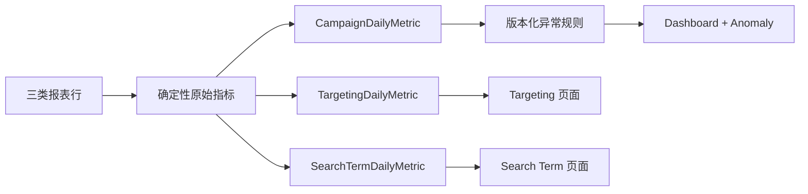

# 指标、快照与异常设计

三类事实严格分表：Dashboard/Campaign 只读取 `CampaignDailyMetric`，Keyword/ProductTarget 只读取 `TargetingDailyMetric`，Search Term 只读取 `SearchTermDailyMetric`，不得互相相加。

确定性公式由 `analytics.calculations` 计算。分母为零时结果为 null，并分别保存 `NO_IMPRESSIONS/NO_CLICKS/NO_SALES/NO_SPEND`；不返回 0 或 Infinity。Campaign 日事实冻结预算和状态，Targeting 日事实冻结竞价和状态，每条事实追溯最新权威 ImportBatch。

目标 ACOS 按 Campaign → Profile → Tenant 继承。异常规则以只追加版本保存，当前已实现 HIGH_ACOS 基础规则和最小点击门槛；数据不足为 `INSUFFICIENT_DATA`。CRITICAL 只保留枚举，不由当前规则产生。

金额始终绑定 Profile currency；不同 Marketplace/currency 不在 Dashboard 直接合计。

