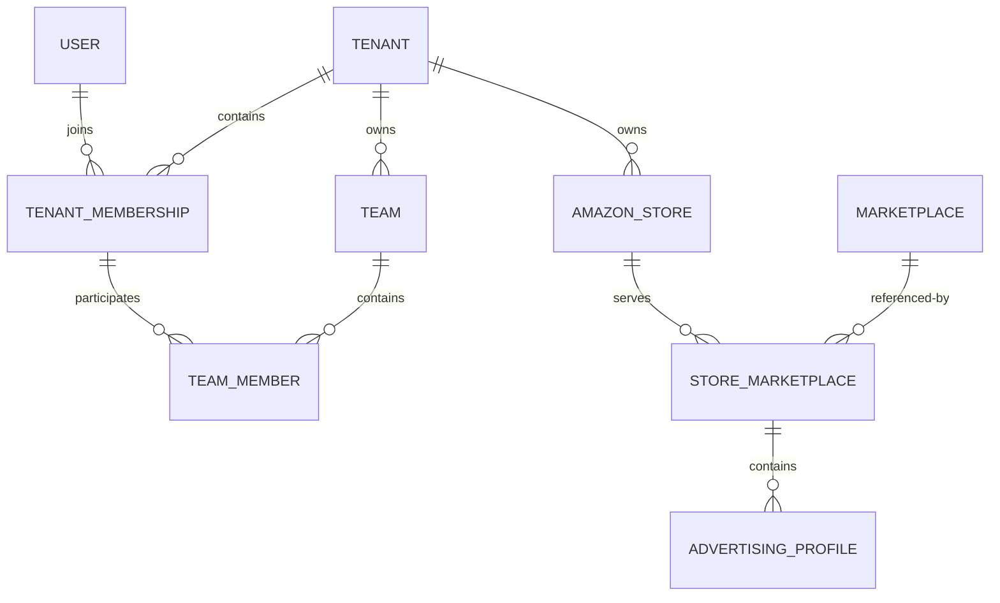

# V1 数据模型（M1 基线）

## 1. 身份与组织

`User` 是全局账号，不含 Tenant 外键。`TenantMembership` 将 User 关联至 PERSONAL、TEAM 或 COMPANY Tenant，并记录 OWNER、ADMIN、MEMBER。`Team` 只存在于 Tenant 内，`TeamMember` 必须引用同 Tenant Membership；个人卖家不创建虚拟 Team。

## 2. 店铺与 Profile

- `AmazonStore(tenant, external_store_id)` 唯一。
- `Marketplace.code` 全局唯一，保存 currency 与 timezone。
- `StoreMarketplace(store, marketplace)` 唯一。
- `AdvertisingProfile(store_marketplace, external_profile_id)` 唯一。
- Profile 的 currency/timezone 是业务日期与金额隔离的权威上下文；后续广告对象必须直接或间接追溯到 Profile。

## 3. 表名与迁移

M1 新增 `tenants.0001`、`stores.0001`、`permissions.0001/0002`。组织表使用 `org_`，店铺及数据授权表使用 `ads_`，固定权限目录使用 `sys_`。Phase 1/2A 迁移未修改。

