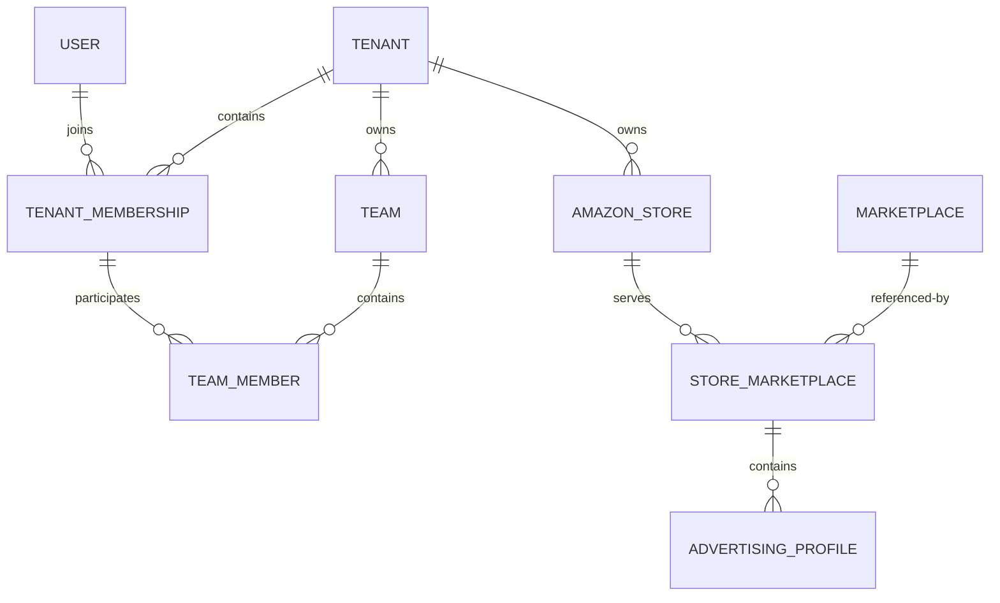

# V1 数据模型

## 1. 身份与组织

`User` 是全局账号，不含 Tenant 外键。`TenantMembership` 将 User 关联至 PERSONAL、TEAM 或 COMPANY Tenant，并记录 OWNER、ADMIN、MEMBER。`Team` 只存在于 Tenant 内，`TeamMember` 必须引用同 Tenant Membership；个人卖家不创建虚拟 Team。

## 2. 店铺与 Profile

- `AmazonStore(tenant, external_store_id)` 唯一。
- `Marketplace.code` 全局唯一，保存 currency 与 timezone。
- `StoreMarketplace(store, marketplace)` 唯一。
- `AdvertisingProfile(store_marketplace, external_profile_id)` 唯一。
- Profile 的 currency/timezone 是业务日期与金额隔离的权威上下文；后续广告对象必须直接或间接追溯到 Profile。

## 3. 广告、报表与事实

Sponsored Products 层级为 Profile → Campaign → AdGroup →
Keyword/ProductTarget；SearchTerm 直接归属 Profile 并关联 Campaign/AdGroup。
Product/CatalogItem/Listing 保持 ASIN、SKU 与站点范围关系。

`ReportUpload` 保存文件元数据和哈希，`ImportTask`、`ImportBatch`、
`ImportRowError` 保存任务、血缘和部分错误；正文及规范化 JSONL gzip 在
FileStorage。Campaign/Targeting/SearchTerm 三类 Daily Metric 是独立事实，
各自有自然键、currency、快照和 source batch，禁止跨粒度相加。

## 4. 优化与只追加对象

`AnalysisTask` → 四个 `AgentRun` → `Recommendation`/Revision →
`ActionPreview`/不可变 Version → `ApprovalRecord` → `ExecutionTask`/Item/
`ExecutionRecord` → `EffectEvaluation`。Approval、Execution、Audit 和冻结版本
没有普通更新/删除入口；重复请求由唯一幂等键和行锁保护。

## 5. 表名与迁移

组织表使用 `org_`，广告/授权使用 `ads_`，报表使用 `report_`，分析事实使用
`analytics_`，AI/Agent/Action/Audit 使用对应允许前缀，固定目录使用 `sys_`。
已共享迁移不修改，只能新增；MySQL 8.4 从零路径和前向兼容已在 M6 验证。
