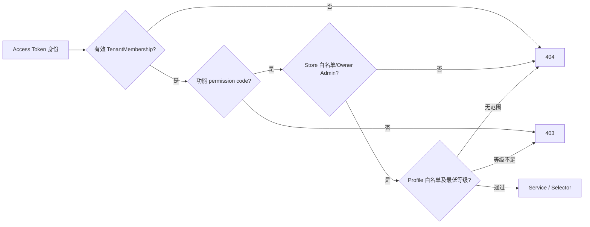

# V1 权限模型（M1）

## 1. 授权交集

业务 View 不以菜单和按钮为授权依据。跨 Tenant、Store 或完全无 Profile 范围使用 404 隐藏对象存在性；已在当前范围但功能码或动作等级不足使用 403。

## 2. 功能 RBAC

`Permission` 是固定编码目录，由数据迁移维护。`Role` 可为系统角色或 Tenant 自定义角色，`RolePermission` 只能引用既有权限，`UserRole` 始终带 Tenant。Owner/Admin 直接获得当前权限目录全集；Member 从当前 Tenant 的角色合并权限。

## 3. 数据权限

Store 与 Profile 均支持 User 直接授权和 Team 授权，二者取并集。Profile 等级顺序为 VIEW、OPERATE、APPROVE、EXECUTE、MANAGE，同一 Profile 取最高等级。Owner/Admin 对当前 Tenant 所有 Profile 为 MANAGE。V1 无显式 DENY。

## 4. 缓存边界

M1 权限直接查询数据库，尚未启用权限缓存，避免提前引入失效复杂度。M6 若增加缓存，键必须包含 Tenant/User/Profile，设置短 TTL，并在角色、Team 或授权变化后失效。

