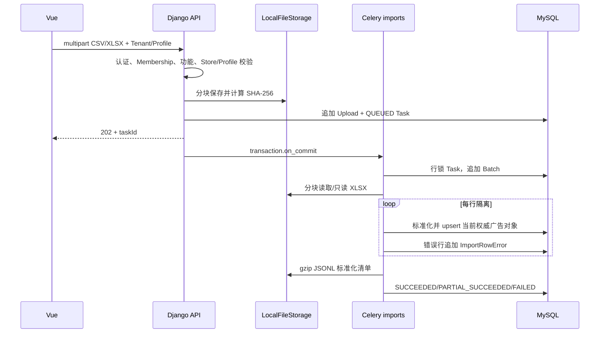

# 三类报表导入设计

## 关键规则

- `ReportUpload`、`ImportTask`、`ImportBatch` 只追加；重处理复用原 Upload 但新建 Task/Batch。
- SHA-256 相同且 Profile/报表类型相同标记 duplicate，但允许处理。
- 文件级不支持/空表头整批失败；行级错误不阻断合法行，混合结果为 `PARTIAL_SUCCEEDED`。
- 文件正文和 gzip JSONL 在 FileStorage；MySQL 只保存元数据、错误、血缘和标准化业务对象。
- `REPORT_FIELD_ALIASES` 可覆盖真实列名映射；当前 fixture 为虚构模板，尚未用真实 Amazon 导出验证。
- 上传当前采用 25 MiB 保守限制，正文默认保留 365 天；真实 P95/P99 和 Excel 工作表规则待样例校准。

## Source Adapter

`FileUploadReportSource` 为可用实现；`ThirdPartyProviderReportSource` 和 `AmazonAdsApiReportSource` 仅公开明确的 unavailable/reserved capability，不发起外部调用。

