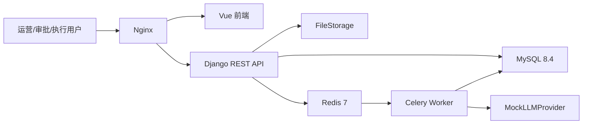

# 系统上下文

V1 是单体 Django/DRF + Vue 应用。用户经 Nginx 访问前端和 API；Django 将权威业务事实写入 MySQL，将异步任务交给 Redis/Celery。上传正文经 `FileStorage` 保存，MySQL 仅保存元数据、哈希和血缘。分析只调用 `LLMProvider`，稳定演示使用 `MockLLMProvider`。

V1 不连接真实 Amazon Ads 写 API、第三方广告数据商或真实 LLM。Tenant → Store → Marketplace → AdvertisingProfile 是所有广告数据和操作的授权上下文。
