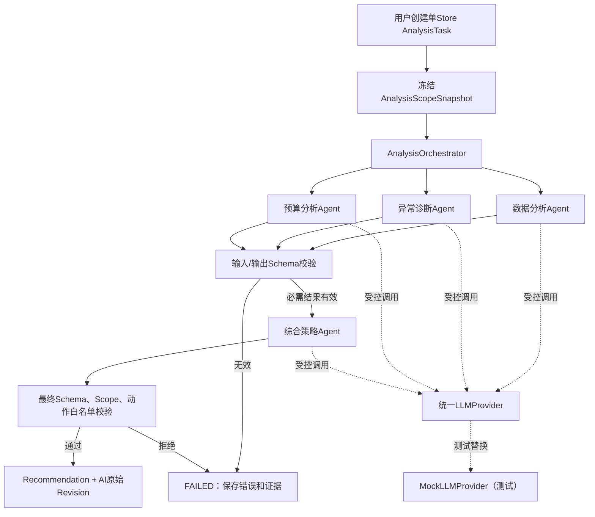

# 智能分析编排流程

```mermaid
flowchart TD
    User["用户创建单Store AnalysisTask"]
    Scope["冻结AnalysisScopeSnapshot"]
    Orchestrator["AnalysisOrchestrator"]
    DataAgent["数据分析Agent"]
    AnomalyAgent["异常诊断Agent"]
    BudgetAgent["预算分析Agent"]
    Validate1["输入/输出Schema校验"]
    StrategyAgent["综合策略Agent"]
    Validate2["最终Schema、Scope、动作白名单校验"]
    Recommendation["Recommendation + AI原始Revision"]
    Failed["FAILED：保存错误和证据"]
    Provider["统一LLMProvider"]
    Mock["MockLLMProvider（测试）"]

    User --> Scope --> Orchestrator
    Orchestrator --> DataAgent
    Orchestrator --> AnomalyAgent
    Orchestrator --> BudgetAgent
    DataAgent --> Validate1
    AnomalyAgent --> Validate1
    BudgetAgent --> Validate1
    Validate1 -->|必需结果有效| StrategyAgent
    Validate1 -->|无效| Failed
    StrategyAgent --> Validate2
    Validate2 -->|通过| Recommendation
    Validate2 -->|拒绝| Failed

    DataAgent -.受控调用.-> Provider
    AnomalyAgent -.受控调用.-> Provider
    BudgetAgent -.受控调用.-> Provider
    StrategyAgent -.受控调用.-> Provider
    Provider -.测试替换.-> Mock
```

Agent不互相直接调用；图中的汇合由Orchestrator完成。
