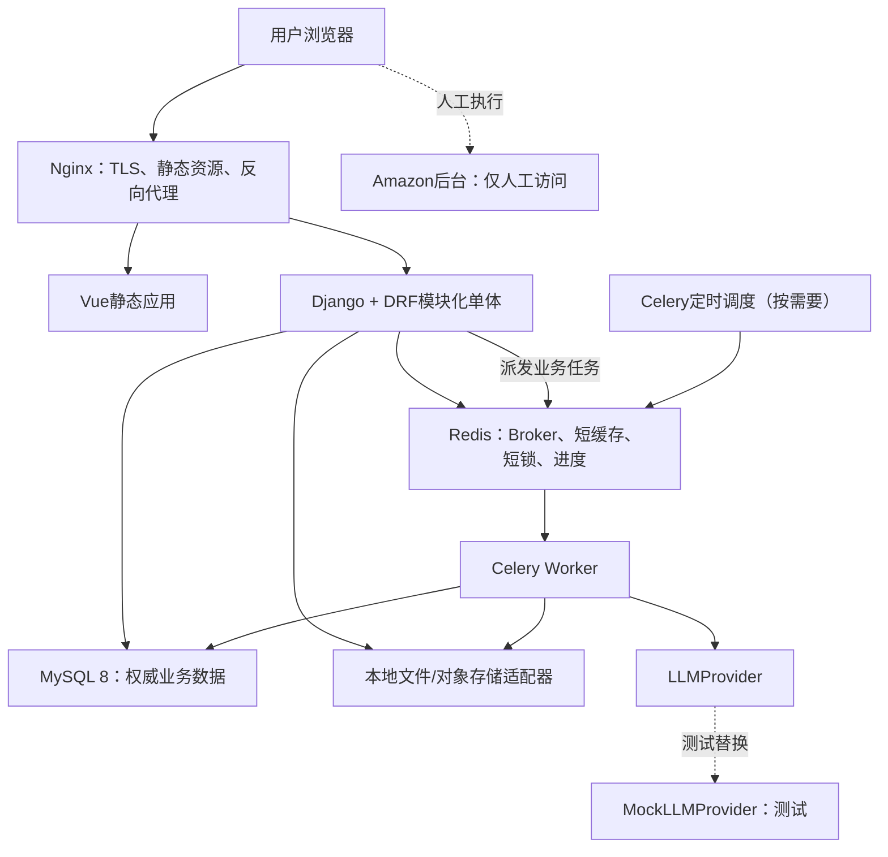

# 部署架构

```mermaid
flowchart TB
    Browser["用户浏览器"]
    Nginx["Nginx：TLS、静态资源、反向代理"]
    Vue["Vue静态应用"]
    Django["Django + DRF模块化单体"]
    Worker["Celery Worker"]
    Scheduler["Celery定时调度（按需要）"]
    MySQL["MySQL 8：权威业务数据"]
    Redis["Redis：Broker、短缓存、短锁、进度"]
    Storage["本地文件/对象存储适配器"]
    LLM["LLMProvider"]
    Mock["MockLLMProvider：测试"]
    Amazon["Amazon后台：仅人工访问"]

    Browser --> Nginx
    Nginx --> Vue
    Nginx --> Django
    Django --> MySQL
    Django --> Redis
    Django --> Storage
    Django -->|"派发业务任务"| Redis
    Redis --> Worker
    Scheduler --> Redis
    Worker --> MySQL
    Worker --> Storage
    Worker --> LLM
    LLM -.测试替换.-> Mock
    Browser -.人工执行.-> Amazon
```

说明：

- Redis不是审批、执行或审计的权威存储。
- V1系统服务不调用真实Amazon Advertising API。
- 具体组件版本和生产拓扑数量待运行基线确认。
