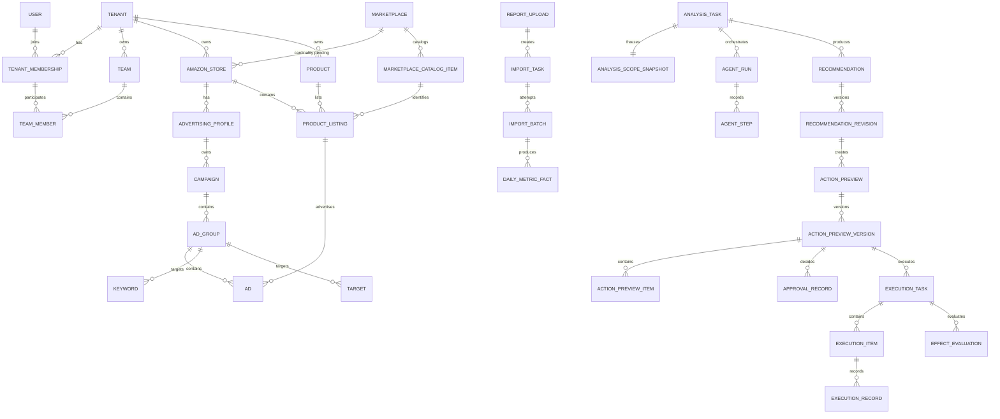

# 核心领域模型图

```mermaid
erDiagram
    USER ||--o{ TENANT_MEMBERSHIP : joins
    TENANT ||--o{ TENANT_MEMBERSHIP : has
    TENANT ||--o{ TEAM : owns
    TENANT_MEMBERSHIP ||--o{ TEAM_MEMBER : participates
    TEAM ||--o{ TEAM_MEMBER : contains

    TENANT ||--o{ AMAZON_STORE : owns
    MARKETPLACE ||--o{ AMAZON_STORE : "cardinality pending"
    AMAZON_STORE ||--o{ ADVERTISING_PROFILE : has

    TENANT ||--o{ PRODUCT : owns
    MARKETPLACE ||--o{ MARKETPLACE_CATALOG_ITEM : catalogs
    PRODUCT ||--o{ PRODUCT_LISTING : lists
    AMAZON_STORE ||--o{ PRODUCT_LISTING : contains
    MARKETPLACE_CATALOG_ITEM ||--o{ PRODUCT_LISTING : identifies

    ADVERTISING_PROFILE ||--o{ CAMPAIGN : owns
    CAMPAIGN ||--o{ AD_GROUP : contains
    AD_GROUP ||--o{ AD : contains
    PRODUCT_LISTING ||--o{ AD : advertises
    AD_GROUP ||--o{ KEYWORD : targets
    AD_GROUP ||--o{ TARGET : targets

    REPORT_UPLOAD ||--o{ IMPORT_TASK : creates
    IMPORT_TASK ||--o{ IMPORT_BATCH : attempts
    IMPORT_BATCH ||--o{ DAILY_METRIC_FACT : produces

    ANALYSIS_TASK ||--|| ANALYSIS_SCOPE_SNAPSHOT : freezes
    ANALYSIS_TASK ||--o{ AGENT_RUN : orchestrates
    AGENT_RUN ||--o{ AGENT_STEP : records
    ANALYSIS_TASK ||--o{ RECOMMENDATION : produces
    RECOMMENDATION ||--o{ RECOMMENDATION_REVISION : versions

    RECOMMENDATION_REVISION ||--o{ ACTION_PREVIEW : creates
    ACTION_PREVIEW ||--o{ ACTION_PREVIEW_VERSION : versions
    ACTION_PREVIEW_VERSION ||--o{ ACTION_PREVIEW_ITEM : contains
    ACTION_PREVIEW_VERSION ||--o{ APPROVAL_RECORD : decides
    ACTION_PREVIEW_VERSION ||--o{ EXECUTION_TASK : executes
    EXECUTION_TASK ||--o{ EXECUTION_ITEM : contains
    EXECUTION_ITEM ||--o{ EXECUTION_RECORD : records
    EXECUTION_TASK ||--o{ EFFECT_EVALUATION : evaluates
```

SearchTerm与Keyword/Target的关联不画成永久主数据关系；它只存在于带时间和报表来源的事实数据中。
