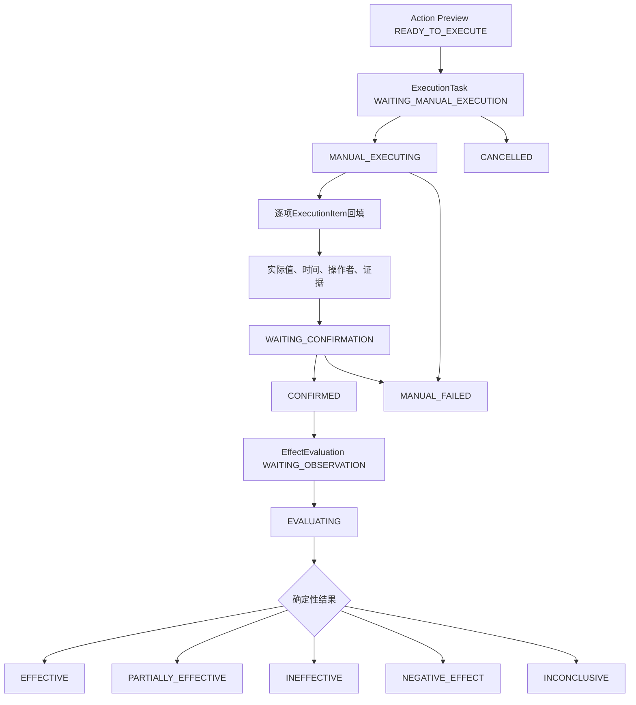

# 人工执行与效果评估流程

```mermaid
flowchart TD
    Ready["Action Preview READY_TO_EXECUTE"]
    Task["ExecutionTask WAITING_MANUAL_EXECUTION"]
    Execute["MANUAL_EXECUTING"]
    Items["逐项ExecutionItem回填"]
    Evidence["实际值、时间、操作者、证据"]
    Confirm["WAITING_CONFIRMATION"]
    Confirmed["CONFIRMED"]
    Failed["MANUAL_FAILED"]
    Cancelled["CANCELLED"]
    Observe["EffectEvaluation WAITING_OBSERVATION"]
    Evaluating["EVALUATING"]
    Results{"确定性结果"}
    Effective["EFFECTIVE"]
    Partial["PARTIALLY_EFFECTIVE"]
    Ineffective["INEFFECTIVE"]
    Negative["NEGATIVE_EFFECT"]
    Inconclusive["INCONCLUSIVE"]

    Ready --> Task
    Task --> Execute
    Task --> Cancelled
    Execute --> Items --> Evidence --> Confirm
    Execute --> Failed
    Confirm --> Confirmed
    Confirm --> Failed
    Confirmed --> Observe --> Evaluating --> Results
    Results --> Effective
    Results --> Partial
    Results --> Ineffective
    Results --> Negative
    Results --> Inconclusive
```

V1没有Amazon API核验；执行证据等级、观察窗口和基线窗口为待确认。
