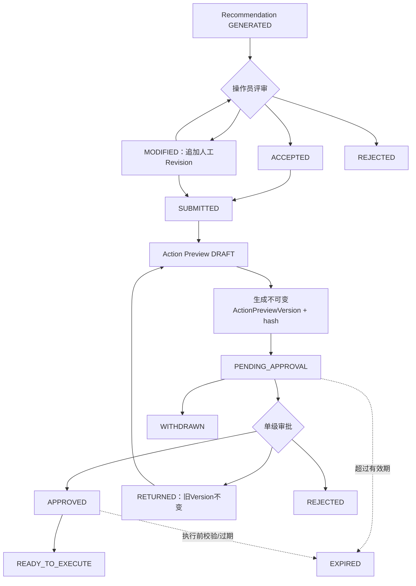

# Recommendation与审批流程

```mermaid
flowchart TD
    Generated["Recommendation GENERATED"]
    Review{"操作员评审"}
    Accepted["ACCEPTED"]
    Modified["MODIFIED：追加人工Revision"]
    Rejected["REJECTED"]
    Submitted["SUBMITTED"]
    Draft["Action Preview DRAFT"]
    Version["生成不可变ActionPreviewVersion + hash"]
    Pending["PENDING_APPROVAL"]
    Decision{"单级审批"}
    Approved["APPROVED"]
    Returned["RETURNED：旧Version不变"]
    ApprovalRejected["REJECTED"]
    Withdrawn["WITHDRAWN"]
    Ready["READY_TO_EXECUTE"]
    Expired["EXPIRED"]

    Generated --> Review
    Review --> Accepted
    Review --> Modified
    Review --> Rejected
    Modified --> Review
    Accepted --> Submitted
    Modified --> Submitted
    Submitted --> Draft --> Version --> Pending
    Pending --> Decision
    Decision --> Approved --> Ready
    Decision --> Returned --> Draft
    Decision --> ApprovalRejected
    Pending --> Withdrawn
    Pending -.超过有效期.-> Expired
    Approved -.执行前校验/过期.-> Expired
```

审批始终引用具体不可变Version；退回修改创建新Version，不修改旧Version。
