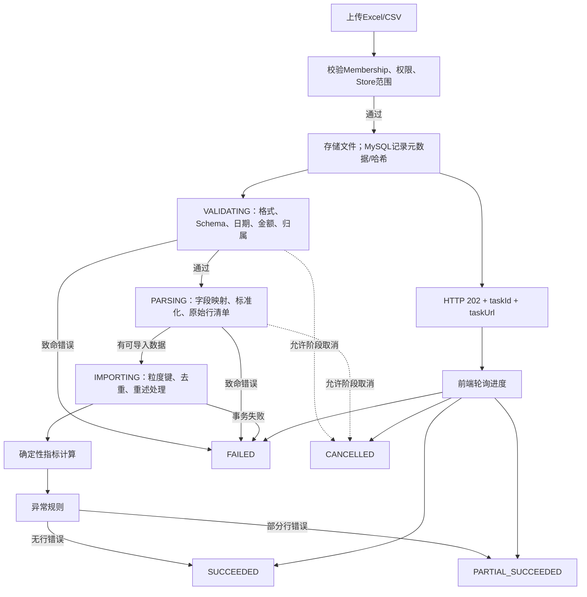

# 报表导入流程

```mermaid
flowchart TD
    Upload["上传Excel/CSV"]
    Auth["校验Membership、权限、Store范围"]
    StoreFile["存储文件；MySQL记录元数据/哈希"]
    Accept["HTTP 202 + taskId + taskUrl"]
    Validate["VALIDATING：格式、Schema、日期、金额、归属"]
    Parse["PARSING：字段映射、标准化、原始行清单"]
    Import["IMPORTING：粒度键、去重、重述处理"]
    Metric["确定性指标计算"]
    Anomaly["异常规则"]
    Success["SUCCEEDED"]
    Partial["PARTIAL_SUCCEEDED"]
    Failed["FAILED"]
    Cancelled["CANCELLED"]
    Poll["前端轮询进度"]

    Upload --> Auth
    Auth -->|通过| StoreFile --> Accept
    Accept --> Poll
    StoreFile --> Validate
    Validate -->|通过| Parse
    Parse -->|有可导入数据| Import
    Import --> Metric --> Anomaly
    Anomaly -->|无行错误| Success
    Anomaly -->|部分行错误| Partial
    Validate -->|致命错误| Failed
    Parse -->|致命错误| Failed
    Import -->|事务失败| Failed
    Validate -.允许阶段取消.-> Cancelled
    Parse -.允许阶段取消.-> Cancelled
    Poll --> Success
    Poll --> Partial
    Poll --> Failed
    Poll --> Cancelled
```

迟到/重述策略、PARTIAL阈值和IMPORTING取消边界均为待确认。
