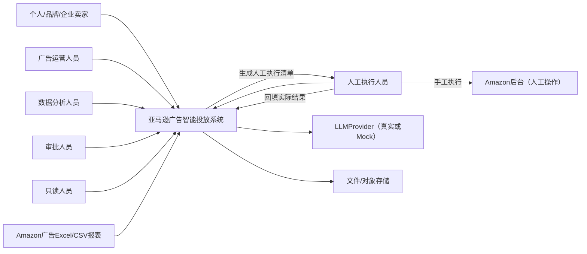

# 系统上下文图

```mermaid
flowchart LR
    Seller["个人/品牌/企业卖家"]
    Operator["广告运营人员"]
    Analyst["数据分析人员"]
    Approver["审批人员"]
    Executor["人工执行人员"]
    Viewer["只读人员"]
    System["亚马逊广告智能投放系统"]
    Report["Amazon广告Excel/CSV报表"]
    AmazonUI["Amazon后台（人工操作）"]
    LLM["LLMProvider（真实或Mock）"]
    Storage["文件/对象存储"]

    Seller --> System
    Operator --> System
    Analyst --> System
    Approver --> System
    Executor --> System
    Viewer --> System
    Report --> System
    System --> Storage
    System --> LLM
    System -->|"生成人工执行清单"| Executor
    Executor -->|"手工执行"| AmazonUI
    Executor -->|"回填实际结果"| System
```

边界说明：

- V1系统不连接真实Amazon Advertising API。
- LLM只能生成受Schema约束的分析结果，不能执行广告动作。
- Amazon后台操作由人工完成。
