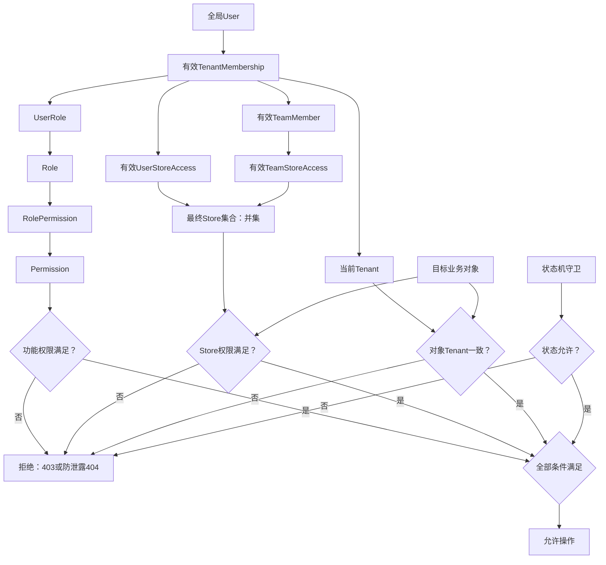

# Tenant与权限模型

```mermaid
flowchart TD
    User["全局User"]
    Membership["有效TenantMembership"]
    Tenant["当前Tenant"]
    UserRole["UserRole"]
    Role["Role"]
    RolePermission["RolePermission"]
    Permission["Permission"]
    Direct["有效UserStoreAccess"]
    TeamMember["有效TeamMember"]
    TeamAccess["有效TeamStoreAccess"]
    Stores["最终Store集合：并集"]
    Object["目标业务对象"]
    State["状态机守卫"]
    Allow["允许操作"]
    Deny["拒绝：403或防泄露404"]

    User --> Membership
    Membership --> Tenant
    Membership --> UserRole --> Role --> RolePermission --> Permission
    Membership --> Direct --> Stores
    Membership --> TeamMember --> TeamAccess --> Stores

    Permission --> Check{"功能权限满足？"}
    Stores --> Scope{"Store权限满足？"}
    Tenant --> Owner{"对象Tenant一致？"}
    Object --> Owner
    Object --> Scope
    State --> Guard{"状态允许？"}

    Check -->|否| Deny
    Scope -->|否| Deny
    Owner -->|否| Deny
    Guard -->|否| Deny
    Check -->|是| Final{"全部条件满足"}
    Scope -->|是| Final
    Owner -->|是| Final
    Guard -->|是| Final
    Final --> Allow
```

V1不设置显式拒绝授权；没有Team的个人卖家仅通过UserStoreAccess进入最终Store集合。
