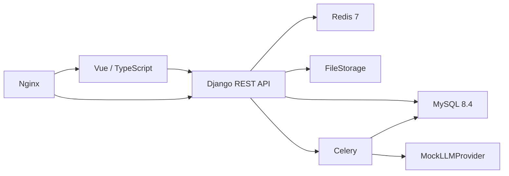
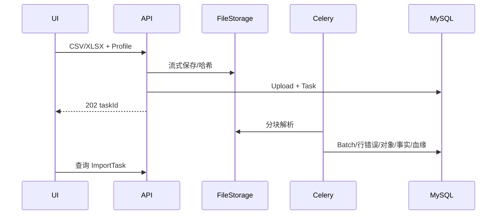
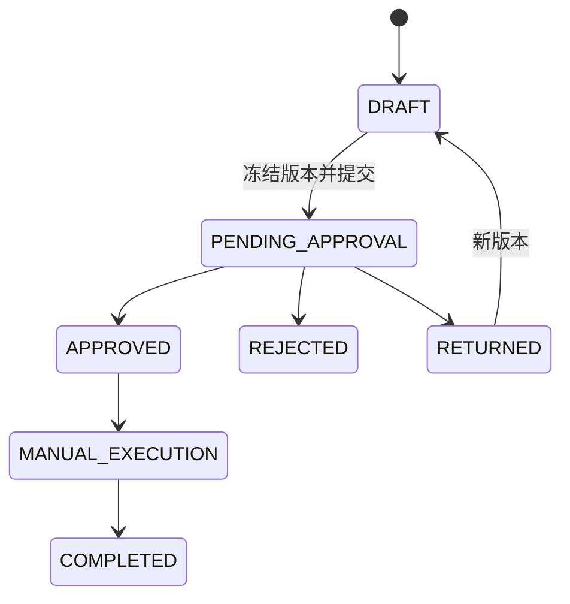

# Amazon 广告智能优化系统 V1 技术讲解

## 1. 问题与边界

系统把卖家手工导出的 Campaign、Targeting、Search Term 报表转为可追溯指标，再用 Mock Agent 生成结构化建议，经过后端校验、单级审批和人工执行回填形成闭环。V1 不调用 Amazon Ads 写 API，不让 LLM 裁决权限、金额、指标或状态。

## 2. 总体架构

讲解重点：模块化单体降低 V1 运维复杂度；写入统一走 Service，复杂读取走 Selector，异步入口只调用 Service。

## 3. 身份、租户和权限

User 是全局账号，通过 TenantMembership 加入 PERSONAL/TEAM/COMPANY。上下文固定为 Tenant → Store → Marketplace → Profile。每个受保护请求都重新验证 Membership、功能权限、Store/Profile 范围、对象归属和状态；越界 404，范围内缺动作权 403。

## 4. 数据导入

文件正文不进入 MySQL；成功行与错误行并存时为 `PARTIAL_SUCCEEDED`。

## 5. 指标与异常

Campaign、Targeting、Search Term 使用三张独立日事实表，防止粒度重复汇总。CTR/CPC/CVR/ACOS/ROAS 由 Decimal 代码计算；无分母返回 null 和原因。HIGH_ACOS 规则按版本留痕，目标 ACOS 按 Campaign → Profile → Tenant 继承。

## 6. Agent 与安全护栏

Orchestrator 把最小 Profile 范围的确定性指标传给四个 Agent。所有输出使用 Schema 1.0，经 Recommendation Service 再验证动作白名单、对象归属、beforeValue 漂移和金额边界。演示只启用无密钥 MockLLMProvider。

## 7. 审批与人工执行

PERSONAL Owner 可自确认；TEAM/COMPANY 提交人不能自批。ApprovalRecord、ExecutionRecord、AuditLog 只追加。

## 8. 前端

七个一级菜单由后端 permissionCodes 控制：工作台、数据中心、广告分析、智能优化、审批执行、知识中心、系统管理。菜单隐藏只改善体验，所有授权仍由后端执行。路由懒加载后入口 JS 为约 51 kB。

## 9. 测试证据

- 后端：112 项通过。
- 前端：9 个文件、31 项通过；lint/typecheck/build 通过。
- Chrome E2E：本轮 NOT VERIFIED；两次均在浏览器启动前的旧固定 SQLite
  迁移历史处失败，已改唯一测试库但未违反两次上限继续运行。
- 替代证据：后端 112/112、前端 46/46、当前源码 Compose 7 服务 healthy，
  Docker HTTP/Celery/MySQL Campaign 上传链路通过。
- OpenAPI：生成、验证和 TypeScript 类型同步通过。
- M6 将补最终 Compose 状态、部署文档和性能计划；不把目标写成实测结果。

## 10. 已知限制

真实三报表样例仍未获得；真实 LLM、Amazon Ads API、第三方数据源、跨币种汇总、多级审批、库存/财务均不在 V1。性能基线尚未在参考 8C16G 环境实测。
