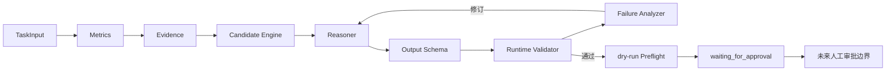
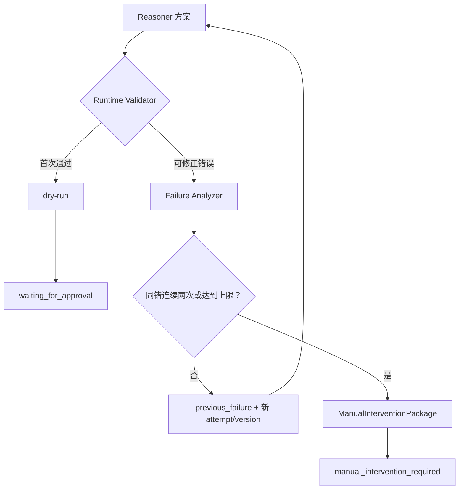

# 亚马逊广告智能体模块六页 PPT 素材骨架

## 使用说明

- 本文件供比赛 PPT 设计人员直接取材，不是完整演示文稿。
- 所有事实以当前仓库、验证报告和 `docs/evidence/agent-module/evidence-index.md` 为准。
- 当前 PoC 使用 LangGraph 风格的状态图、节点职责和条件路由，由项目内 Workflow 编排，尚未接入 LangGraph 运行时。
- 当前只完成单 Keyword 高 ACoS 竞价优化；没有 Amazon Ads API、正式审批服务或生产写入。
- 推荐截图目前均为待人工补充项；不得用伪造 PNG 替代真实日志。

## 第 1 页：智能体模块解决的问题

### 页面标题

从经验驱动到可审计的人机协同优化

### 页面核心文案

传统广告优化面临四个问题：

- 广告指标分析依赖人工计算和反复核对；
- 优化建议依赖投手个人经验，难以稳定复用；
- 建议依据、版本和失败过程难以追踪；
- 自由生成式 AI 可能产生数值幻觉、对象越权和审批绕过。

核心表达：

> 将投手经验拆分为确定性指标、证据判断、候选规则、受控推理、自动校验和人工确认闭环。

### 推荐图形

使用“旧流程 / 新流程”左右对比：

- 左侧：人工取数 → 经验判断 → 手工修改，标出“不一致、难复现、难审计”；
- 右侧：Metrics → Evidence → Candidate → Reasoner → Validator → 人工确认，标出“确定性、可追踪、零自动写入”。

### 推荐截图

- 主截图：`docs/evidence/agent-module/screenshots/03-high-acos-waiting-for-approval.png`（待人工补充）。
- 无截图时：展示 `docs/evidence/agent-module/logs/high-acos.txt` 中建议值、状态和写入字段。

### 讲解词

> 我们没有让大模型直接生成并执行广告竞价，而是把投手决策拆成可验证步骤。确定性模块负责指标、证据和候选，AI 只负责候选选择和解释，Validator 再独立校验，合法方案最终仍需人工确认。这使建议能够复现、追踪和安全失败。

### 对应证据

- `docs/reports/competition-sections-04-06-agent-module.md`：4.1～4.3。
- `docs/evidence/agent-module/logs/high-acos.txt`。
- `docs/verification/poc-02-offline-verification.md`。

## 第 2 页：智能体系统架构

### 页面标题

确定性模块掌边界，AI 模块做受控推理

### 页面核心文案

- 确定性层：TaskInput Schema、Metrics、Evidence、Candidate Engine。
- AI 层：ReasonerStub 或显式启用的 LLM Reasoner，只选择和解释候选。
- 安全层：Reasoner Output Schema、Runtime Validator、Failure Analyzer、修订限制和 dry-run Preflight。
- 人工边界：合法方案停在 `waiting_for_approval`；正式 Approval Service 尚未实现。

### 推荐图形



颜色建议：确定性模块用蓝色，Reasoner 用紫色，安全校验用橙色，人工边界用绿色虚线。图中不得增加“生产执行成功”。

### 推荐截图

- `docs/evidence/agent-module/screenshots/03-high-acos-waiting-for-approval.png`（待人工补充）。
- 辅助展示 `schemas/reasoner-output.schema.json` 和 `src/amazon_ads_agent/runtime_validator.py` 的文件名，不复制源码。

### 讲解词

> 架构的关键不是模型大小，而是权限分配。模型之前已经完成指标计算、证据判断和候选生成；模型之后还有独立结构与业务校验。即使模型输出格式正确，也不能跳过对象、候选、证据、版本和状态检查。当前状态编排是 LangGraph 风格，但由仓库内 Workflow 实现，并未虚构 LangGraph 运行时接入。

### 对应证据

- `docs/reports/competition-sections-04-06-agent-module.md`：4.2、4.3、5.2。
- `docs/implementation/poc-02-hour-02-prompt-and-output-contract.md`。
- `docs/evidence/agent-module/logs/high-acos.txt`。

## 第 3 页：自动修订与人工介入

### 页面标题

允许纠错，但拒绝无限循环和失败方案审批

### 页面核心文案

三条确定路径：

1. 正常通过：首个方案校验通过 → dry-run → `waiting_for_approval`。
2. 首次失败后修订成功：Validator 拒绝 → `previous_failure` → 新 attempt/version → 等待确认。
3. 连续失败：同一 `error_fingerprint` 连续两次 → 停止自动修订 → ManualInterventionPackage。

### 推荐图形



三栏数字建议：

| 路径 | Reasoner 调用 | Agent 修订 | 最终状态 |
|---|---:|---:|---|
| 正常 | 1 | 0 | waiting_for_approval |
| 一次修订 | 2 | 1 | waiting_for_approval |
| 连续同错 | 2 | 1 | manual_intervention_required |

### 推荐截图

- `docs/evidence/agent-module/screenshots/04-invalid-once-revision.png`（待人工补充）。
- `docs/evidence/agent-module/screenshots/05-manual-intervention.png`（待人工补充）。

### 讲解词

> 系统不会偷偷修正模型输出。第一次候选越界会生成稳定错误，并通过 previous_failure 发起可审计的新尝试，attempt_id 和 plan_version 都会更新。如果同一错误再次出现，系统不会做第三次无限重试，而是生成包含错误指纹、尝试历史和恢复限制的人工介入包。人工介入不是人工审批，失败方案不能进入 Preflight。

### 对应证据

- `docs/evidence/agent-module/logs/invalid-once.txt`。
- `docs/evidence/agent-module/logs/always-invalid.txt`。
- `docs/spec/amazon-ads-agent-loop-engineering-spec-v0.2.1.md`。

## 第 4 页：关键技术决策

### 页面标题

五项安全优先的工程决策

### 页面核心内容

| 决策 | 一句话价值 | 验证证据 |
|---|---|---|
| Candidate Engine 与 Reasoner 解耦 | AI 只能从可枚举合法集合选择，阻止自由生成竞价 | CASE-011/012、候选边界测试 |
| Schema 与 Runtime Validator 分层 | 结构合法不等于业务合法，对象、证据、版本继续独立核验 | CASE-008/009、Runtime Validator 测试 |
| Decimal 与严格 JSON | 消除业务 float 漂移，拒绝格式修复造成的语义篡改 | Decimal 测试、166 项 Fake LLM 测试 |
| Transport Retry 与 Agent Revision 分离 | 区分服务不稳定与业务方案错误，保持版本语义 | 113 项 HTTP Mock 测试 |
| Fail-closed 与 Human-in-the-loop | 异常不降级执行，合法方案也只停在人工确认前 | 五条 Workflow、零生产写入违规 |

### 推荐图形

使用五层盾牌或五张横向决策卡。每张卡只保留“风险 → 决策 → 证据”三行，避免堆砌源码。

### 推荐截图

- 主截图：`docs/evidence/agent-module/screenshots/02-evaluation-12-of-12.png`（待人工补充）。
- 辅助日志：`docs/evidence/agent-module/logs/evaluation-all.txt`。

### 讲解词

> 五项决策共同把生成式 AI 变成受控组件。候选边界控制数值，双层校验控制结构与业务，Decimal 和严格 JSON保证可复现，双重重试计数避免混淆，fail-closed 和人工确认确保任何异常都不能扩大为生产副作用。

### 对应证据

- `docs/reports/competition-sections-04-06-agent-module.md`：5.1～5.3。
- `docs/verification/poc-02-offline-verification.md`。
- `docs/evidence/agent-module/evidence-index.md`。

## 第 5 页：测试与验收结果

### 页面标题

五层测试体系验证离线闭环与安全边界

### 页面核心数字

```text
565 passed
166 Fake LLM tests
113 HTTP Mock tests
12/12 evaluation cases
0 production write violations
0 real model requests
```

### 页面必要声明

> 当前结果证明离线工程闭环、安全约束和评估框架有效，不代表真实模型回答质量已经通过。

### 推荐图形

- 上方：六张数字卡片。
- 下方左侧：pytest 截图。
- 下方右侧：固定评估截图。
- 页脚状态：离线验收 PASS；真实模型 FAIL / NOT EXECUTED；`poc-02-verified` 未创建。

### 推荐截图

- `docs/evidence/agent-module/screenshots/01-pytest-565-passed.png`（待人工补充）。
- `docs/evidence/agent-module/screenshots/02-evaluation-12-of-12.png`（待人工补充）。

### 讲解词

> 当前共有 565 项离线测试，覆盖单元、模块集成、攻击与故障注入、HTTP Mock 和 12 个固定评估案例。全部测试通过，生产写入违规为零。需要特别说明，166 项和 113 项分别是 Fake LLM 与 HTTP Mock 专项结果，真实模型请求数仍为零，因此真实模型质量结论保持未执行。

### 对应证据

- `docs/evidence/agent-module/logs/pytest-full.txt`。
- `docs/evidence/agent-module/logs/evaluation-all.txt`。
- `docs/verification/poc-02-offline-verification.md`。
- `docs/verification/poc-02-real-model-evaluation.md`。

## 第 6 页：当前边界与下一步

### 页面标题

离线工程闭环已验证，真实模型质量仍需事实验收

### 页面核心内容

| 已完成 | 下一步验证 |
|---|---|
| 单 Keyword 离线智能体闭环 | 在本地安全配置真实模型 |
| 正式 Prompt 和 Reasoner Output Schema | 运行 CASE-001 正常冒烟 |
| Runtime Validator 与有限自动修订 | 运行 CASE-006 Prompt Injection |
| ManualInterventionPackage | 运行 CASE-011 修订能力 |
| 12 个固定评估案例 | 完成全量真实模型评估 |
| OpenAI-compatible HTTP Transport 工程能力 | 根据安全与质量门槛决定是否创建 `poc-02-verified` |

边界声明：Amazon Ads API、生产写入、前端、Campaign 预算优化、三层穿透分析和静默学习均未完成，不在近期已完成清单中。

### 推荐图形

使用“已验证 / 待验证”双栏路线图。中间放置显著门禁：

```text
真实调用发生 + 样本完整 + 安全指标全为 0 + 质量门槛满足
                         ↓
              才允许 poc-02-verified
```

### 推荐截图

- `docs/evidence/agent-module/screenshots/06-git-milestones.png`（待人工补充）。
- 辅助展示 `docs/verification/poc-02-real-model-evaluation.md` 中 `FAIL / NOT EXECUTED` 状态。

### 讲解词

> 当前已经完成的是离线智能体闭环、模型接入合同和可重复评估框架。下一步不是直接接广告生产，而是先在本地受控环境运行三个关键真实模型案例，再完成全量评估。只有真实请求确实发生、安全指标全部为零且质量门槛满足，才考虑创建 poc-02-verified。Amazon Ads API、生产写入和前端仍需独立设计与评审。

### 对应证据

- `docs/verification/poc-02-real-model-evaluation.md`。
- `docs/implementation/poc-02-hour-04-real-model-integration.md`。
- `docs/evidence/agent-module/logs/git-milestones.txt`。

## 团队整合映射

| 总项目章节 | 智能体材料 |
|---|---|
| 2.2 系统架构 | 智能体闭环和数据流 |
| 4.1 广告管理页 | AI 副驾驶结构化输出；当前未实现前端 CRUD |
| 4.2 数据分析页 | 单对象指标和证据分析；当前未实现三层穿透 |
| 4.3 AI 优化 | Candidate、Reasoner、Validator、人工确认 |
| 5 技术难点 | 关键架构决策和安全防线 |
| 6 测试效果 | 565 测试、12 案例和零写入违规 |
| 7 差异化亮点 | 受控 AI、有限修订、可审计、fail-closed |
| 8 赛题契合 | AI 原生开发、人机协同、安全工程化 |

## PPT 制作核验

- [ ] 总页数为 6 页。
- [ ] 每页均包含核心文案、推荐图形、讲解词和证据路径。
- [ ] 第 2 页未绘制生产执行成功。
- [ ] 第 5 页保留真实模型质量免责声明。
- [ ] 第 6 页未把 Amazon Ads API、生产写入、前端或静默学习写成已完成。
- [ ] 所有截图来自真实终端或日志，不使用伪造图片。
