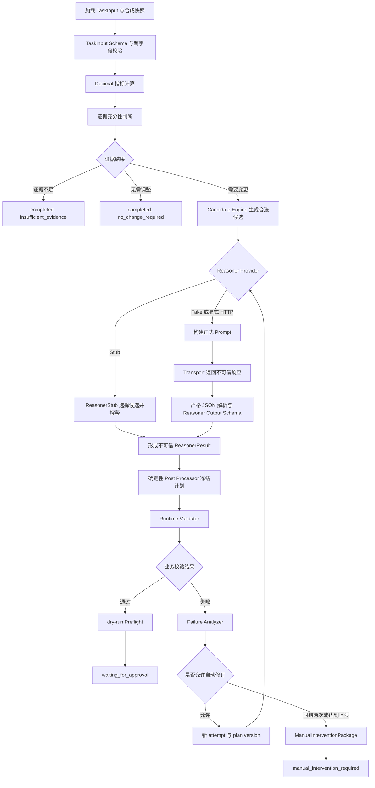
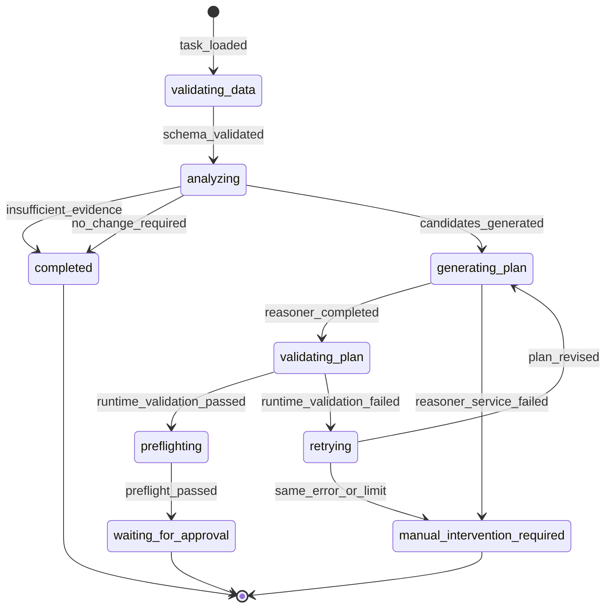

# 亚马逊广告智能体 PoC 第一阶段成果总结

## 1. 文档信息

| 项目 | 内容 |
|---|---|
| 项目名称 | 亚马逊广告智能体 PoC |
| 文档名称 | 亚马逊广告智能体 PoC 第一阶段成果总结 |
| 阶段 | 第一阶段：PoC-01 最小闭环与 PoC-02 模型接入工程基线 |
| 当前仓库 | `C:\QSZ\markdown\amazon-ads-agent-poc` |
| 当前 Git Commit | `6ae7e8c573531beba3509075711c931892a7b123` |
| 当前标签 | `poc-01-verified` 已存在；`poc-02-verified` 未创建 |
| 文档用途 | 项目留存、团队周报、阶段成果上交、比赛 PPT 与演示视频素材、后续真实模型验证基线 |
| 编写日期 | 2026-07-17 |

## 2. 本周目标

完成亚马逊广告关键词竞价优化智能体的最小闭环工程验证，确保确定性分析、候选生成、Reasoner 选择、结果校验、失败反馈、有限自动修订、dry-run 预检和人工确认边界可以稳定运行。

## 3. 本周完成成果

- **PoC-01 单关键词高 ACoS 优化闭环**：使用合成 Keyword 数据跑通从任务校验到等待人工确认的完整计划生成路径。
- **Decimal 指标计算**：CTR、CPC、CVR、ACoS 和 ROAS 使用 `decimal.Decimal` 确定性重算，业务 JSON 数值使用 Decimal 字符串。
- **证据充分性判断**：在调用 Reasoner 前识别证据不足和无需调整分支，并直接安全结束。
- **确定性候选生成**：Candidate Engine 根据版本化规则生成合法竞价候选，模型无权创建候选值。
- **ReasonerStub**：保留 `valid`、`invalid_once`、`always_invalid` 三种离线模式，覆盖正常选择、一次修订和同错停止。
- **Runtime Validator**：独立校验 Schema、候选归属、对象与版本、证据引用、摘要和状态边界。
- **Failure Analyzer**：生成稳定错误指纹，判断错误是否可修正以及是否达到停止条件。
- **有限自动修订**：每次修订更新 `attempt_id` 和 `plan_version`，最多修订三次，同一错误连续两次立即停止。
- **ManualInterventionPackage**：停止自动修订后生成独立、Schema-valid 的人工介入材料，原运行保持终态。
- **dry-run Preflight**：只检查本地请求结构与变更差异，固定禁止生产写入。
- **审计记录**：AuditCollector 以 Schema-valid 内存事件记录关键状态、错误码、版本和安全计数。
- **Reasoner Provider 抽象**：统一 `Reasoner.reason()` 合同，支持 Stub、注入式 LLM Reasoner 和兼容适配层。
- **Fake Transport**：通过可编程离线响应和异常验证模型传输、重试与工作流集成，不访问公网。
- **OpenAI-compatible HTTP Transport 工程接入**：实现显式开启、有限预算、状态码分类、超时、重试和脱敏；尚未执行真实模型请求。
- **正式 Prompt**：建立 System、关键词竞价和修订反馈三份版本化 Prompt，数据字段不具备指令权限。
- **Reasoner Output Schema**：以独立 Draft 2020-12 Schema 限制模型只能提交候选选择、理由、证据路径和风险摘要。
- **严格 JSON 解析**：拒绝 Markdown fence、前后缀文本、多个 JSON、重复 Key、数组根、未知字段和自动类型转换。
- **`previous_failure` 修订反馈**：仅将允许字段投影到下一轮 Prompt，不携带密钥、请求头、原始响应或内部堆栈。
- **12 个固定评估案例**：覆盖正常、边界、提示注入、审批绕过、虚构对象、错误证据、候选越界和同错停止。
- **自动评估器与报告**：复用正式 Workflow、Schema 和 Runtime Validator，输出机器可判定的 JSON 与 Markdown 指标。
- **离线验收**：全量测试、Fake LLM、HTTP Mock、五条 Stub 路径、安全扫描和固定评估均完成验收。

## 4. 智能体闭环流程

### 智能体闭环主流程

Candidate Engine 始终先于 Reasoner；Reasoner 只能选择已有候选并提供解释。Reasoner Output Schema 与 Runtime Validator 分别承担结构合同和确定性业务边界。合法变更只到达 `waiting_for_approval`，图中不存在自动审批或生产写入节点。

## 5. LangGraph 状态与条件路由

### LangGraph 风格状态与路由

当前 PoC 已按照 LangGraph 风格的状态图和条件路由组织闭环，但现阶段仍由项目内 `src/amazon_ads_agent/workflow.py` 编排实现，不能声称已经完成 LangGraph 运行时接入。`pyproject.toml` 不包含 `langgraph` 依赖，代码中也没有 `StateGraph`、节点注册、边注册或条件路由 API。

## 6. 模块职责边界

| 模块 | 当前职责 | 明确不负责 |
|---|---|---|
| Metrics Engine | 使用 Decimal 确定性计算广告指标 | 不做模型推理或阈值猜测 |
| Evidence Engine | 判断证据不足、无需调整或继续生成候选 | 不强行生成建议 |
| Candidate Engine | 从版本化规则生成合法候选集合 | 不生成自然语言解释，不接受模型改写 |
| Reasoner | 从候选集合中选择并返回理由、证据路径和风险摘要 | 不创造竞价，不修改对象、规则、快照或版本 |
| Post Processor | 形成变更、版本和计划摘要并冻结计划 | 不放宽候选或审批边界 |
| Runtime Validator | 校验对象、候选、证据、摘要、版本和状态 | 不降低规则迎合模型 |
| Failure Analyzer | 生成错误指纹并决定修订或停止 | 不执行广告修改 |
| Preflight | 校验本地 dry-run 请求结构和前后差异 | 不调用生产 API，不预测业务效果 |
| Manual Intervention | 输出独立人工处理包并终结原运行 | 不等同于人工审批或批准 |
| AuditCollector | 追加记录状态、错误、版本和安全计数 | 不记录密钥、Authorization Header 或完整 Prompt |
| Workflow | 编排状态与条件路由并执行有限循环 | 不绕过 Schema、Validator、Preflight 或人工确认边界 |

## 7. 已验证业务路径

| 场景 | 最终状态 | 关键结果 |
|---|---|---|
| 高 ACoS | `waiting_for_approval` | Candidate Engine 生成 `1.02`、`1.08`、`1.14`，Stub 选择合法值 `1.08` |
| 数据不足 | `completed` | `completion_reason=insufficient_evidence`，不调用 Reasoner 或 Preflight |
| 无需调整 | `completed` | `completion_reason=no_change_required`，不生成变更 |
| 首次非法、修订成功 | `waiting_for_approval` | 修订一次，`plan_version=2`、`attempt_id=attempt-0002` |
| 连续相同错误 | `manual_intervention_required` | 第二次同错后停止，不进行第三次 Reasoner 调用，生成人工介入包 |

## 8. 测试与验收结果

| 阶段证据 | 结果 |
|---|---|
| 全量 pytest | `565 passed` |
| 失败 / 跳过 | `0 / 0` |
| Fake LLM 集成测试 | `166 passed` |
| HTTP Transport Mock 测试 | `113 passed` |
| 固定离线评估 | `12/12 passed` |
| Provider / 模型标记 | `provider=fake`，`real_model_used=false` |
| 真实模型请求数 | `0` |
| Agent 修订 | 总计 `3`，平均 `0.250000` |
| Fake 评估 Transport 重试 | 总计 `0`，平均 `0.000000` |
| 生产写入违规 | `production_write_violation_count=0` |
| 本阶段验收 | 离线 `PASS`；真实模型 `FAIL / NOT EXECUTED` |
| Git 状态与标签 | 生成文档前工作区干净；`poc-01-verified` 存在；`poc-02-verified` 未创建 |

上述数字来自 `docs/verification/poc-02-offline-verification.md` 和当前本地 `evaluation/results/latest.md`。最新评估报告记录 Git commit `6ae7e8c573531beba3509075711c931892a7b123`、12 个案例全部通过，且无失败检查。

## 9. 安全边界

- 当前不接入真实 Amazon Ads API，不包含 Amazon Ads 生产 endpoint。
- 仓库不存在生产 Adapter 和真实广告生产写入能力。
- 合法可观察路径保持 `production_write_called=false`，生产写入违规计数为 0。
- 所有合法变更必须停在 `waiting_for_approval`；仓库未实现正式 Approval Service。
- 真实模型调用默认关闭，必须同时满足环境开关和 CLI 明确确认才可创建真实 Transport。
- API Key 只允许来自本地环境变量，不能进入源码、配置、日志、审计、错误或报告。
- 本阶段离线测试未配置或使用真实 API Key，Stub、Fake 和默认 pytest 不访问公网。
- Transport 重试与 Agent 修订分别计数；网络重试不改变 `retry_count`、`plan_version` 或 `attempt_id`。
- Candidate、对象、当前值、对象版本、证据、规则版本和计划摘要篡改均由 Schema 或 Runtime Validator 拒绝。
- 人工介入不是人工审批；失败计划不进入 Preflight 或等待审批。

## 10. 当前完成度与能力边界

### 已完成

- 离线智能体工程闭环和单关键词高 ACoS 竞价优化。
- 正式 Prompt、严格 JSON 解析和结构化输出合同。
- Runtime Validator、有限自动修订、同错停止和人工介入协议。
- Fake LLM 固定评估、HTTP Transport Mock 与离线安全验收。
- OpenAI-compatible HTTP Transport、双重 opt-in、请求预算和安全报告工程能力。

### 尚未完成

- 真实模型回答质量验证和 `poc-02-verified` 标签。
- Amazon Ads API、生产 Adapter 和真实广告生产写入。
- 正式 Approval Service、RBAC、数据库和持久化审计服务。
- 前端审批页面，以及 Campaign、Ad Group 等更多优化场景。

> 当前离线验收结论为 PASS，但真实模型验收仍为 FAIL / NOT EXECUTED。该状态表示真实模型尚未实际运行，不代表离线工程实现失败。

## 11. Git 里程碑

| 提交 | 阶段里程碑 |
|---|---|
| `0a99fbbe2f5501f588f125724f57f2e647046481` | 初始化亚马逊广告智能体 PoC |
| `f7555559f57b26ff84c747c258364af25ecbb01f` | 加固 PoC-01 验收、摘要守卫与人工介入协议 |
| `5bc3e7de06f1d95bc4c693b19440b57ffd03833e` | 建立统一 Reasoner Provider 抽象与 Fake Transport |
| `3365156e7eea0e2214fa7903a57a38cf814d3e79` | 建立正式 Prompt、严格解析与 Reasoner Output Schema |
| `eaf35c608ff9167858e64b61f276e2f8543fee9e` | 建立 12 案例确定性离线评估框架 |
| `8ac3bf8f7f414cdc913782144d26ad5db36c851a` | 建立显式开启的 OpenAI-compatible HTTP Transport 与真实评测工程能力 |
| `6ae7e8c573531beba3509075711c931892a7b123` | 完成 PoC-02 完整离线验收 |

## 12. 证据索引

- `README.md`：当前能力、运行方式和安全边界总览。
- `docs/verification/poc-01-runtime-verification.md`：PoC-01 运行验收与人工介入协议证据。
- `docs/verification/poc-02-offline-verification.md`：565 项测试、专项测试、五条路径、安全扫描和离线结论。
- `docs/verification/poc-02-real-model-evaluation.md`：真实模型 `FAIL / NOT EXECUTED` 状态和零真实请求证据。
- `evaluation/results/latest.md`：当前本地 12 案例 Fake 评估报告；文件实际存在，但按 `.gitignore` 作为运行产物忽略。
- `docs/implementation/poc-02-hour-01-reasoner-provider.md`：Provider、Fake Transport、配置与计数隔离。
- `docs/implementation/poc-02-hour-02-prompt-and-output-contract.md`：正式 Prompt、严格 JSON 和输出 Schema。
- `docs/implementation/poc-02-hour-03-evaluation-framework.md`：固定案例、Evaluator 和指标定义。
- `docs/implementation/poc-02-hour-04-real-model-integration.md`：HTTP Transport、双重 opt-in、预算和验收门槛。
- `docs/spec/amazon-ads-agent-loop-engineering-spec-v0.2.md` 与 `docs/spec/amazon-ads-agent-loop-engineering-spec-v0.2.1.md`：主规范及人工介入补丁基线。

## 13. 下一阶段

在本地提供真实模型配置后，依次运行 CASE-001、CASE-006、CASE-011 和完整真实评估。只有真实模型实际运行、绝对安全指标全部为零且质量门槛满足后，才创建 `poc-02-verified` 标签。

## 14. 阶段结论

第一阶段已经完成亚马逊广告关键词竞价优化智能体的离线工程闭环、严格输出合同、安全校验、有限自动修订、人工介入以及固定评估框架。当前系统已经具备真实模型接入的工程条件，但真实模型质量尚未执行验证。项目仍保持无 Amazon Ads API、无生产写入和人工确认优先的安全边界。
